# P1

> 设计并描述在自动柜员机和银行的中央计算机之间使用的一种**应用层协议**。
>
> 你的协议应当允许验证用户卡和口令，查询账目结算（这些都在中央计算机系统中进行维护），支取账目（即向用户支付钱），你的协议实体应当能够处理取钱时账目中钱不够的常见问题。
>
> 通过列出自动柜员机和银行中央计算机在报文传输和接收过程中交换的报文和采取的动作来定义你的协议。
>
> 使用类似于图 1-2 所示的图，拟定在简单无差错取钱情况下该协议的操作。明确地阐述在该协议中关于底层端到端运输服务所作的假设。

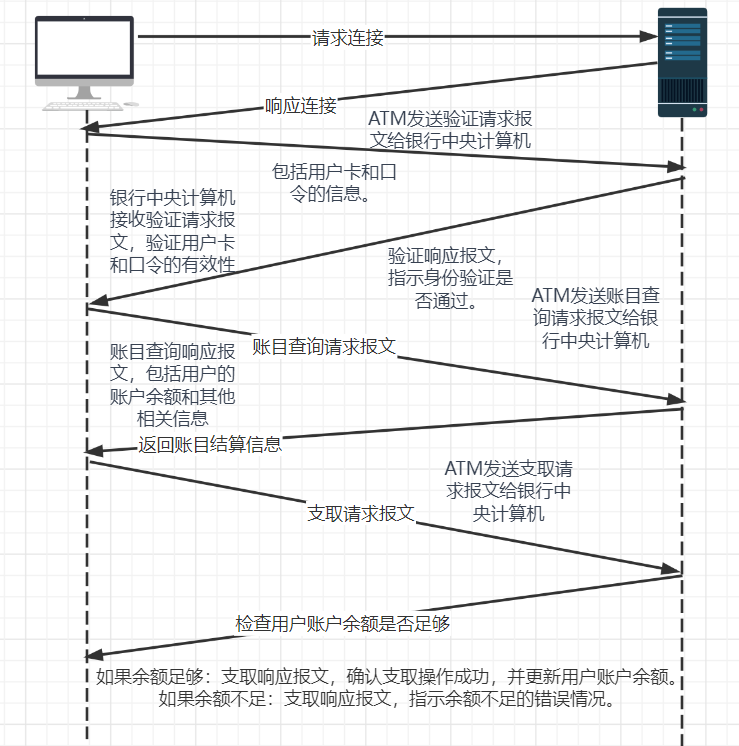

# P2

> 式 (1-1) 给出了经传输速率为 R 的 N 段链路发送长度 L 的一个分组的端到端时延。
>
> 对于经过 N 段链路连续发送 P 个这样的分组，一般化地表示出这个公式。

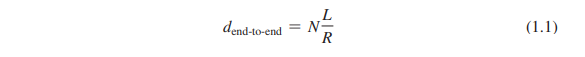

经过$N \frac {L}{R}$时间第一个分组到达目标结点, 此后没经过$\frac{L}{R}$时间都会有一个分组到达目标结点, 则剩下(P - 1)个分组共经过$(P - 1) \frac {L}{R}$时间到达目标结点

则P个分组都到达目标结点的时间为
$$
N\frac L R + (P-1) \frac L R \\
= (N + P - 1) \frac L R
$$

# P3

> 考虑一个应用程序以稳定的速率传输数据（例如，发送方每 k 个时间单元产生一个 N 比特的数据单元，其中 k 较小且固定）。另外，当这个应用程序启动时，它将连续运行相当长的一段时间。回答下列问题，简要论述你的回答：
>
> a. 是分组交换还是电路交换更为适合这种应用，为什么？
>
> b. 假定使用了分组交换网，并且该网中的所有流量都来自如上所述的这种应用程序。此外，假定该应用程序数据传输速率的总和小于每条链路的各自容量。需要某种形式的拥塞控制吗？为什么？

## a

电路交换更为适合这种应用

 k 个时间单元产生一个 N 比特的数据单元，其中 k 较小且固定, 所以频率很高且固定地发送数据, 几乎没有静默期

发送方以固定周期发送数据,速率恒定, 可利用TDM分配固定时隙, 每个时隙包含Nbit, 则可以在一个时隙内充分利用这些资源, 并且是足够用的

并且应用程序持续很长一段时间, 预留端到端电路和资源的时间可以忽略

如果采用分组交换, 网络中也有其它分组, 对于这种高频率发送, 很可能延时

## b

程序数据传输速率的总和小于每条链路的各自容量, 不会形成拥塞

# P4

> 考虑在图 1-13 中的电路交换网。回想在每条链路上有 4 条链路，以顺时针方向标记四台交换机 A、B、C 和 D。
>
>  a. 在该网络中，任何时候能够进行同时连接的最大数量是多少？
>
> b. 假定所有连接位于交换机 A 和 C 之间。能够进行同时连接的最大数量是多少？
>
> c. 假定我们要在交换机 A 和 C 之间建立 4 条连接，在交换机 B 和 D 之间建立另外 4 条连接。我们能够让这些呼叫通过这 4 条链路建立路由以容纳所有这 8 条连接吗？

## a

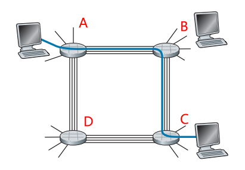

要是的连接数最大, 则相邻连个交换间建立4个连接

即AB, BC, CD, DA 直接都建立4条连接

则最大连接数为16条

## b

只考虑AC直接地连接, 则线路ABC有4条连接, 线路ADC有4条连接, 总共有8条连接

## c

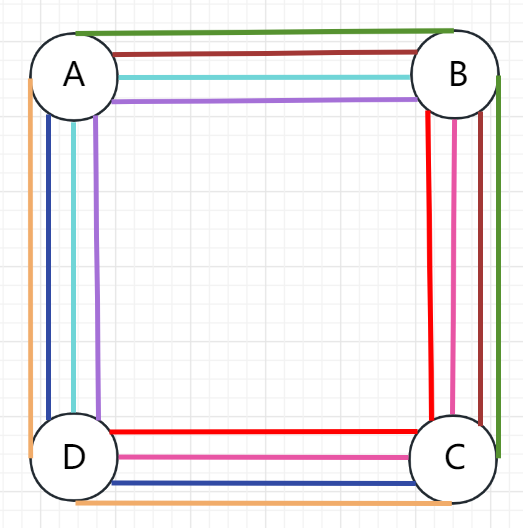

相同颜色表示一条连接

对于A和C之间的连接，我们通过B路由两个连接，通过D路由两个连接。对于B和D之间的连接，我们通过A路由两个连接，通过C路由两个连接。这样，每个链路最多有4个连接通过。

# P5

> 回顾在 1.4 节中的车队的类比。假定传播速度还是 100 km/h。
>
> a. 假定车队旅行 150km: 在一个收费站前面开始，通过第二个收费站，并且在第三个收费站后面结束。其端到端的时延是多少？
>
> b. 重复（a）, 现在假定车队中有 8 辆汽车而不是 10 辆。

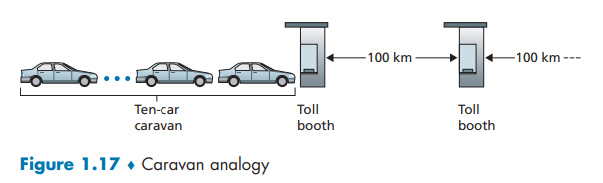

## a

原题中收费站处理速度为每辆车12s, 则10辆车经过一个收费站的时间为120s, 即2min

题目中一共有3个收费站, 则传输时延为
$$
d_{trans} = 3 \times 2min = 6min
$$
第一个收费站和第3个收费站间距离为150km, 传播速率为100km/h

则传播时延为
$$
d_{prop} = \frac {150km}{100km/h} = 1.5h = 1h30min
$$
总的端到端时延为
$$
d = d_{trans} + d_{prop} = 6min + 1h30min = 1h36min
$$

## b

车队中的车辆数量改变只会影响传输时延

传输时延为
$$
d_{trans}' = 8 \times12s \times 3 \\
 = 288s = 4min48s
$$
传播时延不变, 则新的端到端时延为
$$
d = d_{trans}' + d_{prop} = 1h34min48s
$$

# P6

>  这个习题开始探讨传播时延和传输时延，这是数据网络中的两个重要概念。考虑两台主机 A 和 B 由一条速率为  R bps 的链路相连。假定这两台主机相隔 m 米，沿该链路的传播速率为 s m/s。主机 A 向主机 B 发送长度为 L 比特的分组。
>
> a. 用 m 和 s 来表示传播时延 `d_prop`
>
> b. 用 L 和 R 来确定该分组的传输时间 `d_trans`。
>
> c. 忽略处理和排队时延，得到端到端时延的表达式。
>
> d. 假定主机 A 在时刻 t = 0 开始传输该分组。在时刻 t = `d_trans`，该分组的最后一个比特在什么地方？
>
> e. 假定 `d_prop` 大于 `d_trans`。在时刻 t = `d_trans`，该分组的第一个比特在何处？
>
> f. 假定 `d_proc` 小于 `d_trans`。在时刻 t = `d_trans`，该分组的第一个比特在何处？
>
> g. 假定 s = 2.5 x 10^8，L = 120 比特，R = 56 kbps。求出使 `d_proc` 等于 `d_trans` 的距离 m。

## a

题目给出了主机之间的距离和链路的传播速率直接相除
$$
d_{prop} = \frac {m}{s}
$$

## b

题目给出了分组的bit大小

和链路的速率, 即传输速率
$$
d_{trans} = \frac {L}{R}
$$

## c

由于忽略处理和排队时延, 所以只有传输和传播时延
$$
d_{end-to-end} = d_{trans} + d_{prop} = \frac {L}{R} + \frac {m}{s}
$$

## d

该分组的最后一个比特刚刚被推上链路准备开始传送

## e

bit被推到链路上后立刻进行传播

因为传播时延大于传输时延,

所以当分组的最后一个bit刚被推向链路时, 此时该分组的第一个bit已经在链路上传播了一段时间, 但该分组的第一个bit还未到达主机B

## f

因为传播时延小于传输时延

所以当分组的最后一个bit被推向链路时, 分组的第一个bit已经到达了主机B

## g

解方程即可
$$
m = \frac {Ls}{R} \\
= \frac {120 \times 2.5\times10^{8}}{56\times10^{3}} \\
= 536km
$$

# P7

>  在这个习题中，我们考虑从主机 A 向主机 B 通过分组交换网发送语音 (VoIP)。主机 A 将模拟语音转换为传输中的 **64 kbps 数字比特流**。然后主机 A 将这些比特分为 56 字节的分组。A 和 B 之间有一条链路：它的传输速率是 2 Mbps，传播时延是 10 ms。一旦 A 收集了一个分组，就将它向主机 B 发送。一旦主机 B 接收到一个完整的分组，它将该分组的比特转换成模拟信号。从比特产生（从位于主机 A 的初始模拟信号起）的时刻起，到该比特被解码（在主机 B 上作为模拟信号的一部分），花了多少时间？
>
> $K = 10^3  \  M = 10^6$

主机A的bit速率传输为64 kbps

则形成一个56 字节的分组的时间为
$$
t_{encoding} = \frac {56\times8}{64\times10^3} = 7ms
$$
一个分组有448bit, 传输速率为2Mbps, 

所以传输一个分组的传输时延为
$$
t_{trans} = \frac{448}{2\times10^6} = 0.224ms
$$
传播时延为$t_{prop} = 10ms$

所以在到达主机B的分组的第一个bit未被解码前花费的时间为
$$
t = t_{encoding} + t_{trans} + t_{prop} = 17.224ms
$$

# P8

> 用户共享一条 3 Mbps 的链路。又设每个用户传输时要求 150 kbps，但是每个用户仅有 10% 的时间传输。（参见 1.3 节中关于 "分组交换与电路交换的对比" 讨论）
>
> a. 当使用电路交换时，能够支持多少用户？
>
> b. 对于本习题的后续小题，假定使用分组交换。求出给定用户正在传输的概率。
>
> c. 假定有 120 个用户。求出在任何给定时刻，实际有 n 个用户在同时传输的概率。
>
> d. 求出有 21 个或更多用户同时传输的概率。

## a

当使用电路交换时，能够支持
$$
\frac {3M}{150k} = 20
$$
个用户使用

## b

每个用户有10%的时间在传输, 所以使用分组交换时, 某个用户正在传输的概率为10%

## c

已知某个用户正在传输的概率为10%

设$p=10\%$

$X$表示某时刻正在传输的用户数量

易知X服从二项分布, 即$X \sim B(120, p)$

则有n个用户同时进行传输的概率为
$$
P\{X = n\} = {120 \choose n}\cdot p^{n} \cdot (1-p)^{120-n} \\
$$

## d

X的期望
$$
EX = np = 120 \times 0.1 = 12
$$
X的方差
$$
DX = np(1-p) = 120 \times 0.1 \times0.9 = 10.8
$$
则超过21个同时传输的概率为
$$
P\{X \ge 21\} = 1- P\{X \le 20\} \\

=  1- P\{\frac{X - EX}{\sqrt{DX}} \le \frac{20 - EX}{\sqrt{DX}}\} \\\

= 1 - P\{X^* \le \frac{20 - 12}{\sqrt{10.8}}\} \\
= 1 - \Phi(2.43) \\
\approx 1 - 0.992 \\
\approx 0.008
$$

# P9

> 考虑在 1.3 节 "分组交换与电路交换的对比" 的讨论中，给出了一个具有一条 1 Mbps 链路的例子。用户在忙时以 100 kbps 速率产生数据，但忙时仅以 p = 0.1 的概率产生数据。假定用 1 Gbps 链路替代 1 Mbps 的链路。
>
> a. 当采用**电路交换**技术时，能被同时支持的最大用户数量 N 是多少？
>
> b. 现在考虑**分组交换**和有 M 个用户的情况。给出多于 N 用户发送数据的概率公式（用 p、 M、N 表示）

## a

同时支持的用户数为链路速率比上每个用户的数据传输速率
$$
N = \frac {1M}{100k} = 10^4
$$

## b

超过N个用户发送数据的概率为
$$
P\{ X \ge N \} = \sum\limits_{n = N + 1}^{M} {M\choose n}\cdot p^n \cdot (1-p)^{M-n}
$$

# P10

> 考虑一个长度为 L 的分组从端系统 A 开始。经 **3 段链路**传送到目的端系统。令 $d_i$、$s_i$ 和 $R_i$ 表示链路 i 的长度、传播速度和传输速率（i = 1，2，3）。该分组交换机对每个分组的(处理)时延为 `d_proc`。
>
> 假定**没有排队时延**，根据  $d_i$、$s_i$ 和 $R_i(i = 1, 2, 3)$ 和 L，该分组总的端到端时延是什么？
>
> 现在假定该分组是 1500 **字节**，在所有 3 条链路上的传播速率是 $2.5 \times 10^8 m/s$，所有 3 条链路的**传输速率**是 2 Mbps，分组交换机的**处理时延**是 3 ms，第一段链路的长度是 5000 km，第二段链路的长度是 4000 km，并且最后一段链路的长度是 1000 km。对于这些值，该端到端时延为多少？

## a

$$
d_{end-to-end} = \sum\limits_{i = 1}^{3} (\frac{L}{R_i} + \frac {d_i}{s_i}) + 2\cdot d_{proc}
$$

## b

传播速率为$2.5 \times 10^8 m/s$

每个交换机的处理时延为$d_{proc} = 3ms$

分组大小为$1500 \times 8 = 12000 \ bit$

传输速率为$2Mbps$

所以传输时延为
$$
d_{trans} = \frac {12k}{2M} = 6ms
$$
总共经过3次传输, 2次处理, 3次传播, 所以总的端到端时延为
$$
d_{end-to-end} = 3 \times d_{trans} + 2 \times d_{proc} + \\
\frac {5000km + 4000km + 1000km}{2.5\times10^8}  \\
= 3 \times 6ms + 2 \times 3ms + 40ms \\
= 64ms
$$

# P11

> 在上述习题中(P10)，假定 $R_1 = R_2 = R_3 = R $且 `d_proc` = 0。进一步假定该分组交换机不存储转发分组，而是在等待分组到达前立即传输它收到的每个比特。这时端到端处理时延为多少？

虽然交换机不存储转发, 但是从主机A将分组推向链路也需要一个传输时延

所以总的端到端时延为
$$
d_{end-to-end} = d_{trans}  + \\
\frac {5000km + 4000km + 1000km}{2.5\times10^8}  \\
= 6ms +  40ms \\
= 46ms
$$

# P12

> 一台分组交换机接收到一个分组并决定将该分组应当转发的出链路。当某分组到达时，另一个分组正在该出链路上被发送到一半，还有 4 个其他分组正等待传输。这些分组以到达的次序传输。假定所有分组是 1500 字节并且链路速度是 2 Mbps。该分组的排队时延是多少？
>
> 在更一般的情况下，当所有分组的长度是 L, 传输速率是 R, 当前正在传输的分组已经传输了 x 比特，并且已经在队列中有 n 个分组，其排队时延是多少？

## a

每个分组的传输时延为
$$
d_{trans} = \frac {12k}{2M} = 6ms
$$
则该分组的排队时延为
$$
d_{queue} = 4.5d_{trans} = 4.5 \times 6ms = 27ms
$$
一般的

每个分组的传输时延为
$$
d_{trans} = \frac {L}{R}
$$
分组的排队时延为
$$
d_{queue} = (n + \frac {x}{L})d_{trans} \\
= (n + \frac {L - x}{L}) \times \frac {L}{R} \\
$$
其中, $\frac {L - x}{L}$表示还没被传输的bit数

# P13

> a. 假定有 N 个分组同时到达一条当前没有分组传输或排队的链路。每个分组长为 L, 链路传输速率为 R。对 N 个分组而言，其平均排队时延是多少？
>
> b. 现在假定每隔$LN/R$秒有N个分组同时到达链路. 一个分组的平均排队时延时多少?

## a

第1个分组的排队时延为0

第2个分组的排队时延为$L/R$

第3个分组的排队时延为$2L/R$

...

第N个分组的排队时延为$(N - 1)L/R$

则N个分组平均排队时延为
$$
d_{aver-queue} = \frac {\sum\limits_{i = 0}^{N - 1}i\cdot \frac{L}{R}}{N} \\
= \frac {\frac{L}{R}\sum\limits_{i = 0}^{N - 1}i }{N} \\
= \frac {\frac{L}{R} \times\frac{(N-1)N}{2} }{N} \\
= \frac {L(N-1)}{2R}
$$

## b

每隔$LN/R$秒有N个分组同时到达链路, 此时上一组N个分组刚好全部传输完毕, 此时队列为空, 所以总的平均排队时延就是一个批次的N个分组的排队时延, 即a解出的
$$
 \frac {L(N-1)}{2R}
$$

# P14

> 考虑路由器缓存中的**排队时延**。令`I`表示**流量强度**, 即 `I = La/R`。假定排队时延的形式为 `IL/R(1-I)`, 其中 `I < 1`。
>
> 其中, a表示分组到达队列的平均速率
>
> a. 写出总时延，即排队时延加上传输时延
>
> b. 以 L/R 为函数画出总时延的图

## a

排队时延已经给出

传输时延为$L/R$

所以总时延为
$$
d = \frac {IL}{R(1-I)} + \frac{L}{R} \\
= \frac {L}{R(1-I)} \\
= \frac {L}{R(1-aL/R)} \\
$$

## b

因为
$$
d = \frac {L}{R(1-aL/R)} \\
$$
令$L/R = x$

则
$$
d = \frac{x}{1-ax}
$$
则总的时延随x的变化图像为

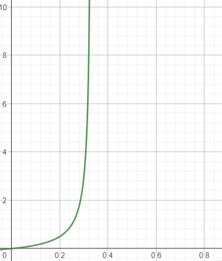

# P15

> 令 a 表示在一条链路上分组的到达率（以分组/秒计）, 令 $\mu$ 表示一条链路上分组的传输率（以分组/秒计）。基于上述习题中推到处的总延时公示（即排队时延加传输时延）, 推导出以 a 和 $\mu$ 表示的总时延公示。

$L/R$表示传输一个分组的时间(s)

则$R/L$表示1s传输的分组, 即分组的传输率

则$\mu = R/L$

则总时延为
$$
d = \frac {L}{R(1-aL/R)} \\
= \frac {\frac{1}{\mu}}{1 - a\frac{1}{\mu}} \\
= \frac {1}{\mu - a}
$$

# P16

> 考虑一台路由器缓存前面的一条出链路。在这个习题中，将使用李特尔公式，这是排队论中的一个著名公式。令 N 表示在缓存中的分组加上被传输的分组的平均数。令 a 表示到达链路的分组速率。令 d 表示一个分组经历的平均总延时（即排队时延加传输时延）。李特尔公式是 $N = a \times d$。
>
> 假定该缓存平均包含 10 个分组，并且平均分组排队时延是 10 ms。该链路的传输速率是 100 分组/秒。使用李特尔公式，在没有丢包的情况下，平均分组到达率是多少？

平均分组排队时延是 10 ms

因为链路的传输速率是 100 分组/秒, 即一秒传输100个分组

则一个分组的传输时延为$0.01s = 10ms$

所以一个分组的平均总时延为20ms, 即d=20ms

由题知缓存中的分组数为10, 一般情况下有1个正在传输的分组

则N=11

由李特尔公式
$$
a = \frac {N}{d} \\
 = \frac {1}{0.02} \\
 = 550
$$
a=550, 即一秒到达550个分组, 即平均分组到达速率为550 pkg / s

# P17

> a. 对于不同的处理速率、传输速率和传播时延，给出 1.4.3 节中式（1-2）的一般表达式。
>
> b. 重复（a）,不过此时假定在每个结点有平均排队延时 $d_{queue}$

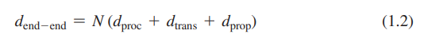

## a

由于N-1个台路由器, 所以有N段链路

设第`i`段链路的处理速率为$v_i$

则处理时延$d_{proc}^i = L / v_i$,

设第`i`段链路的传输速率为$R_i$

则传输时延$d_{trans}^{i} = L / R_i$

设第`i`段链路的传播时延为$d_{prop}^i$, 

则总的端到端时延为
$$
d_{end-to-end} = \sum\limits_{i = 1}^{N}(d_{proc}^i + d_{trans}^i + d_{prop}^i)
$$

## b

设从源主机开始的每个结点的排队时延为$d_{queue}^i$

则总的端到端时延为
$$
d_{end-to-end} = \sum\limits_{i = 1}^{N}(d_{proc}^i + d_{trans}^i + d_{prop}^i + d_{queue}^i)
$$

# P18

> 在一天的 3 个不同小时内，在同一个大路上的源和目的地之间执行 Traceroute。
>
> a. 在这 3 个小时的每个小时中，求出往返时延的均值和方差。
>
> b. 在这 3 个小时的每个小时中，求出路径上的路由器数量。在这些时段中，该路径发生变化了吗？
>
> c. 试图根据源到目的地 Traceroute 分组通过的情况，辨明 ISP 网络的数量。具有类似名字和 / 或类似的 IP 地址的路由器应当被认为是同一个 ISP 的一部分。在你的实验中，在相邻的 ISP 间的对等接口处出现最大的时延了吗？
>
> d.对位于不同大陆上的源和目的地重复上述内容。比较大陆内部和大陆之间的这些结果。

# P19

> 梅特卡夫（Metcalfe)定律:计算机网络的价值正比于与该系统连接的用户数量的平方。令n表示计算机网络中的用户数量。假设每个用户向每个其他用户发送一个报文，将要发送多少个报文? 你的答案支持梅特卡夫定律吗?

总共发送$n\times(n-1)$个报文, 数量正比于$n^2$, 支持了特卡夫定律

# P20

> 考虑对应于图 1-20b 吞吐量的例子。现在假定有 M 对客户-服务器而不是 10 对。用 $R_s$、$R_c$ 和 R 分别表示服务器链路、客户链路和网络链路的速率。假设所有的其他链路都有充足容量，并且除了由这 M 对客户-服务器产生的流量外，网络中没有其他流量。推导出由 $R_s$、$R_c$、R 和 M 表示的通用吞吐量表达式。

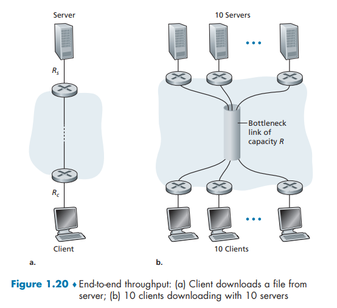

网络核心的公共链路为M个数据传输提高M个相等的传输速率

所以M个的其中之一的端到端吞吐量为
$$
min\{R_s, R_c, \frac{R}{M}\}
$$

# P21

> 考虑图 1-19b。现在假定在服务器和客户之间有 M 条路径。任两条路径都不共享任何链路。路径 $k(k = 1, ..., M)$ 是由传输速率为$ R_1^k、R_2^k, ..., R_N^k $的 N 条链路组成。如果服务器仅能够使用一条路径向客户发送数据，则该服务器能够取得的最大吞吐量是多少？
>
> 如果该服务器能够使用所有 M 条路径发送数据，则该服务器能够取得的最大吞吐量是多少？

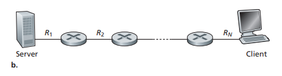

## a

如果只选择M条中的一条路径发送数据

则选取这M条中的最大吞吐量的路径
$$
\max\limits_{k = 1}^{M}\{\min\limits_{p = 1}^{N}R_p^k\}
$$

## b

如果将一份数据分为M条路径发送, 则总的吞吐量为各路径吞吐量之和
$$
\sum\limits_{k = 1}^{M}\min\limits_{p = 1}^{N}\{ R_p^k\}
$$

# P22

> 考虑图 1-19b。假定服务器与客户之间的每条链路的丢包概率为 p, 且这些链路的丢包率是独立的。一个（由服务器发送的）分组成功地被接收方收到的概率是多少？
>
> 如果在服务器到客户的路径上分组丢失了，则服务器将重传该分组。平均来说，为了使客户成功地接收到该分组，服务器将要重传该分组多少次？

## a

一个分组要成功地被接收方收到, 要在所有链路都不被丢弃
$$
p_{s} = (1-p)^N
$$

## b

已知几何分布表示一个事件第一次出现需要的试验次数

设$X$表示传输到第N个链路需要发送分组的数量

显然, $X \sim G(p_s)$
$$
P\{X = k\} = (1-p_s)^{k-1}p_s
$$
又已知几何分组的期望$EX = \frac {1}{P}$

所以平均意义下, 需要发送
$$
\frac {1}{p_s} \\
= \frac {1}{(1-p)^N} \\
$$
个分组才能到达客户端

即重发$\frac {1}{(1-p)^N}-1$个分组 才能到达客户端

# P23

> 考虑图 1-19a。假定我们知道沿着从服务器到客户的路径的瓶颈链路是速率为 R~s~ bps的第一段链路。假定我们从服务器向客户发送紧接着的一对分组，且沿这条路径没有其他流量。假定每个分组的长度为 L 比特，两条链路具有相同的传播时延 d~prop~
>
> a. 在目的地，分组的到达**间隔时间**有多大？也就是说，从第一个分组的最后一个比特到达到第二个分组最后一个比特到达所经历的时间有多长？
>
> b. 现在假定第二段链路是瓶颈链路（即 R~c~ < R~s~ ）。第二个分组在第二段链路输入队列中排队是可能的吗？请解释原因。
>
> 现在假定服务器在发送第一个分组 T 秒之后再发送第二个分组。为确保在第二段链路之前没有排队，T 必须要有多长？试解释原因。

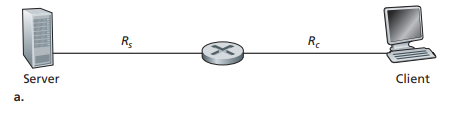

## a

从服务器发出时, 第二个分组会等待第一个分组传输完成(耗时$L/R_s$)

因为R~c~ > R~s~, 所以第二个分组到达路由器时, 第一个分组已经结束传输

所以第二个分组比比一个分组晚$L/R_s$时间完成传输

## b

第一个分组再路由器出完成传输耗时为

即再服务器出链路的传输时延, 第一条链路的传播时延和路由器出链路的传输时延
$$
L/R_s + d_{prop} + L/R_c \\
$$
第二个分组到达路由器的所耗时为

即在服务器出链路的排队时延和传输时延, 和传播时延
$$
L/R_s + L/R_s + d_{prop} \\
$$
如果第二个分组到达路由器的时刻早于第二个分组从路由器完成传输的时刻, 则第二个分组会在路由器的队列中排队
$$
L/R_s + L/R_s + d_{prop} < L/R_s + d_{prop} + L/R_c \\
$$
所以第二个分组在第二段链路输入队列中排队是可能的.

如果服务器在发送第一个分组完成(即传输完成)后 T 秒之后再发送第二个分组

第二个分组到达路由器的所耗时为
$$
L/R_s + L/R_s + d_{prop} + T
$$
为确保在第二段链路之前没有排队, 则要使得第二个分组到达路由器的时刻晚于第二个分组从路由器完成传输的时刻
$$
L/R_s + L/R_s + d_{prop} + T \ge L/R_s + d_{prop} + L/R_c \\
L/R_s + T \ge L/R_c \\
T \ge L/R_c - L/R_s\\
$$
 则等待时间T至少为$L/R_c - L/R_s$

# P24

> 假设你希望从波士顿到洛杉矶紧急传送 40 x 10^12^ 字节数据。你有一条 100 Mbps 专用链路可用于传输数据。你是愿意通过这条链路传输数据，还是愿意使用 FedEx 夜间快递来交付？解释你的理由。

如果使用该链路

传输时延为
$$
d_{tans} = \frac{40\times10^{12} \times8}{100\times 10^6} \\
= \frac{32\times10^{13}}{10^8} \\
= 32\times10^{5}s \\ 
\approx 888.88h \\
\approx 37.04 \ day
$$
大约37天, 肯定选择一夜快递

# P25

> 假定两台主机 A 和 B 相隔 20 000 km, 由一条直接的 R = 2 Mbps 的链路相连。假定跨越该链路的传播速率是 2.5 x 10^8^ m/s。
>
> a. 计算带宽-时延积 $R \cdot t_{prop}$
>
> b. 考虑从主机 A 到主机 B 发送一个 800 000 **比特**的文件。假定该文件作为一个大的报文连续发送。在任何给定的时间，在链路上具有的比特数量最大值是多少？
>
> c. 给出带宽-时延积的一种解释。
>
> d. 在该链路上一个比特的宽度（以米计）是多少？它比一个足球场更长吗？
>
> e. 根据传播速率 s、带宽 R 和链路 m 的长度，推导出一个比特宽度的一般表达式。

## a

$t_{prop} = \frac{2\times10^7}{2.5\times10^8} = 80ms$
$$
R \cdot t_{prop} = 2\times10^6 \times 0.08 \\
 = 1.6\times10^5 bits
$$
量纲是 `bit/s x [m / (m / s)] = bit/s x s = bit`

## b

传播时延反映了一个bit在链路中停留的时间, 而传输速率表示了一个bit到链路的到达速率, 二者相乘可得在传播时延内, 链路上的bit数
$$
0.08 \times 2\times10^6 = 1.6\times10^5 \ bits
$$

## c

带宽-时延积是该链路可以包含的最大比特数。

## d

总的链路长度比链路最大bit数可得平均每个bit所占的长度
$$
\frac{2\times10^7 m}{1.6\times10^5 bit} \\
= 125 m/bit
$$
125m比一个足球场长(一个足球场最长110m)

## e

链路总长度m比带宽-时延积
$$
\frac{m}{R \cdot\frac{m}{s}} \\
= \frac{s}{R}
$$

# P26

> 对于习题 P25，假定我们能够修改 R。对于什么样的 R 值，一个比特的宽度能与该链路的长度一样长？

令单bit宽度与链路长度相等
$$
\frac{s}{R} = m \\
R = \frac{s}{m}
$$
解得带宽R的公式

带入s = 2.5 x 10^8^, m = 20 000 km

解得 R = 12.5 bps

# P27

> 考虑习题P25，但现在链路的速率是 R = 1 Gbps。
>
> a. 计算带宽-时延积 R x d~prop~
>
> b. 考虑从主机 A 到主机 B 发送一个 800 000 比特的文件。假定该文件作为一个大的报文连续发送。在任何给定的时间，在链路上具有的比特数量最大值是多少？
>
> c. 在该链路上的一个比特的宽度（以米计）是多少？

## a

带宽-时延积:
$$
R \times d_{prop} = 1\times 10^{9} \times \frac{2\times10^7}{2.5\times 10^8} \\
= 8\times 10^7 \ bits
$$

## b

文件看作一个分组, 其大小为$L = 8\times10^5 bits$
$$
d_{prop} = \frac{2\times10^7}{2.5\times10^8} = 0.08s
$$

$$
R \times d_{prop} = 8\times 10^7 \ bits
$$

链路最大的bit数取决于带宽-时延积和该文件的大小

所以链路最大的bit数为
$$
min(L, R\times d_{prop}) = min(8\times10^5, 8\times10^7 ) \\
= 8\times 10^5 \ bits
$$

## c

由P25-e推到的比特的宽度公式可得

s是传播速率, R是带宽
$$
\frac{s}{R} = \frac{2.5\times10^8}{1\times10^9} = 0.25m
$$

# P28

> 再次考虑习题 P25
>
> a. 假定连续发送，发送该文件需要多长时间？
>
> b. 假定现在该文件被划分为 20 个分组，每个分组包含 40 000 比特。假定每个分组被接收方确认，确认分组的传输时间可忽略不计。最后，假定前一个分组被确认后，发送方才能发送分组。发送该文件需要多长时间？
>
> c. 比较（a）和 (b) 的结果。

## a

传输时延
$$
d_{trans} = \frac{8\times10^5}{2\times10^6} = 400ms
$$
传播时延
$$
d_{prop} = \frac{2\times10^7}{2.5\times10^8} = 80ms
$$
则连续传输该文件所需时间
$$
T_1 = d_{trans} + d_{prop} = 480ms
$$

## b

一个分组的大小为 40 000 bit

传输时延
$$
d_{trans}^{'} = \frac{4\times10^4}{2\times10^6} = 20ms
$$
传播时延不变
$$
d_{prop} = \frac{2\times10^7}{2.5\times10^8} = 80ms
$$
当一个分组到达接收方后, 接收方会发送信息确认, 等发送方确认后发送方再次发送分组

所以会等待1个传输时延和2个传播时延

20个分组到达接收方的时间为
$$
T_2 =  20 \times (d_{trans}^{'} + 2\cdot d_{prop}) = 3600ms
$$

## c

连续发送比分多组发送更高效

因为分成的多个分组都会产生多余的传播时延
$$
T_2 =  20 \times (d_{trans}^{'} + 2\cdot d_{prop}) \\ 
= d_{trans} + 40 \cdot d_{prop} \\
= T_1 + 39d_{prop}
$$

# P29

> 假定在同步卫星和它的地球基站之间有一条 10 Mbps 的微波链路。每分钟该卫星拍摄一幅数字照片，并将它发送到基站。假定传播速度是 2.4 x 10^8^ m/s
>
> a. 该链路的传播时延是多少？
>
> b. 带宽-时延积 R x d~prop~ 是多少？
>
> c. 若 `x` 表示该照片的大小。对于这条微波链路，能够连续传输的 x 最小值是多少？

## a

同步卫星轨道高度为 36000 km
$$
d_{prop} = \frac{3.6\times 10^{7}}{2.4\times10^8} = 0.15s
$$

## b

带宽-时延积:
$$
R \times d_{prop} = 10^7 \times 0.15\\
= 1.5\times 10^6 \ bits
$$

## c

由于卫星每分钟拍摄一次照片，所以在这60s之内需要把前一行照片传输完毕
$$
d_{trans} = \frac{x}{10^7}
$$
传输时延要大于等于60s, 以保证不会出现一个照片传输完成后等待下一次拍摄的情况

连续传输的意思是刚把这一张拍好的照片的最后一个比特推上链路，下一张照片已经拍好可以推第一个比特了。
$$
\frac{x}{10^7} \ge 60 \\
x \ge 6\times 10^8 \ bits
$$
所以$x$最小为$6\times 10^8 \ bits$

# P30

> 考虑 1.5 节中我们在分层讨论中对航线旅行的类比，随着协议数据单元向协议栈底层流动，首部在增加。随着旅客和行李移动到航线协议栈底部，有与上述首部信息等价的概念吗？

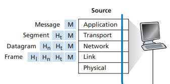

让我们假设乘客和他/她的包对应于到达协议栈顶部的数据单元。当乘客办理登机手续时，他/她的行李会被检查，并**在行李和机票上贴上标签**。这是在行李层中添加的附加信息，如果图1.20允许行李层实现服务，或者在发送端分离乘客和行李，然后在目的地端重新组合(希望如此!)当乘客通过安检时，通常会在他/她的机票上加上额外的印章，表明该乘客已通过安检

# P31

> 包括因特网的现代分组交换中，源主机将长应用报文（如一个图像或音乐文件）分段为较小的分组向网络发送。接收方则将这些分组重新装配为初始报文。我们称这个过程为**报文分段**。
>
> 图 1-27 显示了一个报文在报文不分段或报文分段情况下的端到端传输。
>
> 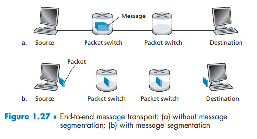
>
> 考虑一个长度为 8 x 10^6^ 比特的报文，它在图 1-27 中从源发送到目的地。假定在该图中的每段链路是 2 Mbps。忽略传播、排队和处理时延。
>
> a. 考虑从源到目的地发送该报文且没有报文分段。从源主机到第一台分组交换机移动报文需要多长时间？记住，每台交换机均使用存储转发分组交换，从源主机移动该报文到目的主机需要多长时间？
>
> b. 现在假定该报文被分段为 800 个分组，每个分组 10 000 比特长。从源主机移动第一个分组到第一台交换机需要多长时间？什么时候第二个分组能被第一台交换机全部收到？
>
> c. 当进行报文分段时，从源主机向目的主机移动该文件需要多长时间？将该结果与（a）的答案进行比较并解释之。
>
> d. 除了减小时延外，使用报文分段还有什么原因？
>
> e. 讨论报文分段的缺点。

## a

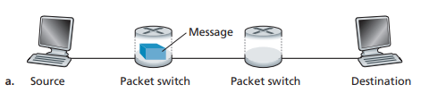

由于没有报文分段, 并且忽略传播、排队和处理时延

到第一个分组交换机经历1个传输时延
$$
\frac{8\times10^6}{2\times10^6} = 4s
$$
到目的主机经历3个传输时延, 即12s

## b

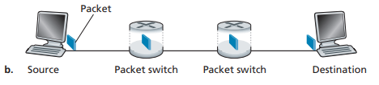

从源主机移动第一个分组到第一台交换机经历1个传输时延
$$
\frac{10^4}{2\times10^6} = 5ms
$$
第二个分组能被第一台交换机全部收到要经历从源主机的传输, 和第一个分组交换机的接受, 会经历2个传输时延: 10ms

## c

由于在源主机端的分组时依次传输的, 间隔是1个传输时延: 5ms

第1个分组到达目的主机经历3个传输时延: 15ms

此后每经过5ms就会由一个分组到达目的主机

所以最后一个分组会经历799个传输时延后到达目标主机, 至此所有分组全部到达目的主机

总的耗时为
$$
15ms + 799 \times 5ms = 4010ms
$$
是不进行报文分段所耗时的1/3

## d

如果没有报文分段，如果不能容忍比特错误，如果有一个比特错误，则必须**重传整个报文**(而不是单个数据包)。

如果没有报文分段，大量的数据包(例如包含高清视频)将被发送到网络中。**路由器必须容纳这些庞大的数据包**。较小的数据包必须排在较大的数据包后面，并遭受**不公平的延迟**。

## e

数据包必须在目的主机按顺序放置。接收方必须按顺序接收

报文分段使得必须引入**报文重组机制**的管理，增加了复杂性

报文分段产生许多更小的数据包。由于所有数据包的报头大小通常是相同的，而不管它们的大小如何，对于报文分段，报头字节的总数更多。使得总的数据量增大

# P32

> 用本书的 Web 网站上的报文分段的 Java 小程序进行实验。
>
> [Message Segmentation](https://media.pearsoncmg.com/ph/esm/ecs_kurose_compnetwork_8/cw/content/interactiveanimations/message-segmentation/index.html)
>
> 该程序中的时延与前一个习题中的时延相当吗？
>
> 链路传播时延时怎样影响分组交换（有报文分段）和报文交换的端到端总时延的？

设置报文大小为16 kbits, 分成的分组每个4kbits

由于传输速率是4 kbps, 所以传输一个分组的时延为1s

根据上一题计算公式得改报文分段后传输耗时为6s

在没有传播时延得情况下, 验证如下:

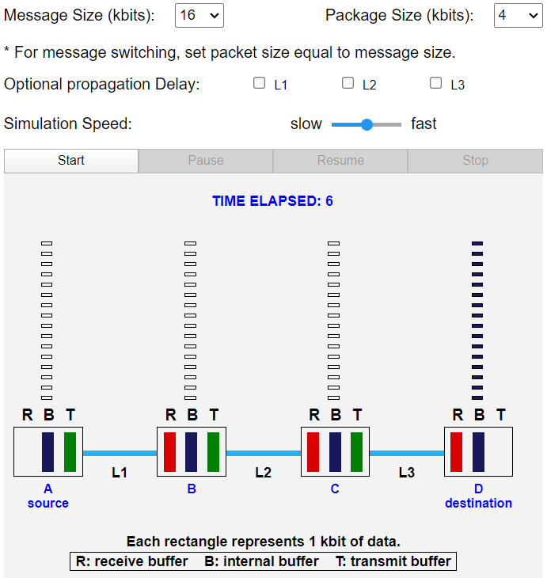

如果不进行报文分段, 计算得传输时延为12s

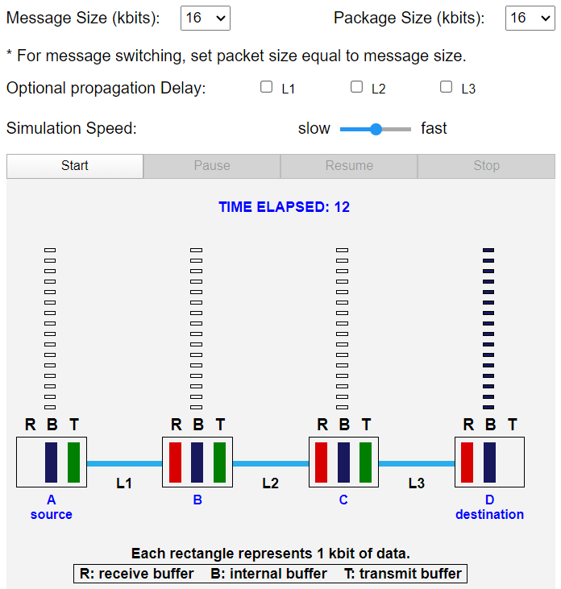

如果考虑传播时延, 进行报文分段的会变为9s, 增加了3s, 即经过了3端链路的传播时延, 同样是线考虑第一个分组到达的时间: 6s, 此后每经过1s, 一个新的分组会到达目的主机, 所以总共是9s

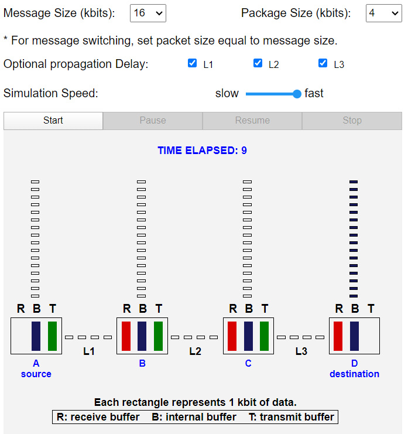

如果不进行报文分段, 也会增加3s, 分析与进行分段的一样

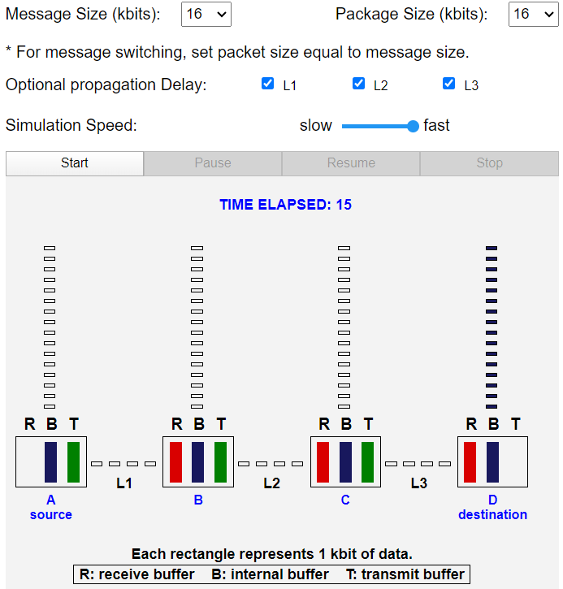

播延迟对分组交换和报文交换的总体端到端延迟的影响是一样的。不会因为分组多而产生更多的传播时延,因为一个分支进行传播的同时另一个分组可能在传输, 对总的时延的影响是固定的

# P33

> 考虑从主机 A 到主机 B 发送一个 F 比特的大文件。A 和 B 之间有两段链路（和两台交换机），并且该链路不拥塞（即**没有排队时延**）。主机 A 将该文件分为每个为 S bit的报文段，并为每个报文段增加了一个 80 bit 的首部，形成 L = 80 + S bit 的分组。每条链路的传输速率为 R bps。求出从 A 到 B 移动该文件时延最小的值 S。**忽略传播时延**。

从 A 到 B 移动该文件时延的表达式:
$$
3 \cdot\frac{80 + S}{R}  + (\frac{F}{S} - 1)\cdot\frac{80 + S}{R} \\
= (\frac{F}{S} + 2)\cdot\frac{80 + S}{R} \\
$$
由于F, R都是固定的值

令
$$
f(S) = (\frac{F}{S} + 2)\cdot\frac{80 + S}{R} \\
= \frac{80F}{SR} + \frac{2S}{R} + \frac{F}{R} + \frac{160}{R}
$$
对$f(S)$对S求导令
$$
f(S)^{'} = \frac{2}{R} - \frac{80F}{R} \frac{1}{S^2}
$$
令导数为0, 解得$S = \sqrt{40F}$

由二阶倒数>0, 可知在$S = \sqrt{40F}$, $f(S)$取得最小值, 即时延最小

由此题可知, 分组大小划分的合适(因为由不同的划分方式), 可以减少总的端到端时延(相比于其它划分方式)

# P34

> Skype 提供了一种服务，使你能用 **PC 向普通电话打电话**。这意味着语音呼叫必须通过因特网和电话网。讨论这是如何做到的。

电路交换电话网和因特网通过“网关”连接在一起。当Skype用户(连接到Internet)呼叫普通电话时，通过电路交换网络在网关和电话用户之间建立电路。skype用户的语音以数据包的形式通过互联网发送到网关。在网关处，语音信号被重构，然后通过电路发送。在另一个方向上，语音信号通过电路交换网络发送到网关。网关将语音信号打包后发送给Skype用户

