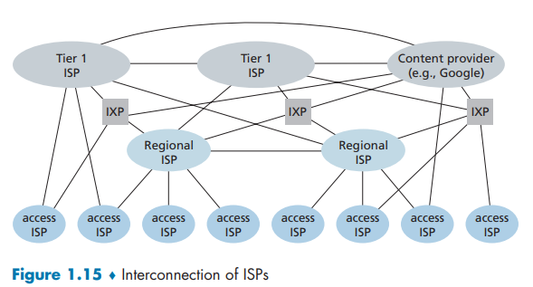
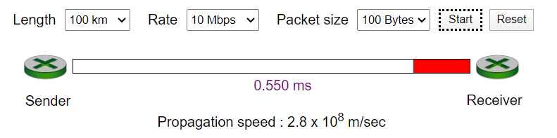
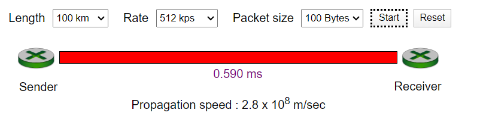
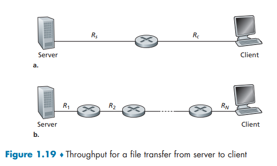
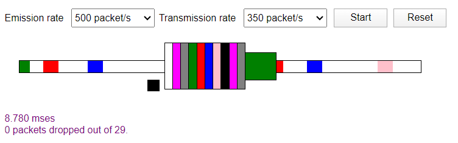
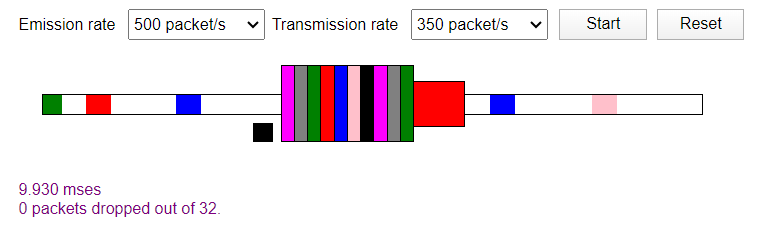
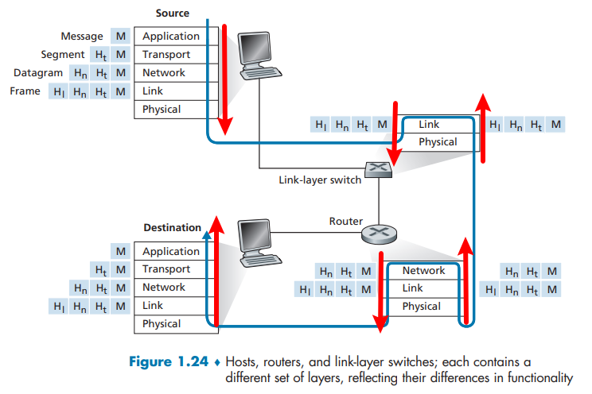
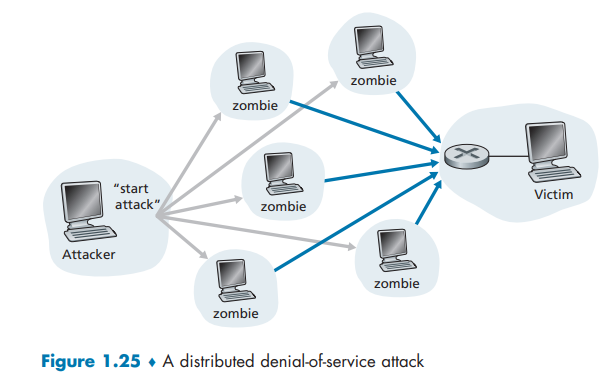

# R1

>  R1. “主机”和“端系统”之间有什么不同？列举几种不同类型的端系统。Web服务器是一种端系统吗？

答案：
主机和端系统并没有不同。所有接入互联网的设备都可以叫端系统或主机.常见的端系统比如笔记本电脑，智能手机等等。Web服务器是一种端系统。

主机 host

端系统: end system

# R2

> R2. “协议”一词常被用于描述外交关系。维基百科是怎样描述外交协议的？

答案：
百度百科：
国家之间或政府之间缔结的据以确定其相互权利和义务的协议文书，多用于重大的政治、经济、军事、法律等问题的协议。有双边的，也有多边的。狭义仅指以条约命名的协议，如同盟条约、友好条约、和平条约、互不侵犯条约等。广义指不论以何种名称或形式缔结的协议，如条约、公约、协定、联合宣言、联合公报、联合声明、议定书、会谈纪要、换文、合同等。条约、公约等属于国际法律文件,是最重要的外交文书。其缔结和生效程序很严格，需经国家宪法规定的机关批准，完成其法律手续。一般由缔约国各方派代表经正式谈判达成原则协议后,共同拟订条文;次经缔约方国家元首批准,再按商定日期和地点举行换文仪式,交换批准书。通常规定双方缔结的条约，自互换批准书之日起开始生效。条约或公约经签订后，在其有效期内对各缔约国均具有约束力。协定用于缔结意义不十分重大或短期性的协议，其应用较广泛，如贸易协定、海运协定等。议定书通常用于某些具体问题的协议，或用于对已经缔结的条约进行解释、补充、修改或延长其有效期等。协定和议定书的有效期较短，缔结手续也比较简单。换文指双方用互换照会的形式对达成协议的内容予以确认，有时它是条约、协定等的附件。

# R3

> R3 . 标准对于协议为什么重要？

答案：
标准定义了协议的要做什么和具体内容。

# R4

> 列出6种接入技术。将它们分类为住宅接入、公司接入或广域无线接入。
> 

## Answer

+ 住宅接入：

  光纤接入

  电缆接入

  数字用户线 DSL(Digital Subscribers Line)接入 

+ 公司接入：

  局域网LAN将端系统接入到边缘路由器

  以太网 

  WiFi 

+ 广域无线接入：

  终端设备使用蜂窝网提供商运营的基站来发送和接收分组

  仅需在基站数万米以内即可, 即所谓广域

  4G 5G

因特网服务提供商: (Internet Service Provider) ISP

## 家庭接入

---

### DSL

---

数字用户线（Digital Subscriber Line，简称DSL）是一种用于在普通电话线上提供高速数据传输的技术。它利用普通的铜质电话线来传输数字信号，使用户能够**同时使用电话和互联网服务**，而无需额外的电话线路。

DSL技术允许在电话线上实现高速的数据传输，利用了**频率分割技术将电话信号和数据信号分隔开**。

DSL提供了不同的变种和标准，其中最常见的是ADSL（Asymmetric Digital Subscriber Line）和VDSL（Very-high-bit-rate Digital Subscriber Line）。

ADSL是一种不对称的数字用户线技术，它提供了较高的下载速度和较低的上传速度。ADSL适用于家庭和小型办公室环境，用户通常更多地从互联网下载数据，如浏览网页、观看视频等。

VDSL是一种更高速的数字用户线技术，提供更高的上行和下行速度。VDSL适用于较大的办公环境和多媒体应用，如视频会议、高清视频流等。

DSL技术的优点包括：

1. 利用现有的电话线基础设施，无需额外的线缆。

2. 提供高速的上行和下行数据传输，适用于大多数用户的互联网需求。

3. 允许同时进行电话通话和互联网连接。

4. 相对较低的成本和易于安装。

需要注意的是，DSL的速度和性能受到距离远近、线路质量和供应商的网络基础设施等因素的影响。在选择DSL服务时，用户应该考虑到自己的需求和实际情况，并与供应商进行咨询和测试，以获得最佳的互联网连接体验。

#### 上下行传输速率

---

上行传输速率（Upstream Transmission Rate）和下行传输速率（Downstream Transmission Rate）是指在网络通信中数据在**不同方向**传输的速率。

**上行传输速率**指的是数据从用户设备发送到网络或互联网的速率。它表示用户设备上传数据的能力和速度。例如，当您将文件从计算机上传到云存储服务或通过电子邮件发送时，上行传输速率决定了数据从您的设备发送到网络的速度。

**下行传输速率**则指的是数据从网络或互联网发送到用户设备的速率。它表示用户设备下载数据的能力和速度。例如，当您浏览网页、观看在线视频或下载文件时，下行传输速率决定了数据从网络传输到您的设备的速度。

上行传输速率和下行传输速率通常以**比特每秒（bps）**为单位表示。

在典型的互联网连接中，通常**上行传输速率和下行传输速率具有不对称性**，即**下行传输速率较高，而上行传输速率较低**。这是因为对于大多数用户来说，下载数据的需求更多，例如浏览网页、观看视频等。因此，服务提供商通常提供较高的下行传输速率以满足用户的需求。

### Cable Access

---

## LAN

---

局域网（Local Area Network，简称LAN）是一种在有限地理范围内的计算机网络，用于连接位于相对较近位置的设备和主机。它通常覆盖的范围是单个建筑物、办公室、学校校园或一个较小的地理区域。

局域网允许在网络中的设备之间进行数据通信和资源共享。这些设备可以包括个人电脑、服务器、打印机、网络存储设备、路由器等。局域网提供了一种高速、低延迟的通信环境，使得设备可以快速地相互通信和交换信息。

局域网的特点包括：

1. 有限的范围：局域网的范围通常限定在一个相对较小的地理区域，例如建筑物、办公室或校园内部。

2. 高速连接：局域网通常使用高速的物理传输介质（如以太网）和传输协议，以实现快速的数据传输速率。

3. 低延迟：由于局域网的范围相对较小，数据传输的延迟较低，通信速度快。

4. 共享资源：局域网中的设备可以共享资源，例如共享打印机、共享文件和共享网络存储等。

5. 较高的安全性：局域网通常具有较高的安全性，可以实施各种安全措施来保护网络和数据的安全性。

局域网常用于企业、学校、办公室等场所，为内部网络提供高效的数据通信和资源共享。它是构建更大范围网络（如广域网）的基础，并为用户提供快速、可靠的网络连接。

### Ethernet

---

以太网（Ethernet）是一种常见的局域网（LAN）技术，它是一种用于在计算机网络中**传输数据的标准**。以太网最初由Xerox、Intel和Digital Equipment Corporation（DEC）共同开发，并在1980年代普及起来。

以太网使用一种称为载波感知多址与碰撞检测CSMA/CD（Carrier Sense Multiple Access with Collision Detection）的访问控制方法。它允许**多个计算机通过共享同一物理传输介质（如电缆）来传输数据**。在发送数据之前，计算机会**监听传输介质**，检测是否有其他计算机正在发送数据。如果检测到**冲突**（多个计算机同时发送数据），则会进行冲突检测并执行适当的**重传机制**。

以太网通常使用**双绞线或光纤**作为物理传输介质。它定义了一组标准和规范，包括传输速率、电气特性、数据格式等。最常见的以太网标准是IEEE 802.3系列标准，它定义了不同速率和介质类型的以太网变种，如10BASE-T、100BASE-TX、1000BASE-T等。

以太网已成为许多组织和家庭局域网的基本网络技术，它被广泛应用于计算机网络、互联网接入、数据中心和各种网络设备之间的通信。

### WLAN

---

无线局域网（Wireless Local Area Network，简称WLAN）是一种使用**无线通信技术**连接设备的局域网。

与传统的有线局域网不同，**WLAN通过无线信号传输数据**，允许设备在没有物理连接的情况下进行通信和访问网络资源。

WLAN使用**无线电波**作为传输介质，通常基于无线局域网标准（如Wi-Fi）进行操作。无线接入点（Wireless Access Point，简称AP）是WLAN的关键组件，它提供无线信号覆盖和网络接入功能。设备（如笔记本电脑、智能手机、平板电脑等）通过无线网卡或无线适配器连接到无线接入点，建立无线连接并访问网络。

WLAN的主要特点包括：

1. 无线连接：设备通过无线信号进行通信和数据传输，无需使用物理连接线。

2. 灵活性和便利性：用户可以在覆盖范围内的任何位置连接到无线局域网，方便灵活地移动和使用设备。

3. 宽带接入：WLAN支持高速数据传输，可以提供与有线局域网类似的带宽和速度。

4. 共享资源：设备在WLAN中可以共享打印机、文件、网络存储等资源，实现资源共享和协作。

5. 安全性：WLAN可以使用各种安全机制和加密算法，如WPA（Wi-Fi Protected Access）和WPA2，来保护网络和数据的安全性。

WLAN广泛应用于家庭、办公室、公共场所、学校等地方，为用户提供无线网络接入和便捷的互联网连接。随着无线技术的不断发展，WLAN的速度和性能也不断提高，成为越来越重要的网络基础设施。

## Modem

---

调制解调器（Modem）(modulator-demodulator) 是一种用于将**数字信号转换为模拟信号（调制）**和将**模拟信号转换为数字信号（解调**）的设备。它用于在数字通信中传输数据，例如通过电话线、电缆、光纤或无线信号等介质。

调制解调器起到了**数字信号和模拟信号之间的桥梁作用**。

当数据需要从计算机或其他数字设备发送到远程位置时，调制解调器将数字信号**转换为适合传输的模拟信号，使其能够通过传输介质传输**。

在接收端，另一个调制解调器将接收到的模拟信号转换为数字信号，以便计算机或其他设备可以处理和解读数据。

调制解调器的工作原理取决于使用的传输介质。例如：

1. 电话线调制解调器（或称为数据DSL调制解调器）用于通过电话线传输数据。它将数字数据调制为模拟信号，并通过电话线发送。在接收端，另一个调制解调器将模拟信号解调为数字数据。

2. 有线电视调制解调器用于将数字数据转换为模拟信号，并通过电缆网络传输。接收端的调制解调器将模拟信号解调为数字数据。

3. 光纤调制解调器用于将**数字数据转换为光信号**，并通过光纤传输。接收端的调制解调器将光信号解调为数字数据。

4. 无线调制解调器（如无线局域网（WLAN）的无线路由器）用于在无线环境中传输数据。它将数字数据转换为无线信号，并通过无线传输介质（如无线电波）发送。接收端的调制解调器将无线信号解调为数字数据。

调制解调器在各种通信场景中起着关键的作用，使得数字数据可以在不同的传输介质上进行可靠的传输和通信。

## DSLAM

---

数字用户线接入复用器 DSLAM（Digital Subscriber Line Access Multiplexer）是一种网络设备，用于**连接多个数字用户线（DSL)，并将这些连接汇集到一个高速宽带网络中。**

DSLAM通常部署在电信运营商的网络架构中，位于用户端和运营商网络之间。它充当着连接用户端DSL调制解调器和运营商的核心网络设备之间的接口。

DSLAM的主要功能包括：

1. **信号调制与解调**：DSLAM接收来自用户端的数字信号，并将其调制为适合在传输线路上传输的模拟信号。同样地，它接收来自核心网络的模拟信号，并将其解调为数字信号发送给用户端。

2. 复用与分解：DSLAM将来自多个用户端的信号复用在一条传输线路上，以实现资源共享和高效的带宽利用。同时，它也能将来自传输线路的信号分解为不同的用户端。

3. 管理与控制：DSLAM负责管理和控制用户端的连接。它可以对连接进行监测、配置和故障排除。此外，DSLAM还提供了管理接口，使运营商能够管理和监控网络性能。

DSLAM的部署通常与数字用户线技术（如ADSL、VDSL等）一起使用，用于提供宽带互联网接入和其他增值服务，如语音通信、视频流媒体等。它在电信运营商网络中起着关键的作用，实现了用户和核心网络之间的连接和数据传输。

# R5

---

>  HFC宽带是专用的，还是用户间共享的？
>
> 在下行HFC信道中，有可能发生碰撞吗？为什么？

## Answer

CMTS与DSLAM类似, 将模拟信号转为数字信号

HFC宽带是**用户间共享**的网络架构，其中**下行HFC信道是在一定程度上共享的**。下行HFC信道是指从运营商的网络传输数据到用户终端的方向。

在典型的HFC系统中，多个用户共享同一个下行信道。这是通过**将用户的信号在光纤网络中复用到同一个同轴电缆上实现的**。因此，下行信道是在一定程度上共享的，**多个用户的数据通过同一个信道传输**。

在下行HFC信道中，通常**不会发生碰撞**。这是因为HFC系统使用了**频分多址（FDMA）或时分多址（TDMA）**等技术，将用户的数据分配到不同的频率或时间槽上进行传输。这样每个用户在特定的频率或时间槽上进行通信，避免了碰撞的发生。

具体来说，HFC系统中使用的调制解调器（Modem）会根据分配的频率或时间槽，以及一定的调度算法，将用户数据发送到正确的频率或时间槽上。这样，即使多个用户同时传输数据，由于它们被分配到不同的频率或时间槽上，彼此之间的数据不会发生碰撞。

需要注意的是，尽管下行HFC信道在一定程度上共享，上行HFC信道通常是**分时共享**的，因为不同用户的**上行数据需要在同一个信道上传输**，可能会发生碰撞。为了避免碰撞，HFC系统通常使用**碰撞检测和重传机制**，例如载波侦听多路访问/冲突避免（CSMA/CA）等。

总体而言，HFC系统在设计上考虑到了下行信道的共享和碰撞问题，并采取了相应的技术和调度策略，以确保多个用户能够在下行信道中高效地共享带宽，避免碰撞和数据冲突。

## HFC

---

混合光纤同轴系统（Hybrid Fiber Coaxial System，简称HFC系统）是一种用于**提供宽带通信和电视信号**的网络架构。它结合了**光纤和同轴电缆**两种传输介质，为用户提供高速的互联网接入和电视信号传输。

HFC系统的架构包括两个主要组成部分：**光纤网络和同轴电缆网络**。

+ 光纤网络：

  光纤网络负责将信号从主干网络**传输到各个分布节点**。在光纤网络中，使用光纤作为传输介质，可以实现高速、大容量的数据传输。光纤网络通常部署在**较长的距离**上，以连接运营商的核心网络和分布节点。

+ 同轴电缆网络：

  同轴电缆网络负责将信号**从分布节点传输到用户终端**。同轴电缆是一种电信标准的传输介质，具有较高的抗干扰能力和传输距离。在同轴电缆网络中，信号被调制和解调，以实现数据和电视信号的传输。

HFC系统的优点包括：

1. 高速宽带：通过光纤网络的使用，HFC系统可以提供高速的互联网接入，满足用户对宽带的需求。

2. 大容量：光纤网络的高带宽特性使得HFC系统能够承载大量的数据和多媒体内容，支持高清视频流、在线游戏等应用。

3. 灵活性：HFC系统可以同时传输数据和电视信号，为用户提供综合的通信和娱乐服务。

4. 可扩展性：HFC系统的架构使得网络能够支持多个用户和大范围的覆盖区域，可以根据需求进行扩展和升级。

HFC系统广泛应用于有线电视网络和宽带接入领域，为用户提供多种服务，如互联网接入、IP电话、视频点播和互动电视等。它是一种成熟的网络架构，为用户提供了高质量的通信和娱乐体验。

## FTTH

---

光纤到户（Fiber to the Home，简称FTTH）是一种先进的通信技术，旨在将光纤网络直接延伸到用户的住宅或商业建筑，为用户提供高速、稳定的宽带互联网接入以及其他通信服务。在FTTH网络中，光纤作为主要的传输媒介，将数据以光信号的形式传输，取代了传统的铜线（如电话线）或同轴电缆。

FTTH网络可以分为几种不同的架构，其中最常见的包括：

1. 点到点（Point-to-Point）架构：每个用户都有一条独立的光纤连接到网络提供商的交换设备，这种架构保证了每个用户都能获得全带宽的支持，但需要大量的光纤布线，造成成本较高。

2. 光纤到多点（Fiber to the Multi-Point，简称FTTM）架构：在这种架构中，多个用户共享一条光纤，通过光分复用技术，将不同用户的数据流在光纤中进行分割和合并。这样可以节省光纤的使用，降低网络建设成本。

在FTTH部署中，光纤网络通常由三个主要部分组成：

1. 光纤骨干网（Fiber Backbone）：光纤骨干网是一个高带宽、高速率的光纤网络，将光信号从互联网服务提供商（ISP）的核心网络传输到不同的区域或社区。光纤线路端接器(OLT)将链接到骨干网
2. 光纤分配节点（Fiber Distribution Node）：光纤分配节点位于用户附近，光纤骨干网的信号在这里分配到不同的用户。分配节点通常位于街道柜子、电信机房等位置。利用光纤分配器(splitter)
3. 光网络终端（Optical Network Terminal，ONT）：光网络终端是安装在用户住宅或商业建筑内的设备，用于将光纤信号转换为电信号，以供用户设备使用。ONT通常包含一个光接口和多个以太网端口，可以连接用户的路由器、电脑、电视等设备。

无论采用哪种架构，FTTH都具有以下优势：

1. 高速宽带：光纤传输的特性使得FTTH能够提供非常高的传输速率和带宽。用户可以享受更快速、稳定的互联网连接，支持高清视频、在线游戏、视频会议等带宽密集型应用。

2. 长距离传输：光纤的传输距离较远，信号质量不受距离影响，因此FTTH可以覆盖广阔的区域，不仅适用于城市地区，也可延伸至偏远农村地区。

3. 低延迟：光纤传输具有很低的延迟，适用于实时应用，如在线游戏、视频通话和远程医疗，确保快速响应和良好的用户体验。

4. 抗干扰：光纤传输对于电磁干扰和雷电等干扰具有高度的抗干扰能力，提供更稳定的信号质量。

5. 未来扩展性：FTTH网络具有良好的未来扩展性，能够满足日益增长的数据需求。随着新的应用和服务的出现，FTTH可以轻松支持更高的带宽要求

# R6

> 列出你所在城市中的可供使用的住宅接入技术。对于每种类型的接入方式，给出所宣称的下行速率、上行速率和每月的价格。

答案：
光纤到户。
几十M大概。

# R7

---

> 以太LAN的传输速率是多少？

## Answer

以太网局域网（Ethernet LAN）的传输速率可以有多种不同的标准和速率。以下是常见的以太网传输速率：

1. 10 Mbps（以太网）：这是最早的以太网标准，也被称为10BASE-T。它的传输速率为10 Mbps（兆比特每秒），适用于较早的以太网设备和低带宽要求的网络。

2. 100 Mbps（快速以太网）：这是快速以太网标准，也被称为100BASE-TX。它的传输速率为100 Mbps，比10 Mbps以太网快10倍。快速以太网在局域网中提供了更高的带宽，适用于大多数常规网络应用。

3. 1 Gbps（千兆以太网）：千兆以太网标准，也被称为1000BASE-T或Gigabit Ethernet，其传输速率为1 Gbps（千兆比特每秒）。千兆以太网提供更高的带宽和更快的数据传输速度，适用于大型网络和带宽密集的应用。

4. 10 Gbps（万兆以太网）：万兆以太网标准，也被称为10GBASE-T，其传输速率为10 Gbps。万兆以太网提供更高的传输速度和带宽，适用于高性能计算、数据中心和需要大量数据传输的应用。

除了以上标准外，还存在更高传输速率的以太网标准，如40 Gbps（40GBASE-T）和100 Gbps（100GBASE-T），它们主要用于高性能网络和数据中心。

需要注意的是，实际的传输速率可能会受到网络设备、电缆质量、网络拓扑和其他因素的影响。因此，在实际网络部署中，确保网络设备、电缆和其他组件都能支持所需的传输速率是很重要的。

# R8

---

> 能够运行以太网的一些物理媒体是什么？

## Answer

以太网可以在多种物理媒体上运行，这些物理媒体用于传输数据信号。以下是一些常见的以太网物理媒体：

1. 双绞线（Twisted Pair）

   双绞线是最常见的以太网物理媒体之一。它包括两对绝缘的铜导线，通过扭绞在一起以减少干扰。双绞线分为不同的类别，如Cat5e、Cat6和Cat7，它们支持不同的传输速率和距离。

2. 光纤（Fiber Optic）：

   光纤是一种使用光信号传输数据的以太网物理媒体。它由玻璃或塑料纤维组成，能够传输高速、长距离的数据。光纤通常用于要求较高带宽和抗干扰能力的网络，例如千兆以太网（Gigabit Ethernet）和万兆以太网（10 Gigabit Ethernet）。

3. 同轴电缆（Coaxial Cable）：

   同轴电缆是一种中空的金属导线包围绝缘层和外层护套的电缆。它曾经被广泛用于传输以太网信号，尤其是在早期的以太网部署中。然而，随着双绞线和光纤的发展，同轴电缆的使用已经较少。

4. 无线传输：

   除了有线媒体，以太网也可以通过无线传输实现。无线局域网（WLAN）标准，如Wi-Fi，提供了通过无线信号传输以太网数据的方式。Wi-Fi使用无线电波进行数据传输，使得设备可以无线连接到以太网。

这些物理媒体的选择取决于网络需求、传输速率要求、距离限制、抗干扰能力和成本等因素。在部署以太网时，需要根据具体需求选择适合的物理媒体和相应的设备。

# R9

---

> 拨号调制解调器、HFC、DSL和FTTH都用于住宅接入。对于这些技术中的每一种，给出传输速率的范围。并讨论有关宽带是共享的还是专用的。

## Answer

以下是拨号调制解调器、HFC（混合光纤同轴）、DSL（数字用户线）和FTTH（光纤到户）这些住宅接入技术的传输速率范围以及关于宽带是共享的还是专用的讨论：

1. 拨号调制解调器：
   - 传输速率范围：拨号调制解调器使用电话线来连接到互联网，其传输速率通常在**56 Kbps至1 Mbps**之间。然而，实际速率可能会受到电话线质量和网络拥塞等因素的影响。
   - 宽带共享或专用：拨号调制解调器提供的宽带通常是**专用**的，因为每次只能有一个设备连接到互联网，并且占用整个电话线的带宽。

2. HFC（混合光纤同轴）：
   - 传输速率范围：HFC网络使用光纤和同轴电缆结合的方式提供宽带接入。传输速率范围可以达到**几十Mbps至几百Mbps**甚至更高的水平，具体取决于网络运营商的部署和配置。
   - 宽带共享或专用：HFC网络中的宽带是**共享**的。多个用户连接到同一段同轴电缆，并共享带宽资源。然而，运营商会采取措施以确保在网络繁忙时仍能提供合理的速度和服务质量。

3. DSL（数字用户线）：
   - 传输速率范围：DSL使用电话线提供宽带接入，传输速率范围从几Mbps到几十Mbps不等。具体速率取决于DSL类型（如ADSL、VDSL）以及用户与交换机之间的距离。
   - 宽带共享或专用：DSL提供的宽带通常是**专用**的。每个用户连接到DSL交换设备的独立线路，享有分配给他们的带宽，因此宽带是专门为每个用户保留的。

4. FTTH（光纤到户）：
   - 传输速率范围：FTTH使用光纤将宽带信号直接传输到用户的住宅。其传输速率范围很大，可以达到**几百Mbps、几Gbps**甚至更高的速度，具体取决于光纤网络的部署和提供商的服务级别。
   - 宽带共享或专用：FTTH网络中的宽带通常是**专用**的。每个用户都有独立的光纤连接到网络提供商的设备，享有分配给

# R10

---

> 描述今天最流行的无线因特网接入技术。对它们进行比较和对照。

## Answer

5G是一种移动通信技术，由运营商提供，并需要支持5G的移动设备。而Wi-Fi是一种局域网无线接入技术，可以由用户自行设置和配置。两者在覆盖范围、部署方式和使用场景等方面有所不同。

与Wi-Fi不同，5G是由移动网络运营商提供的广域无线接入技术，可覆盖更大的范围并提供移动通信服务。

# R11

---

> 假定在发送主机和接收主机间只有一台分组交换机。发送主机和交换机间以及交换机和接收主机间的传输速率分别是R1和R2。假设该交换机使用**存储转发分组**交换方式，发送一个长度为L的分组的**端到端总时延**是什么？（忽略排队时延、传播时延和处理时延）

## Answer

传输速率R的单位是bps, 一个长度为L的分组有L个bit

所以传输时延的计算为
$$
d_{trans} = \frac L R
$$
因为忽略排队时延、传播时延和处理时延, 所以只考虑传输时延

所以传输一个长度为L的分组经过

总的端到端时延为
$$
t_{trans} = \frac {L}{R_1} + \frac {L}{R_2}
$$

# R12

---

> 与分组交换网络相比，电路交换网络有哪些优点？在电路交换网络中，TDM比FDM有哪些优点？

## Answer

---

与分组交换网络相比，电路交换网络具有以下优点：

1. 实时性：

   在电路交换网络中，建立了一条**专用的通信路径**，**数据传输时延较低且稳定**。这对于实时应用和对延迟要求较高的应用非常重要，如**语音通信和视频会议**等。

2. 预留带宽：

   电路交换网络为每个通信会话分配了**独立的带宽**，保证了通信质量和带宽的稳定性。这意味着在**通话期间，始终有一定的带宽可供使用，不会受到其他用户的影响**。

3. 无碰撞：

   在电路交换网络中，建立了一条专用的通信路径，避免了数据碰撞的问题。每个通信会话都有独立的资源，不会与其他会话发生冲突，因此不会导致数据丢失或传输错误。

至于时分多路复用（TDM）和频分多路复用（FDM）在电路交换网络中的比较，TDM有以下优点：

1. 带宽利用率高：

   TDM将时间分成固定的时隙，每个时隙都分配给不同的通信会话。这样可以实现高效的带宽共享，充分利用可用的带宽资源。

2. 灵活性：TDM可以根据通信需求动态分配时隙，以适应不同会话的带宽要求。这使得网络更加灵活，并且可以适应不同速率和优先级的通信。

3. 简单实现：TDM的实现相对简单，只需按照预定的时间间隔分配时隙即可。这使得TDM成为一种成本效益高且易于部署的技术。

总的来说，电路交换网络提供了实时性、预留带宽和无碰撞的优点，而TDM作为一种多路复用技术，在电路交换网络中具有带宽利用率高、灵活性和简单实现的优势。

## 分组交换网络优点

---

分组交换网络相比于电路交换网络具有以下优点：

1. 高效利用带宽：

   分组交换网络可以灵活地共享带宽资源。数据被分割成小的数据包（分组），每个分组独立传输。这样，带宽可以被多个用户或应用程序共享，使得网络资源得到高效利用。

2. 弹性和灵活性：

   分组交换网络可以根据需求进行**动态路由和资源分配**。它可以根据实际情况调整路由路径，适应网络流量的变化，提供更好的弹性和灵活性。

3. 更好的可扩展性：

   分组交换网络可以适应不断增长的网络规模。由于分组交换网络不需要为每个连接维持独占的资源，所以它在支持大规模的连接时更具可扩展性。

4. 多路复用：

   分组交换网络可以**同时处理多个连接和多个应用程序的数据传输**。多个分组可以在同一时间通过网络传输，提供多路复用的功能。

5. 更好的错误检测和纠正：

   分组交换网络通常会在每个分组中添加错误检测和纠正的信息

   例如: **校验和或冗余检验码**。这样可以在传输过程中检测和纠正数据错误，提高数据传输的可靠性。

6. 更好的容错性：

   分组交换网络具有更好的容错性。**当网络中的某个连接或节点发生故障时，可以通过其他路径或节点来传输分组**，确保数据传输的可靠性和连通性。

7. 支持多种数据类型：

   分组交换网络可以传输多种类型的数据，包括实时音频和视频流、大容量的数据文件等。它可以适应不同应用的需求，并提供适当的服务质量保障。

总的来说，分组交换网络具有高效利用带宽、灵活性、可扩展性、多路复用、错误检测和纠正、容错性以及对多种数据类型的支持等优点，使得它在现代网络通信中得到广泛应用。

## TDM

---

时分复用（Time Division Multiplexing，TDM）是一种用于电路交换网络的多路复用技术，它允许多个信号在同一传输介质上共享带宽资源。在TDM中，时间被划分为一系列固定长度的时隙，每个时隙用于传输一个信号。

**周期性获得所有带宽**

时分复用电路交互网络基于以下原则运作：

1. 时间划分：

   在传输介质上划分为固定长度的时隙，每个时隙用于传输一个信号。这些时隙按照预定的顺序周期性地分配给不同的信号源。

2. 时隙分配：

   **每个信号源被分配一个或多个时隙来传输其数据**。时隙分配可以是**静态**的，即每个信号源在固定的时隙上传输数据，也可以是**动态**的，根据需求进行时隙分配。

3. 时隙复用：

   通过在同一传输介质上进行时隙复用，多个信号源可以共享带宽资源。每个信号源在其分配的时隙中传输数据，然后传输介质上的时隙按照顺序进行复用。

4. 时钟同步：

   为了确保各个信号源在正确的时隙上进行传输，系统需要进行时钟同步。所有信号源必须按照相同的时钟频率进行操作，以确保数据在正确的时隙中传输。

TDM在电路交换网络中具有一些优点：

1. 实时传输：由于时分复用将时隙分配给每个信号源，因此传输是实时的，无需等待和竞争资源。

2. 高带宽利用率：多个信号源共享传输介质，可以高效地利用带宽资源。

3. 简单实现：TDM相对简单，易于实现和管理。

然而，TDM也有一些局限性：

1. 固定带宽分配：每个信号源被分配固定的时隙，如果某些信号源的数据量较小，其分配的带宽可能会被浪费。

2. 时延和时隙预留：每个信号源都需要等待其分配的时隙，因此会引入一定的传输时延，并且存在时隙预留的问题。

时分复用电路交互网络在传输语音、视频和数据等实时应用方面具有广泛应用，例如传统的电话网络中使用的PCM（脉冲编码调制）技术就是一种基于TDM的时分复用技术。

## FDM

---

频分复用（Frequency Division Multiplexing，FDM）是一种用于电路交换网络的多路复用技术，它允许多个信号在不同的频率上共享带宽资源。在FDM中，频谱被划分为一系列非重叠的频带，每个频带用于传输一个信号。

**连续性获得一段带宽**

频分复用电路交互网络基于以下原则运作：

1. 频谱划分：

   传输介质的频谱被划分为**多个不重叠的频带**，每个频带用于传输一个信号。**每个信号源被分配一个特定的频带**。

2. 频带分配：

   每个信号源被分配一个或多个频带来传输其数据。频带分配可以是静态的，即每个信号源在固定的频带上传输数据，也可以是动态的，根据需求进行频带分配。

3. 频带复用：

   通过在同一传输介质上进行频带复用，多个信号源可以共享带宽资源。每个信号源在其分配的频带中传输数据。

4. 频率隔离：

   为了确保各个信号源在不同的频带上进行传输，系统需要提供频率隔离。**每个信号源的频带之间需要有足够的频率间隔**，以避免相互干扰。

FDM在电路交换网络中具有一些优点：

1. 带宽隔离：每个信号源在不同的频带上传输数据，彼此之间相互隔离，减少了干扰和冲突。

2. 灵活性：频带分配可以根据需求进行调整和变化，以适应不同信号源的数据传输需求。

3. 兼容性：FDM可以与现有的模拟和数字信号进行兼容，使得现有的设备可以继续使用。

然而，FDM也有一些局限性：

1. 频谱浪费：

   每个信号源被分配一个频带，即使某些信号源的数据量较小，其分配的频谱仍然被浪费。

2. 频带冲突：

   如果分配的频带之间存在重叠或干扰，可能会导致信号互相干扰，影响数据传输的质量。

频分复用电路交互网络在传输数据和宽带应用方面具有广泛应用。它可以在同一传输介质上同时传输多个信号，如音频、视频、数据等，并提供适当的频带隔离，以确保信号之间不会相互干扰。

# R13

---

> 假定用户共享一条2M bps链路。同时假定当每个用户传输时连续以1Mbps传输，但每个用户仅传输20%的时间。
>
> a. 当使用电路交换时，能够支持多少用户？
>
> b. 作为该题的遗留问题，假定使用分组交换。为什么如果两个或更少的用户同时传输的话，在链路前面基本没有排队时延？为什么如果3个用户同时传输的话，将会有排队时延？
>
> c. 求出某指定用户正在传输的概率。
>
> d. 假定现在有3个用户。求出在任何给定时间，所有3个用户在同时传输的概率。求出队列增长的时间比率。

## Answer

### a

链路总的传输速率为2M bps, 同时每个用户传输速率要求为1M bps,

所以链路中可以分出两条电路, 可同时供两个用户使用

2 Mbps / 1 Mbps = 2 个用户

### b

如果两个或更少的用户在传输，即使它们同时传输，也仅仅完全占用了2Mbps链路，不会造成排队。如果有3个用户同时传输，需要3Mbps，而此时链路只有2Mbps，因此将会有排队时延。

2 Mbps表示链路的传输bit速率,即从交换机中推出bit的速率,  当有N个用户同时以1 Mbps传输到交换机时, 接收bit的速率就为 N Mbps, 如果交换机接收速率小于等于链路的传输速率, 即$N\le2$时, 此时传进来一个分组, 在下一个分组到来之前就可以推出当前分组, 或者说, 这些到来速率小于等于2的数据都可以立即进行传输操作

否则当$N \ge 3$时, 分组到达交换机的速率大于将分组推出交换机的速率, 此时会有分组在队列中等待

### c

仅传输 20% 的时间，1s 内有 0.2s 在传输，因此正在传输的概率为 0.2

### d

因为大于等于3个用户同时传输时才会发生排队

3个用户同时传输的概论p为
$$
p = (0.2)^3 = 0.008
$$
所以在0.008个单位时间中, 才会出现队列增长, 即增长的比率为0.008

# R14

> 为什么在等级结构相同级别的两个ISP通常互相对等？
>
> 某IXP是如何挣钱的？

只要级别相同的两个 ISP 对等，就可以减少因为需要联通上层 ISP 而支付的费用，如果不需要互联只有经过上层 ISP 才能达到的端系统，那么就可以少经过几个路由，并且 ISP 也节约了成本。

IXP 是一个让不同 ISP 对等和连接的汇聚点，它根据转发的数据量来进行收费。

## Answer

在等级结构相同级别的两个ISP（Internet Service Provider，互联网服务提供商）通常互相对等，这是因为它们通过互联网交换流量，并且在网络中扮演类似的角色。这种对等关系是建立在互利共赢的基础上，有利于提高网络的可靠性、可扩展性和性能。

当两个ISP互相对等时，它们通过互联网交换流量，使得彼此的用户可以互相访问对方的网络。

这种对等关系允许数据在两个ISP之间更直接地传输，而**不需要经过第三方中转**，从而降低延迟和提高连接速度。

通过建立对等连接，两个ISP可以共享彼此的网络资源，实现更高效的数据传输。

至于IXP（Internet Exchange Point，互联网交换点），它是一个物理设施，允许不同的ISP、内容交付网络（CDN）和其他网络服务提供商在同一地点相互连接。IXP的主要目的是促进网络之间的对等交换，从而减少互联网流量的传输成本和延迟。IXP通过提供交换服务来获得收入。

IXP通常会向连接到其网络的成员收取费用。这些成员可以是ISP、CDN或其他网络服务提供商。费用可能基于成员的使用量、交换端口的速率或其他因素进行计算。通过收取这些费用，IXP可以覆盖其运营成本，并投资于网络设备、带宽扩展和改进服务质量等方面。

# R15

> 某些内容提供商构建了自己的网络。描述谷歌的网络。内容提供商构建这些网络的**动机**是什么？

答案：
谷歌的网络：在本书写作的时候，谷歌估计有30-50个数据中心。谷歌的数据中心经过专用的TCP/IP网络互连，该网络跨越全球，但仍然独立于公共因特网。
内容提供商构建这些网络的动机是：直接与较低层ISP对接，减少向ISP支付的费用。对其服务最终如何交付给端用户有了更多的控制。

## Answer

谷歌的网络由多个组成部分组成：

1. 网络骨干：谷歌在不同地理位置之间建立了高速光纤网络骨干，用于跨大洲的数据传输。这些骨干网络承载着大量的谷歌服务流量，确保数据能够快速、可靠地在全球范围内传输。

2. 数据中心：谷歌在全球各地建立了大型数据中心，用于存储和处理海量的数据。这些数据中心提供基础设施支持，包括服务器、存储设备和网络设备，以确保谷歌服务的高可用性和性能。

3. 边缘节点：为了更好地满足用户需求并提供低延迟的体验，谷歌在全球范围内建立了边缘节点。这些节点位于物理上离用户更近的位置，使得内容可以更快地传输到用户所在的地区，减少了数据的传输时间和延迟。

内容提供商构建自己的网络有多个动机：

1. 提供更好的用户体验：

   构建自己的网络允许内容提供商更好地**控制数据传输的路径和延迟**。通过减少中间环节，内容提供商可以提供更快速、稳定和高质量的服务，提升用户体验。

2. 处理大量流量：

   像谷歌这样的内容提供商处理着海量的数据和流量。构建自己的网络基础设施可以为其提供更高的扩展性和容量，确保能够处理和传输大规模的数据流量。

3. 控制成本和可靠性：

   通过拥有自己的网络，内容提供商可以更好地控制成本。他们可以**优化网络架构，选择更经济高效的传输路径，减少对第三方网络提供商的依赖**。此外，拥有自己的网络还可以提高网络的可靠性和稳定性，减少因第三方网络问题而导致的服务中断风险。

4. 加速创新和部署

   构建自己的网络使内容提供商能够更灵活地进行创新和部署。他们可以根据自身需求和发展方向优化网络架构，快速推出新的服务和功能，并更好地适应不断变化的互联网环境。

# R16

> 考虑从某源主机跨越一条固定路由向某目的主机发送一分组。列出端到端时延组成部分。这些时延中的哪些是固定的，哪些是变化的？

答案：
端到端时延组成部分有：结点处理时延，排队时延，传输时延，传播时延。

即
$$
d_{nodal} = d_{proc} + d_{queue} + d_{trans} + d_{prop}
$$
d表示delay

时延中固定的部分有：结点处理时延, 传输时延, 传播时延
时延中变化的部分有：排队时延

## Answer

当考虑从某源主机跨越一条固定路由向某目的主机发送一分组时，端到端时延可以分为以下几个组成部分：

1. 处理时延（Processing Delay）：数据包在源主机的网络协议栈中进行处理所需的时间。这个时延通常是固定的，取决于**主机的处理能力和网络协议栈的性能**。
2. 排队时延（Queueing Delay）：如果在网络的路由器或交换机上存在排队，数据包需要等待进入传输链路的时间。**排队时延通常是变化的，取决于网络的拥塞状况和数据包的到达速率**。
3. 传输时延（Transmission Delay）：数据包在物理链路上传输所需的时间。传输时延由数据包的大小和链路的带宽决定，可以根据**数据包大小和链路带宽**计算出一个固定的值。
4. 传播时延（Propagation Delay）：数据包在传输介质（如光纤或电缆）中传播所需的时间。传播时延是由**传输介质的传播速度和数据包传播的距离决定**，通常是一个固定值。

需要注意的是，排队时延和传输时延可能会受到网络拥塞、带宽限制和路由器/交换机的负载等因素的影响，而产生变化。而处理时延和传播时延通常是固定的，不受网络状态的影响。

# R17

> 访问在配套Web网站上有关传输时延与传播时延的Java小程序。
>
> [Transmission versus Propagation Delay](https://media.pearsoncmg.com/aw/ecs_kurose_compnetwork_7/cw/content/interactiveanimations/transmission-vs-propogation-delay/transmission-propagation-delay-ch1/index.html)
>
> 在可用速率、传播时延和可用的分组长度之中找出一种组合，使得该分组的第一个比特到达接收方之前发送方结束了传输。
>
> 找出另一种组合，使得发送方完成传输之前，该分组的第一个比特到达了接收方。

## Answer

分组的第一个比特到达接收方之前发送方结束了传输

发送方完成传输之前，该分组的第一个比特到达了接收方。

# R18

> 一个长度为1000**字节**的分组经距离2500km的链路传播，**传播速率为$2.5\times10^8m/s$**并且**传输速率为**2 Mbps，它需要多长时间？
>
> 更为一般地，一个长度为L的分组经距离为d的链路传播，传输速率为s并且传播速率为Rbps，它需要用多长时间？
>
> 该时延与传输速率相关吗？

## Answer

1000字节的分组有8000bit大小, 并且传输速率为2 Mbps

则传输时延为
$$
d_{trans} = \frac {8\times 10^3}{2\times10^6} = 4 \times 10^{-3} = 0.004s
$$
传播速率为$2.5\times10^8m/s$, 并且链路距离为2500km

则传播时延为
$$
d_{prop} = \frac {2.5\times10^{6}} {2.5\times10^8} = 0.01s
$$
则总时延为$0.014s$

分组的长度指的是`bit`大小

更一般的两个延时的和为
$$
d = \frac {d}{R} + \frac {L}{S}
$$
与传输速率有关

# R19

> 假定主机A要向主机B发送一个大文件。从主机A到主机B的路径上有3段链路，其速率分别为R1 = 500kbps，R2 = 2Mbps，R3 = 1Mbps。
>
> a. 假定该网络中没有其他流量，该文件传送的吞吐量是多少？
>
> b. 假定该文件为4MB。传输该文件到主机B大致需要多长时间？
>
> c. 重复(a)和(b)，只是这时R2减小到100kbps。

## a

文件吞吐量是主机B接受的文件的速率

受最小速率的链路限制

则吞吐量为
$$
min(R_1, R_2, R_3) = 500 kbps
$$

## b

文件大小为

$4MB = 4 \times10^6 \times8 = 3.2\times10^7bit$

由于吞吐量为500 kbps

所有传输所需时间为
$$
t = \frac {3.2\times10^7}{5\times10^5} = 64s
$$

## c

吞吐量为100kbps

传输时间为320s

# R20

> 假定端系统A要向端系统B发送一个大文件。在一个非常高的层次上，描述端系统怎样从该文件生成分组。当这些分组之一到达某分组交换机时，该交换机使用分组中的什么信息来决定将该分组转发到哪一条路上？因特网中的分组交换为什么可以与驱车从一个城市到另一个城市并沿途询问方向相类比？

答案：

端系统将文件划分成较小的数据块, 称为分组, 并在每个分组的头部添加目的地的IP地址.分组到达交换机时, 交换机中的转发表读取分组头部的IP地址决定将分组发往哪条出链路.

驱车从一个城市到另一个城市并沿途询问方向, 是在已知目的地地址但是具体不知道怎么走, 沿途询问当地人是为了将地址变成可以行走的具体线路, 与分组转发过程十分相似

## Answer

端系统从一个大文件生成分组的过程如下：

1. 首先，大文件会被**分割成更小的数据块**称为分组。每个分组通常具有固定的最大大小（如以太网的最大传输单元MTU）。

2. 然后，每个分组会被封装，包括源和目标的**IP地址**、源和目标的端口号（如果适用）、**协议信息**（如TCP或UDP）以及其他必要的头部信息。

3. 分组的头部和有效载荷一起组成了一个完整的数据包，准备被发送到目标主机。

当一个分组到达一个分组交换机时，该交换机使用分组中的头部信息来决定将该分组转发到哪一条路上。**分组交换机查看分组的目标IP地址，并使用路由表（也称为转发表）来确定出链路**。

路由表中包含了网络的拓扑结构和对应的目标网络的信息。交换机会将目标IP地址与路由表中的目标网络进行匹配，并找到最佳的下一条路由器。然后，交换机将该分组转发给与下一跳路由器相连的输出接口。

类比于驱车从一个城市到另一个城市并沿途询问方向，可以帮助理解为什么互联网中的分组交换类似。在驱车过程中，你可能会询问当地居民或使用导航系统来确定正确的道路和方向。类似地，在互联网中，分组通过查找路由表和使用目标IP地址来确定正确的下一跳路由器，就像询问方向一样。

# R21

> 访问配套Web站点的排队和丢包Java小程序。
>
> [Queuing and Loss Interactive Animation](https://media.pearsoncmg.com/aw/ecs_kurose_compnetwork_7/cw/content/interactiveanimations/queuing-loss-applet/index.html)
>
> 最大发送速率和最小的传输速率是什么？
>
> 对于这些速率，流量强度是多少？
>
> 用这些速率运行该Java小程序并确定出现丢包要花费多长时间？
>
> 然后第二次重复该实验，再次确定出现丢包花费多长时间。这些值有什么不同？为什么会有这种现象？

最大发送速率为500 packet / s

最小传输速率为350 packet / s

此时的流量强度为
$$
\frac {500}{350} = 1.43
$$
流量强度大于1, 会发生丢包

大约经过8.780ms

重复第二次

发现丢包延迟了, 因为发送速率是不均匀的, 虽然一秒内平均发500个分组, 但是可能在部分时间突发发送

# R22

> 列出一个层次能执行的5个任务。这些任务中的一个（或两个）可能由两个（或更多）层次执行吗？

## Answer

一个层次能执行的5个任务可能包括：

1. 数据传输：将数据从源传输到目标。这包括分割大文件为分组、封装分组并通过网络传输。

2. 路由选择：决定分组在网络中的路径和下一跳路由器。这涉及查找路由表和选择最佳路径。

3. 错误检测和纠正：在数据传输过程中检测和纠正错误。这可以通过校验和、重传等机制来实现。

4. 流量控制：管理和调整数据传输的速率，以适应网络的容量和负载。这可以通过拥塞控制、流量限制等方法来实现。

5. 网络安全：保护数据的机密性、完整性和可用性，防止未经授权的访问和攻击。这涉及加密、身份验证、防火墙等安全机制。

其中，任务2（路由选择）可能由多个层次执行。在分层网络体系结构中，每个层次可以负责特定的路由选择功能。例如，在因特网中，网络层负责路由选择，而数据链路层和物理层则负责传输和转发分组。

同样，任务4（流量控制）也可能由多个层次执行。在分层体系结构中，不同的层次可以实施不同的流量控制策略。例如，在传输控制协议（TCP）中，传输层使用拥塞控制算法来调整数据传输速率，而网络层和链路层可能使用其他策略来管理流量。

不同层次之间的任务分配取决于具体的体系结构和协议设计。在某些情况下，一个任务可能由一个层次完全执行，而在其他情况下，一个任务可能由多个层次共同协作执行。

# R23

> 因特网协议栈中的5个层次有哪些？在这些层次中，每层的主要任务是什么？

答案：

+ 应用层 Application Layer：

  **应用层是应用程序协议存留的地方**

  为应用程序提供网络服务和接口，包括各种协议和服务，如HTTP、SMTP、FTP等。

+ 运输层 Transport Layer：

  运输层在**应用程序端点**之间传输运输层报文

  主要有TCP和UDP两种协议。提供端到端的可靠数据传输和错误恢复，进行数据分段(划分报文)和重组数据、连接管理、流量控制、拥塞控制、错误检测和纠正等。

+ 网络层 Network Layer：

  **网络层负责将分组从一台主机移动到另一台主机**

  负责网络中的数据包传输和路由选择，进行逻辑地址分配、路由选择、分组的封装和解封装、拥塞控制和网络互连。

+ 链路层 Data Link Layer：

  **链路层沿着路经将数据报传递给下一个结点。**

  提供可靠的点对点数据传输，将物理层传输的比特流组织成逻辑上的帧。其主要任务包括帧同步、流量控制、错误检测与纠正、访问控制和链路管理。

+ 物理层 Physical Layer：

  **物理层将帧中的`bits`从一个结点移动到下一个结点**

  负责传输比特流，将比特流转换为适合在物理媒介上传输的信号。其主要任务包括比特的编码、传输介质的接口和物理连接的管理。

# R24

> 什么是应用层报文？
>
> 什么是运输层报文段？
>
> 什么是网络层数据报？
>
> 什么是链路层帧？

## ANswer

### 应用层报文

一个端系统与另一个端系统应用程序基于应用层协议的交换信息的分组。

### 运输层报文段

基于运输层协议进行封装和运输的运输层的分组

### 网络层数据报

网络层的分组

### 链路层帧

链路层的分组

# R25

> **路由器**处理因特网协议栈中的哪些层次？
>
> **链路层交换机**处理的是哪些层次？
>
> **主机**处理的是哪些层次？

答案：

路由器处理的层次：物理层 链路层 网络层 

交换机处理的层次：物理层 链路层

主机处理的层次：物理层 链路层 网络层 运输层 应用层

# R26

> 病毒和蠕虫之间有什么不同？

## Answer

病毒：需要用户交互才能感染设备。

蠕虫：不许用户交互就能感染设备。

1. 传播方式：

   病毒需要依赖宿主文件或程序来传播。它会将自身代码附加到其他文件或程序中，当用户运行被感染的文件或程序时，病毒才会激活并开始传播。

   **蠕虫则是自主传播的**，可以通过网络或其他通信渠道直接传播自己的副本，而无需依赖宿主文件。

2. 自复制能力：

   病毒具有自复制的能力，可以通过感染其他文件或程序来扩散。它会修改宿主文件或程序，并在用户执行它们时激活

   相比之下，蠕虫是自我独立复制的，可以直接在目标系统上创建和传播自己的副本，而无需依赖其他文件。

3. 传播范围：

   由于病毒需要依赖宿主文件进行传播，它的传播范围通常较为有限，取决于感染的文件数量和传播方式。

   蠕虫具有自主传播的能力，可以迅速在网络中传播，感染大量系统。

4. 影响方式：

   病毒通常会对被感染的**文件或系统产生破坏性的影响**，如删除文件、损坏数据或破坏系统功能。

   蠕虫一般不会对目标系统直接造成破坏，但会**占用系统资源**、拖慢网络速度，甚至通过传播量过大导致网络拥塞。

5. 检测和清除

   由于**病毒可以隐藏在被感染的文件中**，其检测和清除相对较为困难。常规的安全软件需要识别并清除感染的文件。

   蠕虫相对容易检测，因为它们会通过网络流量或其他异常行为产生明显的迹象。

# R27

> 描述如何产生一个僵尸网络，以及僵尸网络是怎样被用于DDoS攻击的。

答案：
恶意软件控制了很多网络设备，统称为僵尸网络。

在DDoS攻击中，攻击者利用多台被感染的计算机或设备（通常是组成僵尸网络的僵尸主机）同时向目标服务器发动攻击。这些攻击源可能分布在全球不同的位置，由于攻击流量的分散性和规模，很难将其有效地阻止或过滤。

DDoS攻击的目标是使目标服务器或网络的带宽、计算资源或其他关键资源耗尽，以至于无法正常处理合法用户的请求。攻击者通过占用目标服务器的资源，导致其运行缓慢、响应时间延长，甚至完全使其瘫痪。

# R28

---

> 假定Alice和Bob经计算机网络相互发送分组。假定Trudy将自己安置在网络中，使得她能够俘获由Alice发送的所有分组，并发送她希望给Bob的东西；她也能俘获Bob发送的所有分组，并发送她希望给Alice的东西。列出在这种情况下Trudy能够做的某些恶意的事情。

Trudy可以进行嗅探分组，得到传输分组的副本，还可以进行IP哄骗，冒充另一个用户。

## Answer

在这种情况下，Trudy作为中间人（Man-in-the-Middle）攻击者，可以进行多种恶意行为，包括但不限于以下几种：

1. 欺骗和篡改数据：Trudy可以截获Alice发送给Bob的分组，并修改其中的数据。她可以**修改或替换原始数据**，以篡改通信内容，传递错误的信息，或者**插入恶意代码或恶意链接**。

2. 窃听敏感信息：由于Trudy能够俘获Alice和Bob之间的所有分组，她可以**窃听敏感信息**，如登录凭据、个人身份信息、信用卡号码等。这使得Trudy能够进行身份盗窃、欺诈行为或其他恶意活动。

3. 会话劫持：Trudy可以截获Alice和Bob之间的通信，并通过伪造的身份冒充其中一方。这使得她可以**劫持会话**，欺骗对方，获取额外的信息，或者执行未经授权的操作。

4. 拒绝服务攻击：Trudy可以**选择性地阻止或丢弃特定的分组**，从而导致Alice和Bob之间的**通信中断或变得非常缓慢**。这种拒绝服务攻击可能会对他们的正常通信造成严重影响，导致服务不可用或造成商业损失。

5. 中间人欺骗：Trudy可以伪装成Alice或Bob，并与对方进行交互。她可以发送虚假的请求或指令，引导对方执行非预期的操作，例如提供敏感信息或进行不安全的操作。

这些恶意行为可能对通信的机密性、完整性和可用性造成严重威胁。为了防止中间人攻击，可以采取安全措施，如使用加密通信协议（如SSL/TLS）、数字签名、双因素身份验证、公钥基础设施（PKI）等。此外，网络监测和入侵检测系统（IDS）也可以帮助检测和阻止中间人攻击。

## 安全措施

1. 使用加密通信：Alice和Bob可以使用加密通信协议，如**SSL/TLS**，来加密他们之间的通信内容。这样即使Trudy截获了分组，她也无法解密或篡改加密的数据。
2. 确认身份：Alice和Bob在通信开始之前应该相互确认对方的身份。这可以通过使用数字证书、数字签名或预共享密钥等机制来实现。确保双方的身份验证可以降低中间人攻击的风险。
3. 避免公共网络：Alice和Bob尽量避免在不安全的公共网络上进行敏感信息的传输。例如，他们可以避免在公共无线网络上进行银行交易或发送密码等敏感数据。
4. 使用安全通道：Alice和Bob可以通过建立安全的**虚拟专用网络（VPN）**或使用其他加密隧道技术来保护他们的通信。这样可以在不受干扰的通道上进行加密通信，减少中间人攻击的风险。

