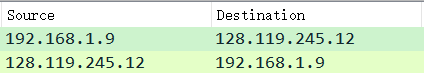

# 1 
> 列出上述步骤7中出现在未过滤的分组列表窗口的协议列中的3种不同的协议。

TCP, UDP, SSDP, HTTP, TLSv1.2, DNS, SSL, OICQ


# 2

> 从发送HTTP GET消息到收到HTTP OK应答需要多长时间?(默认情况下，数据包列表窗口中Time列的值是自Wireshark开始跟踪以来的时间(以秒为单位)。如果要以时间格式显示“时间”字段，请选择“Wireshark视图”下拉菜单，然后选择“时间显示格式”，然后选择“时间”。


17:57:28.977750  - 17:57:28.655767 = 0.321983s


# 3

> gaia.cs.umass.edu(也称为www.net.cs.umass.edu)的Internet地址是什么？您的计算机的Internet地址是什么？

我的计算机的Internet地址是192.168.1.9

gaia.cs.umass.edu的Internet地址是128.119.245.12



# 4

> 打印上面问题2中提到的两个HTTP消息(GET和OK)。在Wireshark文件命令菜单中选择“打印”，选中“仅选中数据包”和“按显示打印”按钮，单击“确定”

```
No.     Time                          Source                Destination           Protocol Length Info
    224 2023-07-23 17:57:28.655767    192.168.1.9           128.119.245.12        HTTP     635    GET /wireshark-labs/INTRO-wireshark-file1.html HTTP/1.1 

Frame 224: 635 bytes on wire (5080 bits), 635 bytes captured (5080 bits) on interface \Device\NPF_{F1B7E33D-CECF-4897-A9C4-555BE2AEF198}, id 0
    Section number: 1
    Interface id: 0 (\Device\NPF_{F1B7E33D-CECF-4897-A9C4-555BE2AEF198})
    Encapsulation type: Ethernet (1)
    Arrival Time: Jul 23, 2023 17:57:28.655767000 中国标准时间
    [Time shift for this packet: 0.000000000 seconds]
    Epoch Time: 1690106248.655767000 seconds
    [Time delta from previous captured frame: 0.000380000 seconds]
    [Time delta from previous displayed frame: 0.000000000 seconds]
    [Time since reference or first frame: 28.990607000 seconds]
    Frame Number: 224
    Frame Length: 635 bytes (5080 bits)
    Capture Length: 635 bytes (5080 bits)
    [Frame is marked: False]
    [Frame is ignored: False]
    [Protocols in frame: eth:ethertype:ip:tcp:http]
    [Coloring Rule Name: HTTP]
    [Coloring Rule String: http || tcp.port == 80 || http2]
Ethernet II, Src: IntelCor_ec:84:39 (40:1c:83:ec:84:39), Dst: zte_e0:66:32 (3c:f6:52:e0:66:32)
Internet Protocol Version 4, Src: 192.168.1.9, Dst: 128.119.245.12
Transmission Control Protocol, Src Port: 11416, Dst Port: 80, Seq: 1, Ack: 1, Len: 581
Hypertext Transfer Protocol

No.     Time                          Source                Destination           Protocol Length Info
    230 2023-07-23 17:57:28.977750    128.119.245.12        192.168.1.9           HTTP     237    HTTP/1.1 304 Not Modified 

Frame 230: 237 bytes on wire (1896 bits), 237 bytes captured (1896 bits) on interface \Device\NPF_{F1B7E33D-CECF-4897-A9C4-555BE2AEF198}, id 0
    Section number: 1
    Interface id: 0 (\Device\NPF_{F1B7E33D-CECF-4897-A9C4-555BE2AEF198})
    Encapsulation type: Ethernet (1)
    Arrival Time: Jul 23, 2023 17:57:28.977750000 中国标准时间
    [Time shift for this packet: 0.000000000 seconds]
    Epoch Time: 1690106248.977750000 seconds
    [Time delta from previous captured frame: 0.000000000 seconds]
    [Time delta from previous displayed frame: 0.321983000 seconds]
    [Time since reference or first frame: 29.312590000 seconds]
    Frame Number: 230
    Frame Length: 237 bytes (1896 bits)
    Capture Length: 237 bytes (1896 bits)
    [Frame is marked: False]
    [Frame is ignored: False]
    [Protocols in frame: eth:ethertype:ip:tcp:http]
    [Coloring Rule Name: HTTP]
    [Coloring Rule String: http || tcp.port == 80 || http2]
Ethernet II, Src: zte_e0:66:32 (3c:f6:52:e0:66:32), Dst: IntelCor_ec:84:39 (40:1c:83:ec:84:39)
Internet Protocol Version 4, Src: 128.119.245.12, Dst: 192.168.1.9
Transmission Control Protocol, Src Port: 80, Dst Port: 11416, Seq: 1, Ack: 582, Len: 183
Hypertext Transfer Protocol
```


