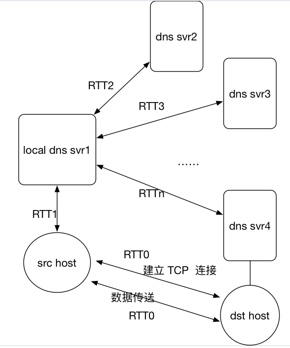
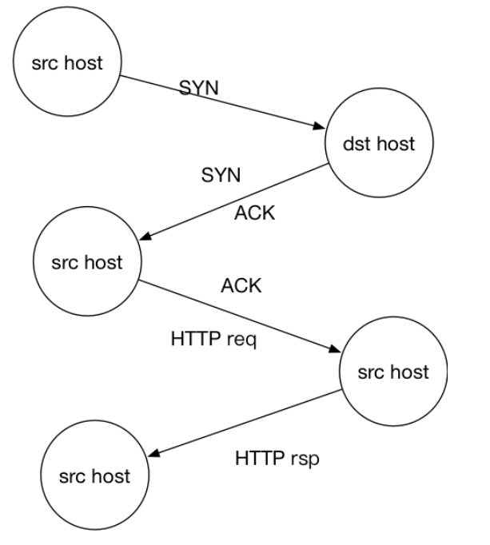
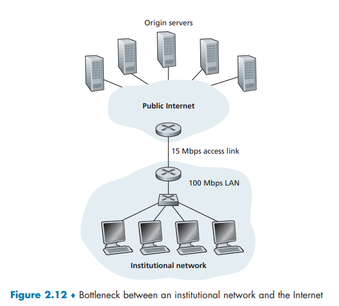
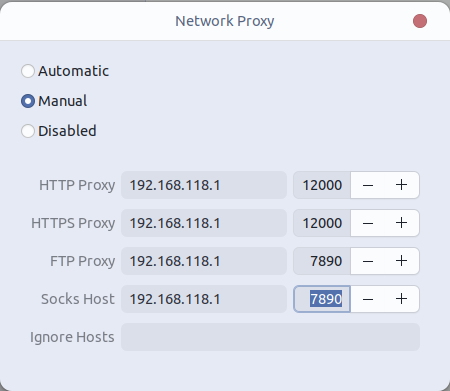
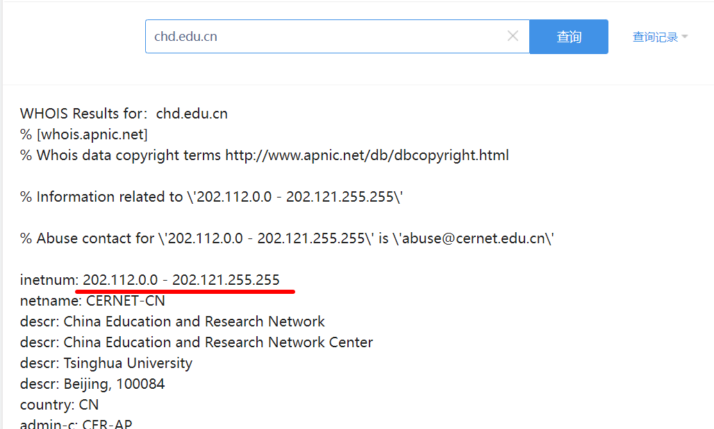
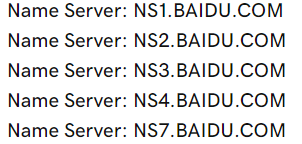

# P1

> 是非判断题
>
> a. 假设用户请求由一些文本和 3 幅图像组成的 Web 页面。对于这个页面，客户将发送一个请求报文并接收 4 个响应报文。
>
> b. 两个不同的 Web 页面（例如，`www.mit.edu/research.html `及 `www.mit.edu/students.html` ） 可以通过同一个持续连接发送。
>
> c. 在浏览器和初始服务器之间使用非持续连接的话，一个 TCP 报文段是可能携带两个不同的 HTTP 服务请求报文的。
>
> d. 在 HTTP 响应报文中的 Date: 首部指出了该响应中对象最后一次修改的时间。
>
> e. HTTP 响应报文决不会具有空的报文体。

## a

❌ 客户先对web页面进行请求, 然后在响应报文中得到1个文本和3 幅图像的URL, 然后根据这些URL发送1次或3次请求。

## b

✔ 因为客户与主机 `www.mit.edu` 建立了持续连接，所以同一台服务器上的不同网页都可以在该连接上传送。

## c

❌使用非持续连接的TCP连接只能传输一个请求报文和一个响应报文, 连接就关闭。即每个非持续连接在服务器发送一个对象/报文后就关闭连接

## d

❌在 HTTP 响应报文中的 `Last-Modified:` 首部指出了该响应中对象最后一次修改的时间。HTTP响应报文的`Date:`首部是指在服务器发送响应的时候，服务器生成该响应的时间戳。

### Date

HTTP响应报文的`Date`首部是指在服务器发送响应的时候，服务器生成该响应的时间戳。它的作用是指示响应生成的日期和时间，帮助客户端了解响应的时效性和服务器的当前时间。

`Date`首部的格式通常遵循RFC 7231中定义的HTTP日期格式，如下所示：

```
Date: Fri, 13 Aug 2023 15:30:45 GMT
```

在这个例子中，`Date`首部表示服务器在格林尼治标准时间（GMT）的时间点发送了响应。

`Date`首部的主要用途包括：

1. **缓存控制**：客户端可以使用`Date`首部来判断响应是否过期，以便决定是否从缓存中获取资源或从服务器重新请求资源。

2. **时效性判断**：客户端可以比较`Date`首部和其他相关时间信息，来评估响应的时效性，从而决定是否使用该响应。

3. **调试和日志记录**：`Date`首部可以帮助开发人员在服务器和客户端之间进行调试，以及记录服务器响应的时间戳。

需要注意的是，由于HTTP报文是通过网络传输的，因此服务器生成的时间戳应该基于可靠的时间源，以确保准确性。如果服务器的时间不准确，可能会影响缓存管理和客户端的处理。

### Last-Modified

HTTP响应报文中的`Last-Modified`首部是指在服务器端的资源上一次被修改的日期和时间。它表示了服务器上资源的最新修改时间，用于标识资源的更新时间，从而帮助客户端判断资源是否已经发生了变化。

`Last-Modified`首部的格式通常遵循RFC 7231中定义的HTTP日期格式，例如：

```
Last-Modified: Fri, 13 Aug 2023 10:15:30 GMT
```

这个首部的作用在于：

1. **缓存控制**：客户端可以在发送请求时，通过比较`Last-Modified`首部与之前保存的资源的最后修改时间来判断资源是否发生了变化。如果时间戳不同，客户端就知道服务器上的资源已经被修改，需要重新请求新的资源。

2. **条件请求**：客户端可以在请求中使用条件头，例如`If-Modified-Since`头，将之前记录的`Last-Modified`时间发送给服务器。如果服务器资源的最后修改时间早于这个时间戳，服务器可以返回304 Not Modified状态，指示客户端继续使用缓存中的资源而不重新下载。

3. **节省带宽**：通过使用`Last-Modified`首部和条件请求，客户端可以减少不必要的资源传输，从而节省带宽和提高性能。

需要注意的是，`Last-Modified`首部适用于静态资源等频繁不变的内容。对于频繁更新的动态内容，使用缓存控制策略如`Cache-Control`和`ETag`可能更为合适，因为它们可以提供更精细的缓存管理和验证机制。

## e

❌ HTTP 响应报文可能会具有空的报文体。

HTTP响应报文的报文体可以为空，这通常在以下情况下发生：

1. **响应状态为1xx（Informational）**：1xx状态码表示信息性响应，这些响应本身不包含实际的资源内容，因此它们的报文体为空。

2. **响应状态为204（No Content）**：当服务器成功处理请求，但没有返回实际内容时，可以使用204状态码。这意味着服务器没有资源表示可以发送给客户端，并且该响应没有报文体。

3. **响应状态为304（Not Modified）**：客户端使用条件请求（例如使用`If-Modified-Since`头）验证缓存时，如果资源未更改，服务器会返回304状态码。这种情况下，服务器不需要返回实际的资源内容，而是通过报文头部指示客户端继续使用缓存。

4. **某些错误状态码**：某些错误状态码，如401（Unauthorized）或403（Forbidden），可以不返回实际的资源内容，因为客户端没有权限访问资源。

5. **使用HEAD请求方法**：HTTP请求方法中的`HEAD`方法与`GET`方法相似，但是它在服务器响应中只返回首部信息，而不返回实际的资源内容。换句话说，使用`HEAD`方法，客户端可以获取关于资源的元数据，如响应头部，但不会下载资源的主体内容

需要注意的是，即使响应报文的报文体为空，它仍然可以包含响应头部，这些头部可能包含与响应相关的信息，如日期、内容类型、缓存控制等。响应报文的报文体为空通常是为了节省带宽、提高性能或遵循HTTP协议规范。

# P2

> SMS、iMessage 和 WhatsApp都是智能手机即时通信系统。在因特网上进行一些研究后，为这些系统分别写一段它们所使用协议的文字。然后撰文解释它们的差异所在。

​	SMS(短消息服务)是一种允许通过蜂窝网络在移动电话之间发送和接收文本信息的技术。一条短信可以包含140字节的数据，并且支持国际语言。消息的最大长度为160个7位字符、140个8位字符或70个16位字符。SMS通过ss# 7协议的移动应用部分(MAP)实现，短信协议由3GPP TS 23.040和3GPP TS 23.041定义。此外，MMS(多媒体消息服务)扩展了原始文本消息的功能，并支持发送照片、较长的文本消息和其他内容。

​	iMessage是苹果公司开发的即时通讯服务。iMessage支持我们通过蜂窝数据网络或WiFi发送到iOS设备和mac的文本、照片、音频或视频。苹果的iMessage基于专有的二进制协议APNs(苹果推送通知服务)。

​	WhatsApp Messenger是一种即时通讯服务，支持许多移动平台，如iOS, Android，移动电话，黑莓。WhatsApp用户可以通过蜂窝数据网络或WiFi相互发送无限的图像、文本、音频或视频。WhatsApp使用XMPP协议(可扩展消息和在场协议)。

iMessage和WhatsApp与SMS不同，因为它们使用数据计划发送消息，并且它们在TCP/IP网络上工作，但SMS使用我们从无线运营商那里购买的短信计划。而且iMessage和WhatsApp支持发送照片、视频、文件等，而原来的SMS只能发送文字信息。最后，iMessage和WhatsApp可以通过WiFi使用，但SMS不能

# P3

> 考虑一个 HTTP 客户要获取一个给定 URL 的 Web 页面。该 HTTP 服务器的 IP 地址开始时并不知道。在这种情况下，除了 HTTP 外，还需要什么运输层和应用层协议？

HTTP 协议基于运输层的TCP协议, 所以需要TCP协议。

另外, 要将HTTP服务器的主机名映射到IP地址, 需要应用层的DNS协议, 又因为DNS协议基于UDP协议, 所以也需要UDP协议。

综上,  除了 HTTP 外, 运输层协议需要TCP、 UDP协议,应用层需要DNS协议


# P4 

> 考虑当浏览器发送一个 HTTP GET 报文时，通过 Wireshark 俘获到下列 ASCII 字符串（即这是一个 HTTP GET 报文的实际内容）。字符` <cr> <lf>` 是回车和换行符（即下面文本中的斜体字符串` <cr> <lf> `表示单个回车符，该回车符包含在 HTTP 首部中的相应位置）。回答下列问题，指出你在下面 HTTP GET 报文中找到答案的地方。
>
> ```
> GET /cs453/index.html HTTP/1.1<cr><lf>
> Host: gaia.cs.umass.edu<cr><lf>
> User-Agent: Mozilla/5.0 ( Windows;U; Windows NT 5.1; en-US; rv:1.7.2) Gec ko/20040804 Netscape/7.2 (ax) <cr><lf>Accept:ext/xml, application/xml, application/xhtml+xml, text /html;q=0.9, text/plain;q=0.8,image/png,*/*;q=0.5 <cr><lf>
> Accept-Language: en-us,en;q=0.5<cr><lf>
> Accept- Encoding: zip,deflate<cr><lf>
> Accept-Charset: ISO -8859-1,utf-8;q=0.7,*;q=0.7<cr><lf>Keep-Alive: 300<cr> <lf>Connection:keep-alive<cr><lf><cr><lf>
> ```
>
> a. 由浏览器请求的文档的 URL 是什么？
>
> b. 该浏览器运行的是 HTTP 的何种版本？
>
> c. 该浏览器请求的是一条非持续连接还是一条持续连接？
>
> d. 该浏览器所运行的主机的 IP 地址是什么？
>
> e. 发起该报文的浏览器的类型是什么？在一个 HTTP 请求报文中，为什么需要浏览器类型？

## a

`Host: gaia.cs.umass.edu` 表示服务器的名称, `/cs453/index.html`表示文件名

所以文档的 URL : `http://gaia.cs.umass.edu/cs453/index.html `

## b

HTTP/1.1

## c

`Connection:keep-alive`表明浏览器请求的是持续连接

## d

这是个刁钻的问题。此信息不包含在任何HTTP消息中。因此，仅从HTTP消息的交换中无法看出这一点。回答这个问题需要来自IP数据报(承载了承载HTTP GET请求的TCP段)的信息

## e

`User-Agent: Mozilla/5.0 `暗示了浏览器类型

服务器需要浏览器类型信息来将同一对象的不同版本发送给不同类型的浏览器。

### User-Agent

在HTTP请求报文中包含浏览器类型（User-Agent）是为了让服务器了解客户端正在使用的浏览器和操作系统，从而根据不同的用户代理提供适当的内容和服务。以下是为什么需要浏览器类型的一些原因：

1. **内容适配与兼容性**：不同的浏览器和操作系统可能支持不同的特性和标准。服务器可以通过检查浏览器类型，为特定的浏览器提供适当的内容和功能，以确保在不同的浏览器中呈现一致的用户体验。

2. **移动设备支持**：许多网站会针对移动设备提供优化的内容，以适应不同的屏幕尺寸和交互方式。检测浏览器类型可以帮助服务器判断请求是否来自移动设备，并相应地提供适合移动浏览器的界面和功能。

3. **错误排查与分析**：知道用户使用的浏览器类型和版本可以帮助开发人员识别可能出现的问题。如果某个特定浏览器存在兼容性问题，开发人员可以更容易地排查和解决问题。

4. **统计和分析**：收集浏览器类型和版本信息可以帮助网站管理员了解访问者的浏览器使用情况。这对于分析用户群体、制定策略以及改进用户体验都是有价值的。

5. **浏览器功能支持**：某些功能可能只在特定版本的浏览器中受支持。根据浏览器类型，服务器可以决定是否使用某些功能或技术。

需要注意的是，浏览器类型是通过`User-Agent`首部字段传递给服务器的。然而，由于用户代理可以被伪造或修改，有些服务器可能会使用其他方式来检测浏览器类型，如JavaScript代码中的`navigator.userAgent`属性。尽管如此，浏览器类型在提供个性化内容、分析用户行为以及确保兼容性方面仍然具有重要作用。


# P5 

> 下面文本中显示的是来自服务器的回答，以响应上述问题中的 HTTP GET 报文。回答下列问题。指出你在下面报文中找到答案的地方。
>
> ```
> HTTP/1.1 200 OK <cr><lf>
> Date: Tue, 07 Mar 2008 12:39:45GMT<cr><lf>
> Server: Apache/2.0.52 (Fedora) <cr><lf>
> Last-Modified: Sat, 10 Dec2005 18:27:46 GMT<cr><lf>
> ETag: “526c3-f22-a88a4c80”<cr><lf>
> Accept- Ranges: bytes<cr><lf>
> Content-Length: 3874<cr><lf>
> Keep-Alive: timeout=max=100<cr><lf>
> Connection: Keep-Alive <cr><lf>
> Content-Type: text/html; charset= ISO-8859-1<cr><lf>
> <cr><lf>
> <!doctype html public “- //w3c//dtd html 4.0 transitional//en”><lf><html><lf> <head><lf> <meta http-equiv=”Content-Type” content=”text/html; charset=iso-8859-1”><lf> <meta name=”GENERATOR” content=”Mozilla/4.79 [en] (Windows NT 5.0; U) Netscape]”><lf> <title>CMPSCI 453 / 591 / NTU-ST550A Spring 2005 homepage</title><lf></head><lf> <much more document text following here (not shown)>
> ```
>
> a. 服务器能否成功地找到那个文档？该文档提供回答是什么时间？
>
> b. 该文档最后修改是什么时间？
>
> c. 文档中被返回的字节有多少？
>
> d. 文档被返回的前 5 个字节是什么？该服务器同意一条持续连接吗？

## a

响应状态码是`200 OK`, 所以服务器可以成功地找到那个文档。

响应时间可根据`Date: Tue, 07 Mar 2008 12:39:45GMT`看出来

## b

`Last-Modified: Sat, 10 Dec2005 18:27:46 GMT`

## c

`Content-Length: 3874`表明文本的大小是3874 byte

## d

文档的前5个字节为`<!doc`

`Connection: Keep-Alive`表明服务器同意建立一条持续连接

# P6 

> 获取 HTTP/1.1 规范 （RFC 2616）。回答下列问题
>
> [RFC 2616](https://www.rfc-editor.org/rfc/rfc2616.html)
>
> a. 解释在客户和服务器之间用于指示**关闭持续连接**的信令机制。客户、服务器或两者都能发送信令通知连接关闭了吗？
>
> b. HTTP 提供了什么加密服务？
>
> c. 一个客户能够与一个给定的服务器打开 3 条或更多并发连接吗？
>
> d. 如果一个服务器或一个客户检测到连接已经空闲一段时间，该服务器或客户可以关闭两者之间的传输连接。一侧开始关闭连接而另一侧通过该链路传输数据是可能的吗？请解释。

## a

通过查阅RFC 2616 8.1.2.1 Negotiation:

```txt
	An HTTP/1.1 server MAY assume that a HTTP/1.1 client intends to maintain a persistent connection unless a Connection header including the connection-token "close" was sent in the request. If the server chooses to close the connection immediately after sending the response, it SHOULD send a Connection header including the connection-token close.

   An HTTP/1.1 client MAY expect a connection to remain open, but would decide to keep it open based on whether the response from a server contains a Connection header with the connection-token close. In case the client does not want to maintain a connection for more than that request, it SHOULD send a Connection header including the connection-token close.

   If either the client or the server sends the close token in the Connection header, that request becomes the last one for the connection.
```

客户端和服务器通过在http请求/应答的连接头字段中包含连接令牌“close”来指示对方它将关闭持久连接

## b

HTTP不提供任何加密服务

## c

不能, 为了保证响应时间和避免出现网络拥塞, 一个客户端不能与一个服务器或代理服务器建立超过2条的并发连接。

```
8.1.4 Practical Considerations

	Clients that use persistent(持续) connections SHOULD limit the number of simultaneous(同时) connections that they maintain to a given server. A single-user client SHOULD NOT maintain more than 2 connections with any server or proxy. A proxy(代理服务器) SHOULD use up to 2N connections to another server or proxy, where N is the number of simultaneously active users. These guidelines are intended to improve HTTP response times and avoid congestion(拥塞).
```

## d

```
8.1.4 Practical Considerations

	A client, server, or proxy MAY close the transport connection at any time. 
	For example, a client might have started to send a new request at the same time that the server has decided to close the "idle" connection. From the server's point of view, the connection is being closed while it was idle, but from the client's point of view, a request is in progress.
	This means that clients, servers, and proxies MUST be able to recover from asynchronous close events. Client software SHOULD reopen the transport connection and retransmit the aborted sequence of requests without user interaction so long as the request sequence is idempotent(幂等的) (see section 9.1.2). Non-idempotent methods or sequences MUST NOT be automatically retried, although user agents MAY offer a human operator the choice of retrying the request(s). Confirmation by user-agent software with semantic(语义的) understanding of the application MAY substitute(替代品) for user confirmation. The automatic retry SHOULD NOT be repeated if the second sequence of requests fails.
```

由上述可知, 如果服务器正在请求关闭连接, 而客户端正在发送请求, 在客户端眼里请求正在被发送。

# P7 

> 假定你在浏览器中点击一条超链接获得 Web 页面。相关联的 URL 的 IP 地址没有缓存在本地主机上，因此必须使用 DNS lookup以获得该 IP 地址。如果主机从 DNS 得到 IP 地址之前已经访问了 n 个 DNS 服务器；相继产生的 RTT 依次为 RTT~1~、....、RTT~n~。进一步假定与链路相关的 Web 页面只包含一个对象，即由少量的 HTML 文本组成。令 RTT~0~表示本地主机和包含对象的服务器之间的 RTT 值。假定该对象传输时间为零，则从客户点击该超链接到它接收到该对象需要多长时间？

经过n个RTT后已经知道目标主机的IP, 则此时建立TCP连接。



因为TCP连接会有3次握手, 所以会额外产生一个RTT~0~ , 在第三次握手时开始请求对象, 在2个额外RTT~0~结束后, 接收到该对象。



所以客户点击该超链接到它接收到该对象需要
$$
2RTT_0 + \sum\limits_{i=1}^{n}RTT_i
$$

# P8 

> 参照习题 P7，假定在同一服务器上某 HTML，文件引用了 8 个非常小的对象。忽略发送时间，在下列情况下需要多长时间。
>
> a. 没有并行 TCP 连接的非持续 HTTP。
>
> b. 配置有 5 个并行连接的非持续 HTTP。
>
> c. 持续 HTTP。

## a

首先请求HTML, 产生1个TCP连接。再依次请求-接收8个小对象, 产生8个TCP连接, 总共9个TCP连接, 而每个TCP连接(握手到接收响应)耗时2个RTT~0~, 所以耗时为18个RTT~0~

所以在P7题目的基础上的总耗时为:
$$
(9 \times 2)RTT_0 + \sum\limits_{i=1}^{n}RTT_i \\
18RTT_0 + \sum\limits_{i=1}^{n}RTT_i
$$

## b

首先请求HTML, 产生1个TCP连接。再并行建立5个TCP连接请求5个小对象并接收, 再并行建立3个TCP连接请求3个小对象, 共产生3个同步的TCP连接, 即6个RTT~0~

所以在P7题目的基础上的总耗时为:
$$
(3 \times 2)RTT_0 + \sum\limits_{i=1}^{n}RTT_i \\
6RTT_0 + \sum\limits_{i=1}^{n}RTT_i
$$

## c

首先请求HTML, 产生1个TCP连接, 并保持。

如果客户端采用流水线式发送请求, 即在一次请求中包含所有8个小对象, 会产生1个RTT~0~。

所以在P7题目的基础上的总耗时为:
$$
(2 + 1)RTT_0 + \sum\limits_{i=1}^{n}RTT_i \\
3RTT_0 + \sum\limits_{i=1}^{n}RTT_i
$$
如果客户端不采用流水线式发送请求, 则请求8个小对象会花费8个RTT~0~。

所以在P7题目的基础上的总耗时为:
$$
(2 + 8) RTT_0 + \sum\limits_{i=1}^{n}RTT_i \\
10RTT_0 + \sum\limits_{i=1}^{n}RTT_i
$$

# P9 

> 考虑图 2-12，其中有一个机构的网络和因特网相连。
>
> 
>
> 假定对象的平均长度为 850 000 比特，从这个机构网的浏览器到初始服务器的平均请求率是每秒 16 个请求。还假定从接入链路的因特网一侧的路由器转发一个 HTTP 请求开始，到接收到其响应的平均时间是 3 秒（参见 2.2.5 节）。将总的平均响应时间建模为平均接入时延（即从因特网路由器到机构路由器的时延）和平均因特网时延之和。对于平均接入时延，使用 $\Delta/(1 - \Delta \beta)$，式中 $\Delta$ 是跨越接入链路发送一个对象的平均时间，$\beta$ 是对象对该接入链路的平均到达率。
>
> a.求出总的平均响应时间。
>
> b. 现在假定在这个机构 LAN 中安装了一个缓存器。假定错失率为 0.4（命中率为 0.6），求出总的响应时间。

## a

总的平均响应时间为平均接入时延和平均因特网时延之和

因为假设了HTTP请求报文很小, 所以忽略发送请求的时延, 发送对象后的时延

$\Delta$ 是跨越接入链路发送一个对象的平均时间, 则用**对象大小 / 接入链路带宽**计算
$$
\Delta = \frac{8.5\times 10^5}{ 15\times10^6}  \\
= 0.0567s
$$
$\beta$ 是对象对该接入链路的平均到达率, 因为这个机构网的浏览器到初始服务器的平均请求率是每秒 16 个请求, 因为每个请求经历的时延时相同的, 所以每个请求之间的间隔不变, 到达接入链路的频率与发送请求的频率相同
$$
\beta = 16
$$
所以平均接入时延:
$$
\frac{\Delta}{1 - \Delta \beta} \\
= \frac{0.0567}{1 - 16 \times 0.0567} \\
= \frac{0.0567}{0.0928} \\
= 0.611s
$$
因特网时延为3s, 所以总的平均响应时间为: $3.611s$

## b

60%的对象在web缓存被命中, 所以直接考虑从web缓存发送对象到客户主机的时延, 即一个对象大小 / 局域网带宽, 这个时延小到可以忽略。

40%的对象要经过因特网到web缓存, 在从web缓存中发送到客户主机

所以, 总的响应时间:
$$
0.6 \times \frac{8.5\times 10^5}{100\times10^6} + 0.4 \times (3.611+\frac{8.5\times 10^5}{100\times10^6}) \\
= 0.6\times 8.5\times10^{-3} + 0.4 \times (3.611 + 0.0085) \\
= 0.6\times 0 + 0.4\times (3.611 + 0) \\
= 1.44s
$$

# P10 

> 考虑一条 10 米短链路，某发送方经过它能够以 150 bps 速率双向传输。假定包含数据的分组是 100 000 比特长，仅包含控制（比如 ACK 和握手）的分组是 200 比特长。假定 N 个并行连接每个都获得 1/N 的链路带宽。现在考虑 HTTP 协议，并且假定每个下载对象是 100 kb 长，这些初始下载对象包含 10 个来自相同发送方的引用对象。在这种情况下，经非持续 HTTP 的并行实例的并行下载有意义吗？现在考虑持续 HTTP。你期待这比非持续的情况有很大增益吗？评价并解释你的答案。

令$T_p$表示客户端与服务器之间的单向传播时延, 假设光的传播速率为$3\times10^8 m/s$, 一直链路长度为10m
$$
T_p = \frac{10}{3\times10^8} = 0.03\mu s
$$
考虑使用非持续 HTTP 请求1个对象后, 然后并行请求10个引用对象的时延, 每个并行连接分到的带宽为15 bps

第一次, 建立一个TCP连接, 获取初始对象
$$
(\frac{200}{150}) + T_p + (\frac{200}{150}) + T_p + (\frac{200}{150}) + T_p + (\frac{100,000}{150}) + T_p
$$
然后, 并行建立10个TCP连接, 获取引用对象
$$
(\frac{200}{15}) + T_p + (\frac{200}{15}) + T_p + (\frac{200}{15}) + T_p + (\frac{100,000}{15}) + T_p
$$
综上, 总的时延为二者相加:
$$
(\frac{200}{150}) + T_p + (\frac{200}{150}) + T_p + (\frac{200}{150}) + T_p + (\frac{100,000}{150}) + T_p \\+ (\frac{200}{15}) + T_p + (\frac{200}{15}) + T_p + (\frac{200}{15}) + T_p + (\frac{100,000}{15}) + T_p \\
= 7377 + 8T_p \ (s)
$$
如果使用持续 HTTP 进行下载, 先建立一个TCP连接, 再获取初始对象, 再进行10次请求对象操作
$$
(\frac{200}{150}) + T_p + (\frac{200}{150}) + T_p + (\frac{200}{150}) + T_p \\+ (\frac{100,000}{150}) + T_p \\ + 10 \times (\frac{200}{150} +T_p +\frac{100,000}{150} + T_p) \\ 
= 7351 + 24T_p
$$
对比持续连接与非持续连接, 发现持续连接再短距离的链路中, 并没有比非持续连接响应的快很多。

# P11 

> 考虑在前一个习题中引出的情况。现在假定该链路由 Bob 和 4 个其他用户共享。 Bob 使用并行非持续 HTTP ，而其他 4 个用户使用无并行非持续 HTTP。
>
> a. Bob 的并行连接能够帮助他更快地得到 Web 页面吗？
>
> b. 如果所有 5 个用户打开 5 个非持续 HTTP 并行实例，那么 Bob 的并行连接仍将是有益的吗？为什么？

## a

Bob拥有比其他人跟多的连接, 所以会获得比其他人更多的带宽

## b

当所有人都使用持续的并行下载时, 如果Bob不使用, 他将会获得比其他用户更少的带宽。


# P12 

> 写一个简单的 TCP 程序，使服务器接收来自客户的行为并将其打印在服务器的标准输出上，（可以通过修改本书中的 TCPServer.py 程序来实现上述任务。）编译并运行你的程序。在另一台有浏览器的机器上，设置浏览器的代理服务器为你正在运行服务器程序的机器，同时适当地配置端口号。这时你的浏览器向服务器发送 GET 请求报文，你的服务器应当在其标准输出上显示该报文。使用这个平台来确定你的浏览器是否对本地缓存的对象产生了条件 GET 报文。

python文件

```py
from socket import *

serverPort = 12000
serverSocket = socket(AF_INET, SOCK_STREAM)
serverSocket.bind(('', serverPort))
# 开始聆听请求, 最大为1
serverSocket.listen(1)
print("The server is ready to recive")
# 当客户端请求连接时, 接收并分配一个专用的新的socket
connectionSocket, addr = serverSocket.accept()
while True:
    # 此后都是新的socket与用户相互发送数据
    sentenct = connectionSocket.recv(10240)
    print('From Server:', sentenct, '\n')
    connectionSocket.close()
```

在windows本地查询ip

```
ipconfig
```

得到ipv4的ip

```
192.168.118.1
```

在Linux主机上设置http和https代理服务器



在Linux端打开浏览器, 获取到GET报文

```
From Server: b'GET http://detectportal.firefox.com/canonical.html HTTP/1.1\r\n
Host: detectportal.firefox.com\r\n
User-Agent: Mozilla/5.0 (X11; Ubuntu; Linux x86_64; rv:109.0) Gecko/20100101 Firefox/116.0\r\n
Accept: */*\r\n
Accept-Language: en-US,en;q=0.5\r\n
Accept-Encoding: gzip, deflate\r\n
Cache-Control: no-cache\r\n
Pragma: no-cache\r\n
Connection: keep-alive\r\n\r\n'
```

没有发现`If-Modified-Since:`首部, 判断浏览器对对象没有使用条件GET

# P13

> 考虑经HTTP/2发送一个Web页面，该页面由1个视频片段和5幅图像组成。假定该视频片段要传输2000帧,而每幅图像有3帧。
>
> a.如果所有视频片段首先发送而没有交错，所有5幅图像发送完需要多少“帧时间"?
>
> b.如果帧是交错的,所有5幅图像发送完需要多少帧时间?

## a

$$
2000 + 3 \times 5 = 2015
$$

把帧时间看作发送一个帧所需要的时间, 因为是先发送视频,再发生5个图像, 所以当图像发生完毕后, 所需帧时间有2015个


## b

如果帧是交错发送的, 并且先发送视频的帧, 则依次在每一个帧时间内发送`视频, 图像1, 图像2, 图像3, 图像4, 图像5`的一个帧, 所以每6个帧时间将所有对象的一帧发出, 因为每个对象有3个帧, 所以经过18个帧时间将所有5个图像的所有帧发出

# P14

> 考虑习题P13中的Web页面。此时应用HTTP/2优先权。假定为所有图像赋予高于视频片段的优先权，并且为第一幅图像赋予高于第二幅图像的优先权，为第二幅图像赋予高于第三幅图像的优先权,等等。第二幅图像发完需要多少帧时间?

服务器发送响应报文帧的优先权情况

```
picture1 > picture2 > picture3 > picture4 > picture5 > video 
```

当`picture1`的3帧没有被发送完之前, 它的优先权一直是最高的, 所以picture1发送完后才会发送`picture2`, 所以发送完`picture2`需要$2\times3=6$个帧时间

# P15

> SMTP 中的 MAIL FROM 与该邮件报文自身的 From: 之间有什么不同？

SMTP中的MAIL FROM:是来自SMTP客户端的消息，用于标识向SMTP服务器发送邮件消息的发件人。邮件消息本身的 From:不是SMTP消息，而只是邮件消息正文中的一行

在电子邮件中，有两个不同的 "From" 地址，一个是SMTP中的 "MAIL FROM"，是与邮件服务器通信的语法格式, 指定了发送方的邮件地址, 但不一定是实际的邮件地址, 另一个是邮件报文头部中的 "From:",  它指定了邮件的实际发件人的地址。

1. **SMTP中的 MAIL FROM**：
   当你通过SMTP（Simple Mail Transfer Protocol）发送电子邮件时，邮件传输始于客户端（发送方）将邮件发送到邮件服务器。在这个过程中，客户端会使用类似以下命令的语法与服务器进行通信：
   
   ```
   MAIL FROM: <sender@example.com>
   ```
   
   这个命令指定了电子邮件的发件人地址，也就是邮件从哪里发送出去。注意，这个地址可能与邮件报文头部中的 "From:" 地址**不一致**，因为邮件服务器可以允许你发送电子邮件，但可能并不是你实际的邮件地址。

2. **邮件报文头部中的 From:**：
   在电子邮件的报文结构中，有一组头部字段用于描述邮件的各个方面，包括发件人、收件人、主题等等。其中一个字段就是 "From:"，它指定了邮件的实际发件人的地址。这个地址通常是邮件的真实发件人，接收者可以看到这个地址，并且可以通过它回复邮件。

总结来说，SMTP中的 "MAIL FROM" 地址是在电子邮件传输过程中指定的发件人地址，而邮件报文头部中的 "From:" 地址则是显示在邮件中，表示邮件的实际发件人。这两个地址可能相同，但在某些情况下（例如，代理服务器、转发），它们可能会有所不同。

# P16 

> SMTP 是怎样标识一个报文体结束的？HTTP 是怎样做的呢？HTTP 能够使用与 SMTP 标识一个报文体结束相同的方法吗？试解释。

SMTP 使用一个只包含 `.` 的行来标示邮件报文体的结束。

HTTP 使用响应报文中的 `Content-Length:`首部行来决定报文体在什么地方结束。

HTTP 不能够使用与 SMTP 同样的方法标识一个报文体结束，因为 SMTP 的报文体只允许是 7-bit 的 ASCII，而 HTTP 的报文体可以包含二进制数据。

# P17

> 阅读用于 SMTP 的 [RFC 5321](https://www.rfc-editor.org/rfc/rfc5321.html)。MTA 代表什么？
>
> 考虑下面收到的垃圾邮件（从一份真实垃圾邮件修改得到）。
>
> ```
> From - Fri Nov 07 13:41:30 2008
> 
> Return-Path: <tennis5@pp33head.com>
> 
> Received: from barmail.cs.umass.edu (barmail.cs.umass.edu [128.119.240.3]) by cs.umass.edu (8.13.1/8.12.6) for <hg@cs.umass.edu>; Fri, 7 Nov 2008 13:27:10 -0500
> PROBLEMS 175
> 
> Received: from asusus-4b96 (localhost [127.0.0.1]) by barmail.cs.umass.edu (Spam Firewall) for <hg@cs.umass.edu>; Fri, 7 Nov 2008 13:27:07 -0500 (EST)
> Received: from asusus-4b96 ([58.88.21.177]) by barmail.cs.umass.edu for <hg@cs.umass.edu>; Fri,
> 07 Nov 2008 13:27:07 -0500 (EST)
> ❗❗
> Received: from [58.88.21.177] by inbnd55.exchangeddd.com; Sat, 8 Nov 2008 01:27:07 +0700 From: "Jonny" <tennis5@pp33head.com>
> 
> To: <hg@cs.umass.edu>
> 
> Subject: How to secure your savings
> ```
>
> 假定这封垃圾邮件的唯一始作俑者是恶意的，而其他主机是诚实的，指出产生了这封垃圾邮件的恶意主机。

RFC 5321 2.3.3 Mail Agents and Message Stores

```
Additional mail system terminology became common after RFC 821 was published and, where convenient, is used in this specification.  
❗❗
In particular, SMTP servers and clients provide a mail transport service and therefore act as "Mail Transfer Agents" (MTAs).  
"Mail User Agents" (MUAs or UAs) are normally thought of as the sources and targets of mail.  At the source, an MUA might collect mail to be transmitted from a user and hand it off to an MTA; the final ("delivery") MTA would be thought of as handing the mail off to an MUA (or at least transferring responsibility to it, e.g., by depositing the message in a "message store").  However, while these terms are used with at least the appearance of great precision in
other environments, the implied boundaries between MUAs and MTAs often do not accurately match common, and conforming, practices with Internet mail.  Hence, the reader should be cautious about inferring the strong relationships and responsibilities that might be implied if these terms were used elsewhere.
```

MTA(Mail Transfer Agents)表示邮件传输代理, 主机将报文发送到MTA, 然后经过一系列MTA到达收件人的邮件阅读器。

我们看到该垃圾邮件遵循MTA链。诚实的MTA应报告其在何处接收邮件。请注意，在此报文中, `asusus-4b96 ([58.88.21.177])`不会报告其收到电子邮件的位置。由于我们假设只有发起者是不诚实的，因此`asusus-4b96([58.88.21.177])`一定是发起者

# P18

> 如题:
>
> a. 什么是whois数据库?
>
> b. 使用因特网上的各种 whois 数据库，获得两台DNS服务器的名字。指出你使用的是哪个whois 数据库。
>
> c. 你本地机器上使用nslookup向3台DNS服务器发送DNS查询:你的本地DNS服务器和两台你在(b)中发现的 DNS服务器。尝试对类型A、NS和MX报告进行查询。总结你的发现。
>
> d. 使用nslookup找出一台具有多个IP地址的Web服务器。你所在的机构（学校或公司)的Web服务器具有多个IP地址吗?
>
> e. 使用ARIN whois数据库,确定你所在大学使用的IP地址范围。
>
> f. 描述一个攻击者在发动攻击前，能够怎样利用whois 数据库和nslookup 工具来执行对一个机构的侦察。
>
> g. 讨论为什么 whois 数据库应当为公众所用。

## a

对于给定输入的域名（例如ccn.com) 、IP地址或网络管理员名称，可以使用whois数据库来定位相应的注册商、whois服务器、DNS服务器等

WHOIS（发音为"who is"）数据库是一个用于查询和检索互联网域名和IP地址相关信息的公共数据库。它存储了关于域名所有者、域名注册商、域名注册日期、到期日期、域名服务器信息等的数据。通过查询WHOIS数据库，你可以获取有关特定域名或IP地址的详细信息。

主要的用途包括：

1. **域名注册信息查询**：你可以使用WHOIS来查找某个域名的所有者信息，注册商信息，注册日期，以及域名到期日期等。这对于了解域名的归属权和状态非常有用。

2. **网络安全和欺诈检测**：WHOIS数据库使得网络管理员和安全专家能够追踪到不良行为，如网络攻击、垃圾邮件传播等。通过查看域名的注册信息，可以识别不法行为背后的责任人。

3. **联系域名所有者**：如果你想与一个域名的所有者取得联系，你可以使用WHOIS数据库中提供的联系信息。

4. **了解域名服务器信息**：WHOIS还提供了域名的DNS服务器信息，这对于网络管理员来说非常有用，因为他们可以使用这些信息来调试域名解析问题。

5. **商业用途**：一些公司和个人可能会使用WHOIS数据来开展业务活动，比如市场调研、销售、广告等。

需要注意的是，尽管WHOIS数据库是公开的，但出于隐私和安全考虑，一些域名注册商和所有者可能会选择隐藏或保护部分或全部的注册信息。这使得查询到的信息可能不是完全准确或详尽的。

## b

whois 数据库查询网址: https://who.is

```
Domain Name: BAIDU.COM 
Registrar WHOIS Server: whois.markmonitor.com
Creation Date: 1999-10-11T11:05:17Z
Name Server: NS1.BAIDU.COM
Name Server: NS2.BAIDU.COM
Name Server: NS3.BAIDU.COM
Name Server: NS4.BAIDU.COM
Name Server: NS7.BAIDU.COM
```

## c

在Ubuntu安装nslookup: `sudo apt-get install dnsutils`

没有指定域名的dns服务器就会使用本地的dns服务器, 发现本地的DNS服务器地址为`127.0.0.53#53`

```
wxc@wxc-virtual-machine:~$ nslookup www.baidu.com
Server:		127.0.0.53
Address:	127.0.0.53#53

Non-authoritative answer:
www.baidu.com	canonical name = www.a.shifen.com.
Name:	www.a.shifen.com
Address: 36.155.132.31
Name:	www.a.shifen.com
Address: 36.155.132.55
```

查询a记录

```
wxc@wxc-virtual-machine:~$ nslookup -type=a baidu.com
Server:		127.0.0.53
Address:	127.0.0.53#53

Non-authoritative answer:
Name:	baidu.com
Address: 39.156.66.10
Name:	baidu.com
Address: 110.242.68.66
```

查询ns记录

```
wxc@wxc-virtual-machine:~$ nslookup -type=ns baidu.com
Server:		127.0.0.53
Address:	127.0.0.53#53

Non-authoritative answer:
baidu.com	nameserver = ns2.baidu.com.
baidu.com	nameserver = ns7.baidu.com.
baidu.com	nameserver = ns4.baidu.com.
baidu.com	nameserver = dns.baidu.com.
baidu.com	nameserver = ns3.baidu.com.

Authoritative answers can be found from:
```

查询mx记录

```
wxc@wxc-virtual-machine:~$ nslookup -type=mx baidu.com
Server:		127.0.0.53
Address:	127.0.0.53#53

Non-authoritative answer:
baidu.com	mail exchanger = 10 mx.maillb.baidu.com.
baidu.com	mail exchanger = 20 mx1.baidu.com.
baidu.com	mail exchanger = 15 mx.n.shifen.com.
baidu.com	mail exchanger = 20 mx50.baidu.com.
baidu.com	mail exchanger = 20 usmx01.baidu.com.
baidu.com	mail exchanger = 20 jpmx.baidu.com.

Authoritative answers can be found from:

```

查询指定为`NS1.BAIDU.COM`的DNS服务器, 发现DNS服务器地址为`110.242.68.134#53`, 并且查询A记录

```
wxc@wxc-virtual-machine:~$ nslookup -type=a baidu.com NS1.BAIDU.COM
Server:		NS1.BAIDU.COM
Address:	110.242.68.134#53

Name:	baidu.com
Address: 39.156.66.10
Name:	baidu.com
Address: 110.242.68.66
```

查询NS记录

```
wxc@wxc-virtual-machine:~$ nslookup -type=ns baidu.com NS1.BAIDU.COM
Server:		NS1.BAIDU.COM
Address:	110.242.68.134#53

baidu.com	nameserver = dns.baidu.com.
baidu.com	nameserver = ns4.baidu.com.
baidu.com	nameserver = ns2.baidu.com.
baidu.com	nameserver = ns3.baidu.com.
baidu.com	nameserver = ns7.baidu.com.
```

查询MX记录

```
wxc@wxc-virtual-machine:~$ nslookup -type=mx baidu.com NS1.BAIDU.COM
Server:		NS1.BAIDU.COM
Address:	110.242.68.134#53

baidu.com	mail exchanger = 20 usmx01.baidu.com.
baidu.com	mail exchanger = 10 mx.maillb.baidu.com.
baidu.com	mail exchanger = 20 jpmx.baidu.com.
baidu.com	mail exchanger = 15 mx.n.shifen.com.
baidu.com	mail exchanger = 20 mx1.baidu.com.
baidu.com	mail exchanger = 20 mx50.baidu.com.
```

## d

```
$ nslookup -type=a baidu.com NS3.BAIDU.COM
Server:		NS3.BAIDU.COM
Address:	36.152.45.193#53

Name:	baidu.com
Address: 110.242.68.66
Name:	baidu.com
Address: 39.156.66.10
```

可以得知baidu.com的IP地址至少有`110.242.68.66`, `39.156.66.10`

## e

[ARIN whois](https://tool.chinaz.com/)



## f

whois数据库可以让我们知道一个域名的DNS主机名, 和IP范围



通过nslookup可以通过主机名获取对应的IP地址, 让我们可以进行攻击

```
$ nslookup -type=any baidu.com NS1.BAIDU.COM
```


```
Server:		NS1.BAIDU.COM
Address:	110.242.68.134#53

baidu.com
	origin = dns.baidu.com
	mail addr = sa.baidu.com
	serial = 2012147132
	refresh = 300
	retry = 300
	expire = 2592000
	minimum = 7200
baidu.com	text = "v=spf1 include:spf1.baidu.com include:spf2.baidu.com include:spf3.baidu.com include:spf4.baidu.com mx ptr -all"
baidu.com	text = "9279nznttl321bxp1j464rd9vpps246v"
baidu.com	text = "google-site-verification=GHb98-6msqyx_qqjGl5eRatD3QTHyVB6-xQ3gJB5UwM"
baidu.com	text = "_globalsign-domain-verification=qjb28W2jJSrWj04NHpB0CvgK9tle5JkOq-EcyWBgnE"
baidu.com	mail exchanger = 20 usmx01.baidu.com.
baidu.com	mail exchanger = 15 mx.n.shifen.com.
baidu.com	mail exchanger = 10 mx.maillb.baidu.com.
baidu.com	mail exchanger = 20 mx1.baidu.com.
baidu.com	mail exchanger = 20 jpmx.baidu.com.
baidu.com	mail exchanger = 20 mx50.baidu.com.
Name:	baidu.com
Address: 39.156.66.10
Name:	baidu.com
Address: 110.242.68.66
baidu.com	nameserver = ns4.baidu.com.
baidu.com	nameserver = ns3.baidu.com.
baidu.com	nameserver = ns2.baidu.com.
baidu.com	nameserver = ns7.baidu.com.
baidu.com	nameserver = dns.baidu.com.

```


## g

通过分析攻击数据包的源地址，受害者可以使用whois来获取有关攻击来自的域的信息，并可能告知源域的管理员

# P19 

> 在本习题中，我们使用在 Unix 和 Linux 主机上可用的 dig 工具来探索 DNS 服务器的等级结构。图 2-21 讲过，在 DNS 等级结构中较高的 DNS 服务器授权对该等级结构中较低的 DNS 服务器的 DNS 请求，这是通过向 DNS 客户发送回那台较低层次的 DNS 服务器的名字来实现的。先阅读 dig 的帮助页，再回答下列问题。
>
> a. 从一台根 DNS 服务器（从根服务器 [a-m].root-server.net 之一）开始，通过使用 dig 得到你所在系的 Web 服务器的 IP 地址，发起一系列查询。显示回答你的查询的授权链中的 DNS 服务器的名字列表。
>
> b. 对几个流行 Web 站点如 google.com、yahoo.com 或 amazon.com，重复上一小题。

`dig -h`显示dig的帮助页

```
Usage:  dig [@global-server] [domain] [q-type] [q-class] {q-opt}
            {global-d-opt} host [@local-server] {local-d-opt}
            [ host [@local-server] {local-d-opt} [...]]
Where:  domain	  is in the Domain Name System
        q-class  is one of (in,hs,ch,...) [default: in]
        q-type   is one of (a,any,mx,ns,soa,hinfo,axfr,txt,...) [default:a]
                 (Use ixfr=version for type ixfr)
        q-opt    is one of:
                 -4                  (use IPv4 query transport only)
                 -6                  (use IPv6 query transport only)
                 -b address[#port]   (bind to source address/port)
                 -c class            (specify query class)
                 -f filename         (batch mode)
                 -k keyfile          (specify tsig key file)
                 -m                  (enable memory usage debugging)
                 -p port             (specify port number)
                 -q name             (specify query name)
                 -r                  (do not read ~/.digrc)
                 -t type             (specify query type)
                 -u                  (display times in usec instead of msec)
                 -x dot-notation     (shortcut for reverse lookups)
                 -y [hmac:]name:key  (specify named base64 tsig key)
        d-opt    is of the form +keyword[=value], where keyword is:
                 +[no]aaflag         (Set AA flag in query (+[no]aaflag))
                 +[no]aaonly         (Set AA flag in query (+[no]aaflag))
                 +[no]additional     (Control display of additional section)
                 +[no]adflag         (Set AD flag in query (default on))
                 +[no]all            (Set or clear all display flags)
                 +[no]answer         (Control display of answer section)
                 +[no]authority      (Control display of authority section)
                 +[no]recurse        (Recursive mode (+[no]rdflag))
```

基本用法

```
dig [@global-server] [domain]
```


## a

非递归从根DNS服务器`a.root-servers.net`查询`it.chd.edu.cn`的IP

如果递归`dig @a.root-servers.net it.chd.edu.cn`就直接查到了

查询根DNS服务器

```
$ dig @a.root-servers.net it.chd.edu.cn  +norec
```

结果, 获得cn顶级域的列表

```
;; AUTHORITY SECTION:
cn.			172800	IN	NS	c.dns.cn.
cn.			172800	IN	NS	b.dns.cn.
cn.			172800	IN	NS	ns.cernet.net.
cn.			172800	IN	NS	e.dns.cn.
cn.			172800	IN	NS	a.dns.cn.
cn.			172800	IN	NS	d.dns.cn.
```

继续查询其中一个cn顶级域DNS服务器

```
$ dig @c.dns.cn. it.chd.edu.cn  +norec
```

得到edu.cn的DNS列表

```
;; AUTHORITY SECTION:
edu.cn.			172800	IN	NS	deneb.dfn.de.
edu.cn.			172800	IN	NS	dns2.edu.cn.
edu.cn.			172800	IN	NS	ns2.cernet.net.
edu.cn.			172800	IN	NS	ns2.cuhk.hk.
edu.cn.			172800	IN	NS	dns.edu.cn.
```

继续查询`edu.cn`域的DNS服务器

```
$ dig @dns2.edu.cn. it.chd.edu.cn  +norec
```

得到chde.edu.cn的权威DNS服务器的列表

```
;; AUTHORITY SECTION:
chd.edu.cn.		172800	IN	NS	dns2.chd.edu.cn.
chd.edu.cn.		172800	IN	NS	dns1.chd.edu.cn.
```

最后查询权威DNS服务器

```
$ dig @dns2.chd.edu.cn. it.chd.edu.cn  +norec
```

结果发现`it.chd.edu.cn.`是`lxsy.chd.edu.cn.`的别名

该别名有A记录, 所以`it.chd.edu.cn.`的IP地址为`202.117.64.155`

```
;; ANSWER SECTION:
it.chd.edu.cn.		600	IN	CNAME	lxsy.chd.edu.cn.
lxsy.chd.edu.cn.	600	IN	A	202.117.64.155
```


## b 

```
$ dig @a.root-servers.net baidu.com  +norec
```

结果得到com顶级域的DNS服务器名称

```
...
; AUTHORITY SECTION:
com.			172800	IN	NS	e.gtld-servers.net.
com.			172800	IN	NS	b.gtld-servers.net.
com.			172800	IN	NS	j.gtld-servers.net.
com.			172800	IN	NS	m.gtld-servers.net.
com.			172800	IN	NS	i.gtld-servers.net.
com.			172800	IN	NS	f.gtld-servers.net.
com.			172800	IN	NS	a.gtld-servers.net.
com.			172800	IN	NS	g.gtld-servers.net.
com.			172800	IN	NS	h.gtld-servers.net.
com.			172800	IN	NS	l.gtld-servers.net.
com.			172800	IN	NS	k.gtld-servers.net.
com.			172800	IN	NS	c.gtld-servers.net.
com.			172800	IN	NS	d.gtld-servers.net.
...
```

在随便选一个comDNS服务器继续查询

```
$ dig @e.gtld-servers.net. baidu.com  +norec
```

结果为baidu.com的权威域名服务器

```
;; AUTHORITY SECTION:
baidu.com.		172800	IN	NS	ns2.baidu.com.
baidu.com.		172800	IN	NS	ns3.baidu.com.
baidu.com.		172800	IN	NS	ns4.baidu.com.
baidu.com.		172800	IN	NS	ns1.baidu.com.
baidu.com.		172800	IN	NS	ns7.baidu.com.
```

在随便选一个baidu的权威DNS服务器继续查询

得到最终结果

```
;; ANSWER SECTION:
baidu.com.		600	IN	A	110.242.68.66
baidu.com.		600	IN	A	39.156.66.10
```

发现与直接使用`dig baidu.com`结果一致

# P20

> 假定你能够访问所在系的本地 DNS 服务器中的缓存。你能够提出一种方法来粗略地确定在你所在系的用户中最为流行的 Web 服务器（你所在系以外）吗？解释原因。

我们可以对 DNS 缓存进行周期性的快照，在缓存中出现的最频繁的站点就是最为流行的 Web 服务器。因为大部分用户都对此站点感兴趣，所以对它的 DNS 查询就更为频繁，所以在缓存中出现得更频繁。

对某个站点的缓存频率越高, 说明站点的DNS查询越频繁, 说明可会访问该站点频繁, 说明该站点在用户中受欢迎


# P21 

> 假设你所在系具有一台用于系里所有计算机的本地 DNS 服务器。你是普通用户（即你不是网络/系统管理员）。你能够确定是否在几秒钟前从你系里的一台计算机可能访问过一台外部 Web 站点吗？解释原因。

可以确定。可以使用`dig`在本地DNS服务器查询那个外部站点, 如果query time 为 0ms 表示该站点的A记录已经缓存到了本地DNS服务器, 否则如果query time很大, 则说明在我之前没有人访问过那个外部站点

```
$ dig cnn.com
```

```
;; Query time: 11 msec
;; SERVER: 127.0.0.53#53(127.0.0.53)
;; WHEN: Fri Aug 25 10:14:16 CST 2023
;; MSG SIZE  rcvd: 100
```

几秒后再次访问

```
;; Query time: 0 msec
;; SERVER: 127.0.0.53#53(127.0.0.53)
;; WHEN: Fri Aug 25 10:15:25 CST 2023
;; MSG SIZE  rcvd: 100
```


# P22

> 考虑向 N 个对等方分发 F = 20 Gb 的一个文件。该服务器具有 $u_s$ = 30 Mbps 的上载速率，每个对等方具有$d_i$ = 2 Mbps 的下载速率和上载速率 u。对于 N = 10、100 和 1000 并且 u = 300 kbps、700 kbps 和 2 Mbps，对于 N 和 u 的每种组合会指出确定最小分发时间的图表。需要分别针对客户-服务器分发和 P2P 分发两种情况制作。

## C-S

最小分发事件
$$
D_{cs} = max\{\frac{NF}{u_s}, \frac{F}{d_{min}}\} \\
= max\{N\frac{20\times1024^3}{30\times1024^2}, \frac{20\times1024^3}{2\times 1024^2}\} \\
= max\{N \frac{2\times1024}{3}\}, 10\times1024\} \\
$$
因为在C-S体系结构下, 对等方不用上传, 所以$D_{cs}$与u无关

| N\u  | 300kbps   | 700kbps   | 2Mbps     |
| ---- | --------- | --------- | --------- |
| 10   | 10240     | 10240     | 10240     |
| 100  | 68266.67  | 68266.67  | 68266.67  |
| 100  | 682666.67 | 682666.67 | 682666.67 |

## P2P

最小分发时间
$$
D_{P2P} = max\{\frac{F}{u_s}, \frac{F}{d_i}, \frac{NF}{u_s + \sum\limits_{i = 1}^{N}u_i}\} \\
= max\{\frac{20\times1024^3}{30\times1024^2}, \frac{20\times1024^3}{2\times 1024^2}, N\frac{20\times1024^3}{30\times1024^2 + \sum\limits_{i = 1}^{N}u_i}\} \\
= max\{\frac{2\times1024}{3}, 10240,
N\frac{20\times1024^3}{30\times1024^2 + \sum\limits_{i = 1}^{N}u_i}\} \\
$$
$N = 10, u_i = 300kbps, D_{P2P} = 1024$
$$
N = 100, u_i = 700kbps\\ 
D_{P2P} = 100\frac{20\times1024^3}{30\times1024^2 + 100 \times(300/1024)\times1024^2}\} \\
D_{P2P} = \frac{2\times10^3\times1024^3}{30\times1024^2 + 100 \times(300/1024)\times1024^2}\} \\
$$


| N\u  | 300kbps  | 700kbps  | 2Mbps |
| ---- | -------- | -------- | ----- |
| 10   | 10240    | 10240    | 10240 |
| 100  | 34538.67 | 20821.33 | 10240 |
| 100  | 63412    | 28700    | 10240 |

# P23

> 考虑使用一种客户-服务器体系结构向 N 个对等方分发一个 F 比特的文件。假定一种流体模型，即某服务器能够同时向多个对等方传输，只要组合速率不超过 $u_s$，则以不同的速率向每个对等方传输。
>
> a. 假定$ u_s/N \le d_{min}$。定义一个具有 $NF/u_s$ 分发时间的分发方案。
>
> b. 假定 $u_s/N \ge d_{min}$。定义一个具有 $F/d_{min}$ 分发时间的分发方案。
>
> c. 得出最小分发时间通常是由 $\max\{ NF/us, F/d_{min} \}$ 所决定的讨论。

$$
D_{cs} \ge max\{\frac{NF}{u_s}, \frac{F}{d_{min}}\} \\
$$

## a

分发方案:

服务器并行地以速率$u_s/N$发送文件, 因为$u_s/N \le d_{min}$, 所以客户端可以以速率$u_s/N$接受文件, 接受整个文件的时间是$F/(u_s/ N) = NF / u_s$, 因为是并行的, 所以总的时间也是$NF / u_s$

随着$u_s/ N$越来越小于$d_{min}$, $D_{CS}$越来越大于$NF/u_s$

所以
$$
D_{CS} \ge NF/ u_S
$$

## b

服务器并行地以速率$u_s/N$发送文件, 因为服务器传输速率大于客户端接收速率: $u_s/N \ge d_{min}$, 所以最后一个客户端只能以速率$d_{min}$接受文件, 所以总的花费时间等于N个并行传输链路中最慢的费时: $F / min\{d_i\} = F / d_{min}$

## c

我们已知
$$
D_{cs} \ge max\{\frac{NF}{u_s}, \frac{F}{d_{min}}\} \\
$$
可以得到$D_{CS} \ge NF / u_s$

又由(a)可知$D_{CS} \le NF/u_s$, 所以, 当$u_s/ N \le d_{min}$, 有$D_{CS} = NF / u_s$

由(b)可知$D_{CS} \ge F / d_{min}$, 所以, 当$u_s/ N \ge d_{min}$, 有$D_{CS} = F / d_{min}$

综上, 在N个并行发送情况下, 总的最小分发时延可以取到
$$
D_{cs} = max\{\frac{NF}{u_s}, \frac{F}{d_{min}}\} \\
$$


# P24

> 考虑虑使用 P2P 体系结构向 N 个用户分发 F 比特的一个文件。假定一种流体模型。为了简化起见，假定 $d_{min}$ 很大，因此对等方下载带宽不会成为瓶颈。
>
> a. 假定 $u_s \le (u_s + u_1 + ... + u_n)/N$。定义一个具有 $F/u_s$ 分发时间的分发方案。
>
> b. 假定 $u_s \ge (u_s + u_1 + ... + u_n)/N$。定义一个具有 $NF/(u_s + u_1 + ... + u_n)$ 分发时间的分发方案。
>
> c. 得出最小分发时间通常是由 $\max\{F/u_s, NF/(u_s + u_1 + ... + u_n)\}$ 所决定的结论。

由于假定 $d_{min}$ 很大, 所以
$$
D_{P2P} \ge max\{\frac{NF}{u_s + \sum\limits_{i = 1}^{N}u_i}, \frac{F}{u_s}\} \\
$$
令$u = \sum\limits_{i = 1}^{N}u_i$

## a

分发方案:


由假设: 
$$
u_s \le (u + u_s) / N \\
u_s \le u / N + u_s/ N \\
u_s(1-1/N) \le u /N \\
u_s(N -1) \le u \\
u_s \le u / (N - 1)
$$


分发方案:

将文件分为N块, 每块大小为$(u_i/u)F$, (容易看出$\sum\limits_{i = 1}^{N} \frac{u_i}{u}F = F/u\sum\limits_{i=1}^{N}u_i = F$)服务器并行地以速率$r_i = \frac{u_i}{u}u_s$将第`i`块分发给第`i`个对等方, 第`i`个对等方要并行地给其它N-1个对等方以速率$r_i$发送块。所以第`i`个对等方的总发送速率为$(N -1)r_i$
$$
(N - 1)r_i = (N - 1)(u_su_i)/u \le u_i
$$
上式满足假设, 所以每个对等方的发送速率可取$(N -1)r_i$

第`i`个对等方总接收速率(接收服务器的加接收其它N-1个对等方的比特速率)
$$
r_i + \sum\limits_{j \ne i}r_j = u_s
$$
所以每个对等方在$F/u_s$时刻接收到该文件的所有块

## b

由假设
$$
u_s \ge (u + u_s) / N \\
$$
令$r_i = u_i/(N - 1), r_{N + 1} = \frac{u_s - u/(N-1)}{N}$

分发方案:

将文件分成N+1块, 服务器先并行地将N块中的第`i`块分发给第`i`个对等方, 然后每个对等方以速率$r_i$将所持有的块分发给其余N-1个对等方, 同时服务器将第N+1块以速率$r_{N+1}$并行分发给N个对等方, 此时这些对等方不用分发块

所以服务器的总发送速率为
$$
r_1 + ... + r_N + Nr_{N+1} = u / (N - 1) + u_s - u /(N-1) = u_s
$$


每个对等方地发送速率依然是:
$$
(N-1)r_i = u_i
$$
因此, 每个对等方要同时接收服务器地2个块, 其余N-1个服务器地N-1个块, 所以每个对等方接收bit的总速率为:
$$
r_i + r_{N + 1} + \sum\limits_{j \ne i}r_j\\
= u / (N - 1) + (u_s - u(N- 1)) / N \\
= (u_s + u) / N
$$
因此每个对等方接收到文件的所有N+1个块耗费的时间为
$$
\frac{F}{(u_s + u) / N} \\
 = \frac{NF}{(u_s + u)} \\
$$

## c

当
$$
u_s \le (u + u_s) / N \\
$$
有
$$
D_{P2P} = F / u_s
$$
当
$$
u_s \ge (u + u_s) / N \\
$$
有
$$
D_{P2P} = \frac{NF}{(u_s + u)}
$$
综上, 按此种流体模式可以取到最小值
$$
D_{P2P} = max\{\frac{NF}{u_s + \sum\limits_{i = 1}^{N}u_i}, \frac{F}{u_s}\} \\
$$

# P25 

> 考虑在一个有 N 个活跃对等方的覆盖网络中，每对对等方有一条活跃的 TCP 连接。此外，假定该 TCP 连接通过总共 M 台路由器。在对应的覆盖网络中，有多少结点和边？

结点只包括对等方结点, 边描述的是对等方地文件传输关系

由图论知识, 无向完全图有$N(N-1)/2$条边, 

 所以, 在该覆盖网络中总共有$N$个结点, $N(N-1)/2$条边


# P26

> 假定 Bob 加入 BitTorrent，但他不希望向任何其他对等方上载任何数据（因此称为搭便车）。
>
> a. Bob 声称他能够收到由该社区共享的某文件的完整副本。Bob 所言是可能的吗？为什么？
>
> b. Bob 进一步声称他还能够更有效地进行他的 “搭便车”，方法是利用所在系的计算机实验室中的多台计算机（具有不同的 IP 地址）。他怎样才能做到这些呢？

## a

可能，因为持有块的用户不仅仅以上载速率的前 4 位作为发送块的对象，它还会每隔30s随机选取另外一位用户给他发送块，所以只要在洪流中待的时间足够长，就有可能收集到足够的块, 以至于这些块构成一个完整的文件。

## b

因为每台计算机有不同的IP地址, 所在让这些主机都加入到洪流中"搭便车", 只要各个主机收集到的块能够组成他想要的文件, 他甚至可以些程序让每个不同的主机请求该文件的不同的块, 以便更快地完成文件地下载。

# P27

> 考虑一个具有N个视频版本(具有N个不同地速率和质量)和N个音频版本(具有N个不同地速率和质量)的DASH系统。假设我们向允许播放者在任何时间选择N个版本和N个音频版本之一:
>
> a. 如果我们生成音频和视频混合的文件, 因此服务器在任何时间仅发送一个媒体流, 该服务器将需要存储多少个文件(每个文件有一个不同的URL)?
>
> b. 如果该服务器分别发送音频流和视频流并且与客户同步这些流, 该服务器将需要存储多少个文件?

## a

N个文件, 我们根据媒体质量从高到低地将视频与音频一对一匹配(质量高的对质量高的),并存储在一个文件地址。

## b

因为客户端会同步音频流和视频流, 所以服务器端不需要将二者一起存储到一个文件, 所以在服务器端会存储2N个文件

# P28

> 一台主机上安装编译 TCPClient 和 UDPClient Python 程序，在另一台主机上安装编译 TCPServer 和 UDPServer 程序。
>
> a. 如果你在运行 TCPServer 之前运行 TCPClient，将发生什么现象？为什么？
>
> b. 如果你在运行 UDPServer 之前运行 UDPClient，将发生什么现象？为什么？
>
> c. 如果你对客户端和服务器使用了不同的端口，将发生什么现象？

本题使用本书实例python程序分别在windows端和Linux端验证

## a

先在客户端允许客户端程序

```
$ python3 ./TCPClient.py 
```

结果表明, 连接被拒绝, 与不存在的服务器进程不会建立TCP连接

```
Traceback (most recent call last):
  File "./TcpClient.py", line 8, in <module>
    clientSocket.connect((serverName, serverPort))
ConnectionRefusedError: [Errno 111] Connection refused
```

## b

先在客户端允许客户端程序

```
$ python3 ./UDPClient.py
```

通信正常进行

```
Input lowercase sentece:jkdalk
JKDALK
```

## c

如果使用不同的端口号, 则客户端会建立连接失败, 或者与一个错误的进程建立了连接

# P29

> 假定在 `UDPClient.py` 中在创建套接字后增加下面一行：`clientsocket.bind(('', 5432))`，有必要修改 UDPServer.py 吗？UDPClient 和 UDPServer 中的套接字端口号是多少？在变化之前它们是多少？

UDPServer.py

```python
from socket import *

serverPort = 12000
serverSocket = socket(AF_INET, SOCK_DGRAM)
serverSocket.bind(('', serverPort))
print("The server is ready to recive")
while True:
    #  获取的clientAddress中就包含客户端程序的端口号
    message, clientAddress = serverSocket.recvfrom(2048)
    modifiedMessage = message.decode().upper()
    serverSocket.sendto(modifiedMessage.encode(), clientAddress)
```

UDPClient.py

```python
from socket import *


serverName = '172.20.10.7'
serverPort = 12000

clientSocket = socket(AF_INET, SOCK_DGRAM)
# 手动绑定端口号, 而不是由OS决定
clientsocket.bind(('', 5432))
message = input("Input lowercase sentece:")

clientSocket.sendto(message.encode(), (serverName, serverPort))

modifiedMessage, serverAddress = clientSocket.recvfrom(2048)

print(modifiedMessage.decode())

clientSocket.close()
```

在添加之前, 客户端的端口号是OS分配的, 添加`clientsocket.bind(('', 5432))`后, 给socket指定了端口号5432

因为服务器程序是通过UDP客户端发送的数据包中的源端口号来确定客户端进程的端口号的, 而不是在服务器端把客户端的端口号写死, 所以UDP服务器可以给任意端口号进行通信, 所以手动给客户端socket绑定端口号不会影响服务器端的允许。

变化之前: 

客户端socket由OS分配, 服务器socket = 12000

变化之后:

客户端socket =5432 , 服务器socket = 12000

# P30

> 你能够配置浏览器以打开对某 Web 站点的多个并行连接吗？有大量的并行 TCP 连接的优点和缺点是什么？

在传统的Web浏览器中，不能直接配置浏览器以打开对特定网站的多个并行连接。但是，浏览器在加载网页时会使用一些技术来实现并行连接，以加快页面加载速度。这些技术包括：

1. **域名分片（Domain Sharding）**：浏览器通过在不同的子域名上请求资源来实现并行连接，因为浏览器会限制每个域名的并行连接数。例如，将一个页面上的资源分布在多个子域名上（如static1.example.com、static2.example.com），可以增加并行加载的资源数。
2. **并行请求**：浏览器可以同时请求页面上的多个资源，例如图片、样式表和脚本，从而利用可用的并行连接数来加快页面加载。
3. **预连接（Preconnect）**：浏览器可以通过在页面加载之前预先建立连接来减少连接建立时间，从而加快资源的加载速度。

优点是您可能会更快地下载文件。缺点是您可能会占用带宽，从而显著减慢共享相同物理链接的其他用户的下载速度

# P31

> 我们已经看到因特网 TCP 套接字将数据处理为字节流，而 UDP 套接字识别报文边界。面向字节 API 与显示识别和维护应用程序定义的报文边界的 API 相比，试给出一个优点和一个缺点。

对于诸如远程登录（telnet 和 ssh）之类的应用程序，面向字节流的协议是非常自然的，因为应用程序中没有**消息边界**的概念。 当用户键入一个字符时，我们只需将该字符放入 TCP 连接中即可。 

在其他应用程序中，我们可能会发送一系列消息，这些消息之间具有固有的边界。 例如，当一个 SMTP 邮件服务器连续向另一个 SMTP 邮件服务器发送多封电子邮件时。 由于 TCP 没有指示边界的机制，因此应用程序必须自行添加指示，以便应用程序的接收方能够区分一个消息与下一个消息。 如果将每个消息放入不同的 UDP 段中，则接收端将能够区分各种消息，而无需应用程序的发送端添加任何指示。

## P32

> 什么是 Apache Web 服务器？它值多少钱？它当前有多少功能？为回答这个问题，你也需要看一下维基百科。

Apache HTTP Server（通常称为Apache Web服务器或简称为Apache）是一款开源的、跨平台的Web服务器软件，用于托管和提供网站、应用程序和内容。它由Apache软件基金会（Apache Software Foundation）开发和维护。Apache Web服务器是一款非常流行的服务器软件，被广泛用于互联网上的网站和应用程序。

Apache Web服务器是免费开源软件，根据Apache许可证发布。这意味着您可以免费下载、使用、修改和分发Apache软件，无需支付任何费用。Apache许可证是一种宽松的开源许可证，允许您在遵守许可证规定的条件下自由使用软件。

关于Apache Web服务器的功能，它目前具有许多功能，包括但不限于：

1. **静态和动态内容的服务**：Apache可以提供静态HTML、CSS、JavaScript文件，以及动态的脚本生成的内容，如PHP、Python、Perl等。

2. **虚拟主机支持**：Apache允许在同一台服务器上托管多个域名和网站，通过虚拟主机功能实现。

3. **模块化架构**：Apache的插件架构允许用户加载和启用不同的模块，以扩展服务器的功能，如SSL加密、URL重写、身份验证等。

4. **安全性特性**：Apache提供许多安全性特性，包括访问控制、身份验证、SSL/TLS加密等，以保护服务器和传输数据的安全性。

5. **日志记录**：Apache可以生成详细的访问日志和错误日志，有助于监控和故障排除。

6. **反向代理和负载均衡**：Apache可以用作反向代理服务器，将请求转发给后端应用服务器，并支持负载均衡，提高性能和可用性。

7. **URL重写和重定向**：Apache可以通过URL重写规则修改URL，实现用户友好的URL结构和重定向。

8. **缓存支持**：Apache支持缓存设置，以减轻后端服务器的负载，提高响应速度。

