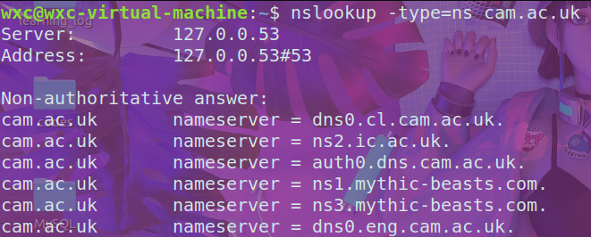

# nslookup

使用nslookup时, 没有指定DNS服务器, 则默认发送到本地DNS服务器

如果没有指定type, 默认查询A记录

## Q1

> 运行 nslookup 获取亚洲 Web 服务器的 IP 地址。 该服务器的 IP 地址是什么？ 

`110.242.68.66`和`39.156.66.10`

## Q2

> 运行 nslookup 确定欧洲大学的权威 DNS 服务器。

## Q3

>  运行 nslookup，以便在问题 2 中获得的 DNS 服务器之一查询 Yahoo! 的邮件服务器。它的IP地址是什么？

借助剑桥的DNS服务器, 查询yahoo的邮件服务器失败, 只能借助本地DNS服务器, 可以查到

# Tracing DNS with Wireshark

## Q4

> 找到 DNS 查询和响应消息。 那么是通过 UDP 还是 TCP 发送？

DNS查询和响应都是通过UDP发送的

## Q5

> DNS查询报文的目的端口是什么？ DNS响应报文的源端口是什么？ 

查询报文的目标端口是53

响应报文的源端口是53

## Q6

> DNS查询报文发送到什么IP地址？ 使用 ipconfig 确定本地 DNS 服务器的 IP 地址。 这两个IP地址相同吗？ 

查询报文发送到了`233.6.6.6`

通过`ipconfig /all` 查看本地DNS服务器确实也是`233.6.6.6`

## Q7

> 检查 DNS 查询报文。 DNS 查询是什么“Type”？ 查询报文中是否包含任何“Answer”？

DNS查询的是A类型的RR

查询报文中没有任何Anwser

## Q8

>  检查 DNS 响应消息。 提供了多少个“答案”？ 每个答案都包含什么内容？

提供了2个A记录

每个记录都包含了`Name, Type, Class, TTL, Data length, Address`

返回的两个IP地址分别是:`104.16.45.99`和`104.16.44.99`

## Q9

> 考虑主机发送的后续 TCP SYN 数据包。 SYN 数据包的目标 IP 地址是否与 DNS 响应消息中提供的任何 IP 地址相对应？ 

TCP的目标地址就是上一个DNS查询得到的两个IP地址的第一个:`104.16.45.99`

## Q10

> 该网页包含图像。 在检索每个图像之前，您的主机是否发出新的 DNS 查询？

没有

---

## Q11

从上面的截图中我们看到，nslookup 实际上发送了 3 个 DNS 查询并收到了 3 个 DNS 响应。 出于本作业的目的，在回答以下问题时，请忽略前两组查询/响应，因为它们特定于 nslookup 并且通常不是由标准 Internet 应用程序生成的。 相反，您应该关注最后的查询和响应消息。

> DNS查询报文的目的端口是什么？ DNS响应报文的源端口是什么？ 

DNS查询报文的目的端口是53

DNS响应报文的源端口是53

## Q12

> DNS查询报文发送到什么IP地址？ 这是您默认本地 DNS 服务器的 IP 地址吗？ 

确实是我的本地DNS服务器

## Q13

> 检查 DNS 查询报文。 DNS 查询的是什么“Type”？ 查询消息中是否包含任何“Answer”？ 

查询的是AAAA类型

查询报文中没有包含"Answer"

## Q14

> 检查 DNS 响应消息。 提供了多少个"Answer"？ 每个答案都包含什么内容？ 

4个Answer, 包含的内容如上图

## Q15

> 提供屏幕截图。

---

## Q16

> DNS 查询报文发送到哪个 IP 地址？ 这是您默认本地 DNS 服务器的 IP 地址吗？

是

## Q17

> 检查 DNS 查询报文。 DNS 查询的是什么“Type”？ 查询消息中是否包含任何“Answer”？ 

查询的类型是NS类型的

没有任何"Answer"

## Q18

> 检查 DNS 响应报文。 提供了多少个“Answer”？ 每个答案都包含什么内容？
>

包含了8条NS类型的RR

包含的内容:

## Q19

>  提供屏幕截图。

---

用其它DNS服务器查询失败

所以用whois查询到`aiit.or.kr`的DNS服务器

## Q20

> DNS 查询报文发送到哪个 IP 地址？ 这是您默认本地 DNS 服务器的 IP 地址吗？
>

DNS 查询报文发送到了`58.120.225.173`

本地DNS服务器地址为`144.144.144.144`

二者不同, 是因为我指定了DNS服务器

## Q21

> 检查 DNS 查询报文。 DNS 查询的是什么“Type”？ 查询消息中是否包含任何“Answer”？ 
>

A类型

没有Answer

## Q22

> 检查 DNS 响应报文。 提供了多少个“Answer”？ 每个答案都包含什么内容？

包含了1个A记录, 具体信息如下图

## Q23

> 提供屏幕截图。

