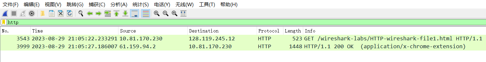
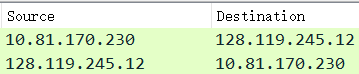
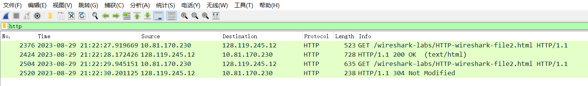
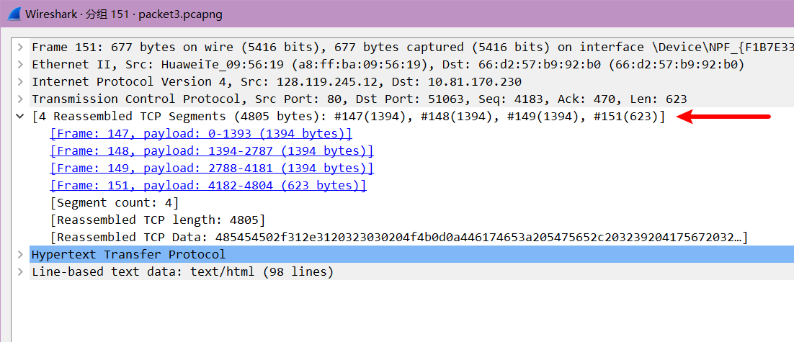
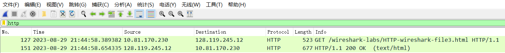
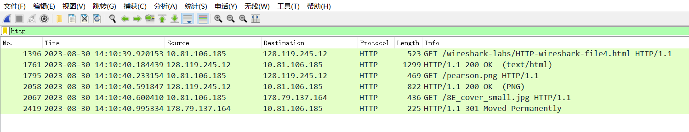
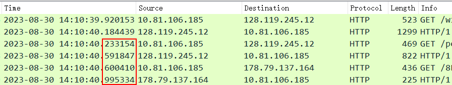
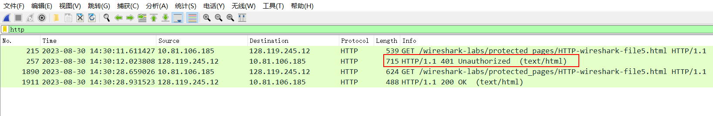
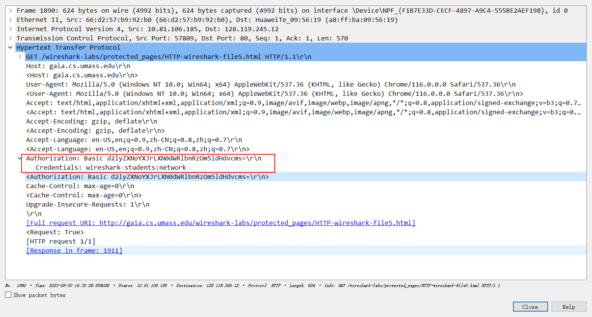
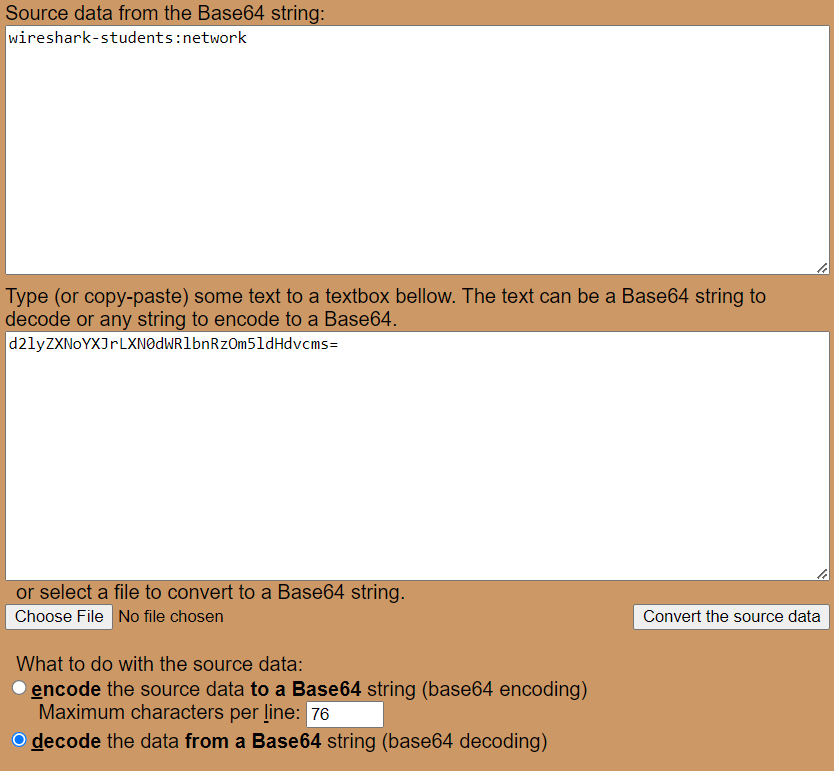

# The Basic HTTP GET / response interaction

通过查看 HTTP GET 和响应消息中的信息，回答以下问题。 回答以下问题时，您应该打印出 GET 和响应消息（有关如何执行此操作的说明，请参阅介绍性 Wireshark 实验室），并指出您在消息中的何处找到了回答以下问题的信息。 当您提交作业时，请对输出进行注释，以便清楚地显示您在输出中的何处获取答案信息（例如，对于我们的课程，我们要求学生用笔标记纸质副本，或使用 彩色字体的文本）。

注意❗❗ : 通过`http`访问而不是`chrome`默认的`https`

```
http://gaia.cs.umass.edu/wireshark-labs/HTTP-wireshark-file1.html
```



## 请求报文

```
Hypertext Transfer Protocol
    GET /wireshark-labs/HTTP-wireshark-file1.html HTTP/1.1\r\n
    Host: gaia.cs.umass.edu\r\n
    <Host: gaia.cs.umass.edu\r\n>
    User-Agent: Mozilla/5.0 (Windows NT 10.0; Win64; x64) AppleWebKit/537.36 (KHTML, like Gecko) Chrome/116.0.0.0 Safari/537.36\r\n
    <User-Agent: Mozilla/5.0 (Windows NT 10.0; Win64; x64) AppleWebKit/537.36 (KHTML, like Gecko) Chrome/116.0.0.0 Safari/537.36\r\n>
    Accept: text/html,application/xhtml+xml,application/xml;q=0.9,image/avif,image/webp,image/apng,*/*;q=0.8,application/signed-exchange;v=b3;q=0.7\r\n
    <Accept: text/html,application/xhtml+xml,application/xml;q=0.9,image/avif,image/webp,image/apng,*/*;q=0.8,application/signed-exchange;v=b3;q=0.7\r\n>
    Accept-Encoding: gzip, deflate\r\n
    <Accept-Encoding: gzip, deflate\r\n>
    Accept-Language: en-US,en;q=0.9,zh-CN;q=0.8,zh;q=0.7\r\n
    <Accept-Language: en-US,en;q=0.9,zh-CN;q=0.8,zh;q=0.7\r\n>
    Upgrade-Insecure-Requests: 1\r\n
    \r\n
    [Full request URI: http://gaia.cs.umass.edu/wireshark-labs/HTTP-wireshark-file1.html]
    <Request: True>
    [HTTP request 1/1]

```

## 响应报文

```
Hypertext Transfer Protocol
    HTTP/1.1 200 OK\r\n
    Content-Type: application/x-chrome-extension\r\n
    <Content-Type: application/x-chrome-extension\r\n>
    Content-Length: 106799\r\n
    <Content-Length: 106799\r\n>
    Connection: keep-alive\r\n
    <Connection: keep-alive\r\n>
    Server: Default-server-KS-CLOUD-XG-02-05\r\n
    <Server: Default-server-KS-CLOUD-XG-02-05\r\n>
    ETag: "Ka3HdaPh0pNfJU4FZp8bqAplGJA="\r\n
    Date: Tue, 29 Aug 2023 07:23:44 GMT\r\n
    <Date: Tue, 29 Aug 2023 07:23:44 GMT\r\n>
    Last-Modified: Tue, 29 Aug 2023 07:13:15 GMT\r\n
    <Last-Modified: Tue, 29 Aug 2023 07:13:15 GMT\r\n>
    Expires: Sat, 16 Mar 2024 07:23:44 GMT\r\n
    Age: 20504\r\n
    Cache-Control: public, max-age=17280000\r\n
    <Cache-Control: public, max-age=17280000\r\n>
    Accept-Ranges: bytes\r\n
    X-Cache: TCP_HIT\r\n
    X-AspNetMvc-Version: 5.2\r\n
    MS-CorrelationId: 944d8c27-48ca-4c5e-a9ff-3acea56ff9db\r\n
    MS-RequestId: ebe518e5-f41b-43d2-8beb-0f2ed8530cc2\r\n
    MS-CV: YqW91qzKfUSqNnLz.0\r\n
    X-AspNet-Version: 4.0.30319\r\n
    X-Powered-By: ASP.NET\r\n
    X-Powered-By: ARR/3.0\r\n
    X-Powered-By: ASP.NET\r\n
    X-CID: 16\r\n
    X-CCC: CN\r\n
    X-Azure-Ref-OriginShield: Ref A: CCB7EE5EACFE4B4E85F6299B812DCD44 Ref B: SG2EDGE2407 Ref C: 2023-08-29T07:19:15Z\r\n
    X-MSEdge-Ref: Ref A: F79E8F782E024E5890006AF07D8A9C56 Ref B: HKBEDGE0508 Ref C: 2023-08-29T07:23:44Z\r\n
    x-link-via: lzct53:80;hamp16:443;gzun11:443;xg02:443;\r\n
    X-Cache-Status: MISS from KS-CLOUD-XG-02-05\r\n
    X-Cache-Status: MISS from KS-CLOUD-GZ-UN-11-03\r\n
    X-Cache-Status: HIT from KS-CLOUD-HA-MP-16-19\r\n
    X-Cache-Status: HIT from KS-CLOUD-LZ-CT-53-11\r\n
    X-Cdn-Request-ID: ef1ebe5882cfc963a70a987ddefccbe4\r\n
    \r\n
    <Response: True>
    [HTTP response 1/1]
    File Data: 106799 bytes

```


## Q1

> 您的浏览器运行的是 HTTP 版本 1.0 还是 1.1？ 服务器运行什么版本的 HTTP？ 

````
GET /wireshark-labs/HTTP-wireshark-file1.html HTTP/1.1\r\n
````

由GET请求行可知, 客户端浏览器运行的是 HTTP 版本 1.1

```
HTTP/1.1 304 Not Modified\r\n
```

由响应行可知, 服务器浏览器运行的也是 HTTP 版本 1.1

## Q2

> 您的浏览器表明可以接受服务器的哪些语言（如果有）？ 

`Accept-Language` 是HTTP请求头之一，用于指示客户端偏好的语言

每个语言标签由两个部分组成：语言代码和地区代码，用连字符 `-` 分隔。例如，`en-US` 表示美国英语，`fr-FR`表示法国法语。

权重值是一个介于0和1之间的浮点数跟在`;q=`后面

```
Accept-Language: en-US,en;q=0.9,zh-CN;q=0.8,zh;q=0.7\r\n
```

由`Accept-Language:`请求头可知, 客户端接收` en-US, en, zh-CN, zh`, 并且对应的偏好值以此为`1, 0.9, 0.8, 0.7`

## Q3

> 您电脑的IP地址是多少？ gaia.cs.umass.edu 服务器的呢？ 



通过Wireshark捕获的http报文, 可以知道包的源和目的地IP地址

上面的是GET请求, 所以客户端的IP地址为`10.81.170.230`

`gaia.cs.umass.edu`的IP地址为: `128.119.245.12`

## Q4

> 服务器返回给浏览器的状态码是什么？ 

 ```
 HTTP/1.1 200 OK\r\n
 ```

由响应报文行可知, 状态码为200

## Q5

> 您正在检索的 HTML 文件最后一次在服务器上修改是什么时候？

```
 Last-Modified: Tue, 29 Aug 2023 07:13:15 GMT\r\n
```

由` Last-Modified:`报文头可知文件上次修改时间为: `Tue, 29 Aug 2023 07:13:15 GMT`

## Q6

> 有多少字节的内容返回到您的浏览器？ 

```
<Content-Length: 106799\r\n>
```

106799 bytes

## Q7

> 通过检查数据包内容窗口中的原始数据，您是否看到数据中未显示在数据包列表窗口中的任何标头？ 如果有，请说出一个。

` Last-Modified`数据没有出现在列表标头


# The HTTP CONDITIONAL GET/response interaction



进行了连续的2次请求

第一个响应式200, 第2个响应是304

## Q8

> 检查从浏览器到服务器的第一个 HTTP GET 请求的内容。 您是否在 HTTP GET 中看到“IF-MODIFIED-SINCE”行？ 

第一个 HTTP GET 请求的内容如下, 没有看到`IF-MODIFIED-SINCE`首部行

```
Hypertext Transfer Protocol
    GET /wireshark-labs/HTTP-wireshark-file2.html HTTP/1.1\r\n
    Host: gaia.cs.umass.edu\r\n
    <Host: gaia.cs.umass.edu\r\n>
    User-Agent: Mozilla/5.0 (Windows NT 10.0; Win64; x64) AppleWebKit/537.36 (KHTML, like Gecko) Chrome/116.0.0.0 Safari/537.36\r\n
    <User-Agent: Mozilla/5.0 (Windows NT 10.0; Win64; x64) AppleWebKit/537.36 (KHTML, like Gecko) Chrome/116.0.0.0 Safari/537.36\r\n>
    Accept: text/html,application/xhtml+xml,application/xml;q=0.9,image/avif,image/webp,image/apng,*/*;q=0.8,application/signed-exchange;v=b3;q=0.7\r\n
    <Accept: text/html,application/xhtml+xml,application/xml;q=0.9,image/avif,image/webp,image/apng,*/*;q=0.8,application/signed-exchange;v=b3;q=0.7\r\n>
    Accept-Encoding: gzip, deflate\r\n
    <Accept-Encoding: gzip, deflate\r\n>
    Accept-Language: en-US,en;q=0.9,zh-CN;q=0.8,zh;q=0.7\r\n
    <Accept-Language: en-US,en;q=0.9,zh-CN;q=0.8,zh;q=0.7\r\n>
    Upgrade-Insecure-Requests: 1\r\n
    \r\n
    [Full request URI: http://gaia.cs.umass.edu/wireshark-labs/HTTP-wireshark-file2.html]
    <Request: True>
    [HTTP request 1/2]
    [Response in frame: 2424]
    [Next request in frame: 2504]

```


## Q9

> 检查服务器响应的内容。 服务器是否显式返回了文件的内容？ 你怎么知道？ 

第一个 HTTP GET 请求对应的响应报文内容如下

```
Hypertext Transfer Protocol
    HTTP/1.1 200 OK\r\n
    Date: Tue, 29 Aug 2023 13:22:29 GMT\r\n
    <Date: Tue, 29 Aug 2023 13:22:29 GMT\r\n>
    Server: Apache/2.4.6 (CentOS) OpenSSL/1.0.2k-fips PHP/7.4.33 mod_perl/2.0.11 Perl/v5.16.3\r\n
    <Server: Apache/2.4.6 (CentOS) OpenSSL/1.0.2k-fips PHP/7.4.33 mod_perl/2.0.11 Perl/v5.16.3\r\n>
    Last-Modified: Tue, 29 Aug 2023 05:59:01 GMT\r\n
    <Last-Modified: Tue, 29 Aug 2023 05:59:01 GMT\r\n>
    ETag: "173-6040981f40bfa"\r\n
    Accept-Ranges: bytes\r\n
    Content-Length: 371\r\n
        [Content length: 371]
    <Content-Length: 371\r\n>
    Content-Type: text/html; charset=UTF-8\r\n
    <Content-Type: text/html; charset=UTF-8\r\n>
    \r\n
    <Response: True>
    [HTTP response 1/2]
    [Time since request: 0.252757000 seconds]
    [Request in frame: 2376]
    [Next request in frame: 2504]
    [Next response in frame: 2520]
    [Request URI: http://gaia.cs.umass.edu/wireshark-labs/HTTP-wireshark-file2.html]
    File Data: 371 bytes

```

由`Content-Length: 371`和` Content-Type: text/html`可知服务器是显式返回了文件的内容

## Q10

> 现在检查从浏览器到服务器的第二个 HTTP GET 请求的内容。 您是否在 HTTP GET 中看到“IF-MODIFIED-SINCE:”行？ 如果是这样，“IF-MODIFIED-SINCE:”标头后面有哪些信息？ 

第二个 HTTP GET 请求的内容如下:

```
Hypertext Transfer Protocol
    GET /wireshark-labs/HTTP-wireshark-file2.html HTTP/1.1\r\n
    Host: gaia.cs.umass.edu\r\n
    <Host: gaia.cs.umass.edu\r\n>
    User-Agent: Mozilla/5.0 (Windows NT 10.0; Win64; x64) AppleWebKit/537.36 (KHTML, like Gecko) Chrome/116.0.0.0 Safari/537.36\r\n
    <User-Agent: Mozilla/5.0 (Windows NT 10.0; Win64; x64) AppleWebKit/537.36 (KHTML, like Gecko) Chrome/116.0.0.0 Safari/537.36\r\n>
    Accept: text/html,application/xhtml+xml,application/xml;q=0.9,image/avif,image/webp,image/apng,*/*;q=0.8,application/signed-exchange;v=b3;q=0.7\r\n
    <Accept: text/html,application/xhtml+xml,application/xml;q=0.9,image/avif,image/webp,image/apng,*/*;q=0.8,application/signed-exchange;v=b3;q=0.7\r\n>
    Accept-Encoding: gzip, deflate\r\n
    <Accept-Encoding: gzip, deflate\r\n>
    Accept-Language: en-US,en;q=0.9,zh-CN;q=0.8,zh;q=0.7\r\n
    <Accept-Language: en-US,en;q=0.9,zh-CN;q=0.8,zh;q=0.7\r\n>
    Cache-Control: max-age=0\r\n
    <Cache-Control: max-age=0\r\n>
    If-Modified-Since: Tue, 29 Aug 2023 05:59:01 GMT\r\n
    If-None-Match: "173-6040981f40bfa"\r\n
    Upgrade-Insecure-Requests: 1\r\n
    \r\n
    [Full request URI: http://gaia.cs.umass.edu/wireshark-labs/HTTP-wireshark-file2.html]
    <Request: True>
    [HTTP request 2/2]
    [Prev request in frame: 2376]
    [Response in frame: 2520]

```

观察到了`If-Modified-Since: Tue, 29 Aug 2023 05:59:01 GMT\r\n`

后面表示请求发送的时间


## Q11

> 服务器响应第二次 HTTP GET 返回的 HTTP 状态代码和短语是什么？ 服务器是否显式返回了文件的内容？ 解释。

```
Hypertext Transfer Protocol
    HTTP/1.1 304 Not Modified\r\n❗❗❗
    Date: Tue, 29 Aug 2023 13:22:31 GMT\r\n
    <Date: Tue, 29 Aug 2023 13:22:31 GMT\r\n>
    Server: Apache/2.4.6 (CentOS) OpenSSL/1.0.2k-fips PHP/7.4.33 mod_perl/2.0.11 Perl/v5.16.3\r\n
    <Server: Apache/2.4.6 (CentOS) OpenSSL/1.0.2k-fips PHP/7.4.33 mod_perl/2.0.11 Perl/v5.16.3\r\n>
    ETag: "173-6040981f40bfa"\r\n
    \r\n
    <Response: True>
    [HTTP response 2/2]
    [Time since request: 0.255974000 seconds]
    [Prev request in frame: 2376]
    [Prev response in frame: 2424]
    [Request in frame: 2504]
    [Request URI: http://gaia.cs.umass.edu/wireshark-labs/HTTP-wireshark-file2.html]

```

状态码是304, 短语是`Not Modified`, 

没有``Content-Length`和` Content-Type`首部行, 所以没有显示地返回文件内容, 

因为第二次发送请求包含

```
If-Modified-Since: Tue, 29 Aug 2023 05:59:01 GMT\r\n
```

而文件上次修改时间

```
Last-Modified: Tue, 29 Aug 2023 05:59:01 GMT\r\n
```

因为修改日期在请求日期之前, 代理服务器拦截后, 发现在代理服务器出地对象缓存可以使用, 所以直接命中代理服务器, 所以web服务器没有返回内容, 但仍对

# Retrieving Long Documents

在我们的例子中，HTML 文件相当长，4500 字节太大，无法容纳在一个 TCP 数据包中。 因此，单个 HTTP 响应消息被 TCP 分成几个部分，每个部分都包含在一个单独的 TCP 段中



## Q12

> 您的浏览器发送了多少条 HTTP GET 请求消息？ 跟踪中的哪个数据包编号包含法案或权利的 GET 消息？

一个GET请求



其下紧接着的响应报文好汉了文档的全部内容

## Q13

> 跟踪中的哪个数据包编号包含与 HTTP GET 请求的响应关联的状态代码和短语？

151

## Q14

> 响应中的状态代码和短语是什么？

200 OK

## Q15

>  需要多少个包含数据的 TCP 段来承载单个 HTTP 响应和权利法案文本？

4个

# HTML Documents with Embedded Objects

## Q16

> 您的浏览器发送了多少条 HTTP GET 请求消息？ 这些 GET 请求发送到哪些 Internet 地址？ 



发送了3条HTTP GET请求

前两个GET请求发送到了`128.119.245.12`

第3个GET请求发送到了`178.79.137.164`


## Q17

> 您能否判断您的浏览器是串行下载这两个图像，还是从两个网站并行下载它们？ 解释。



应该是串行下载的, 根据时间来看, 因为第一个GET请求接收到后才发送第二个GET请求

# HTTP Authentication

wireshark-students

network

http://gaia.cs.umass.edu/wireshark-labs/protected_pages/HTTP-wireshark-file5.html

## Q18

> 服务器对来自浏览器的初始 HTTP GET 消息的响应（状态代码和短语）是什么？ 



401 Unauthorized

## Q19

> 当您的浏览器第二次发送HTTP GET消息时，HTTP GET消息中包含哪些新字段？



包含了`Authorization`的认证消息

您输入的用户名 (wireshark-students) 和密码 (network) 编码在客户端 HTTP GET 消息中“Authorization: Basic”标头后面的字符串 (d2lyZXNoYXJrLXN0dWRlbnRzOm5ldHdvcms=) 中。 虽然您的用户名和密码可能看起来已加密，但它们只是以 Base64 格式进行**编码**。 用户名和密码其实是未加密的！

在https://www.motobit.com/util/base64-decoder-encoder.asp可以将已经编为Base64的码进行解码, 可以得到输入的用户名和密码



由于任何人都可以下载像 Wireshark 这样的工具并嗅探通过其网络适配器传递的数据包（不仅仅是他们自己的数据包），并且任何人都可以将 Base64 转换为 ASCII（您刚刚做到了！），因此您应该清楚 WWW 上的简单密码 除非采取额外措施，否则站点并不安全。 

不要害怕！ 正如我们将在第 8 章中看到的，有一些方法可以使 WWW 访问更加安全。 然而，我们显然需要一些超出基本 HTTP 身份验证框架的东西！