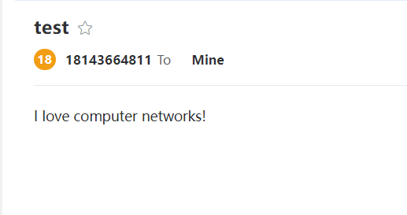

`SMTPClient.py`

先与网易的SMTP服务器`smtp.163.com`建立TCP连接,

再进行用户登录,`m18143664811@163.com` 防止被识别为垃圾邮件

每条命令都已回车(CR)和换行(LF)结尾

再向`2415571314@qq.com`的用户发送邮件

```py
from socket import *
msg = "\r\n I love computer networks!"
endmsg = "\r\n.\r\n"

# Choose a mail server (e.g. Google mail server) and call it mailserver
mailserver = 'smtp.163.com'


# Create socket called clientSocket and establish 
#   a TCP connection with mailserver
#Fill in start 
clientSocket = socket(AF_INET, SOCK_STREAM)
clientSocket.connect((mailserver, 25))
#Fill in end
recv = clientSocket.recv(1024).decode()
print(recv)
if recv[:3] != '220':
    print('220 reply not received from server.')
# Send HELO command and print server response.
heloCommand = 'HELO m18143664811@163.com\r\n'
clientSocket.send(heloCommand.encode())
recv1 = clientSocket.recv(1024).decode()
print(recv1)
if recv1[:3] != '250':
    print('250 reply not received from server.')
 

def getMailFrom(source):
    return "MAIL FROM: <" + source +">\r\n"
def getRcptTo(target):
    return "RCPT TO: <" + target + ">\r\n"

login = "auth login\r\n"
clientSocket.send(login.encode())
res = clientSocket.recv(1024).decode()
print(res)

user = "MTgxNDM2NjQ4MTFAMTYzLmNvbQ==\r\n"
clientSocket.send(user.encode())
res = clientSocket.recv(1024).decode()
print(res)

pwd = "TFRMWUxaUldUTk1TRlRCUA==\r\n"
clientSocket.send(pwd.encode())
res = clientSocket.recv(1024).decode()
print(res)

# Send MAIL FROM command and print server response.
# Fill in start
local = getMailFrom("m18143664811@163.com")
clientSocket.send(local.encode())
recv = clientSocket.recv(1024).decode()
print(recv)
# Fill in end
# Send RCPT TO command and print server response. 
# Fill in start
friend = getRcptTo("2415571314@qq.com")
clientSocket.send(friend.encode())
recv = clientSocket.recv(1024).decode()
print(recv)
# Fill in end
# Send DATA command and print server response. 
# Fill in start
cmd = "DATA\r\n"
clientSocket.send(cmd.encode())
recv = clientSocket.recv(1024).decode()
print(recv)
# Fill in end
# Send message data.
# Fill in start
from_user = 'from: <18143664811@163.com>\r\n'
to_user = 'to: <2415571314@qq.com>\r\n'
subject = 'subject: test\r\n'
clientSocket.send(from_user.encode())
clientSocket.send(to_user.encode())
clientSocket.send(subject.encode())
clientSocket.send(msg.encode())
# Fill in end
# Message ends with a single period.
# Fill in start
clientSocket.send(endmsg.encode())
recv = clientSocket.recv(1024).decode()
print(recv)
# Fill in end
# Send QUIT command and get server response.
# Fill in start
clientSocket.send("QUIT".encode())
recv = clientSocket.recv(1024).decode()
print(recv)
# Fill in end
```

程序输出

```
220 163.com Anti-spam GT for Coremail System (163com[20141201])

250 OK

334 dXNlcm5hbWU6

334 UGFzc3dvcmQ6

235 Authentication successful

250 Mail OK

250 Mail OK

354 End data with <CR><LF>.<CR><LF>

250 Mail OK queued as zwqz-smtp-mta-g5-1,_____wDH5T2PqO1ke4N+Ag--.16186S2 1693296784
```

验证: 在目标客户:`2415571314@qq.com`接收到了邮件

