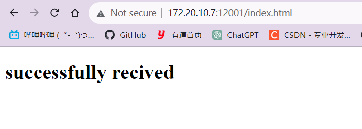
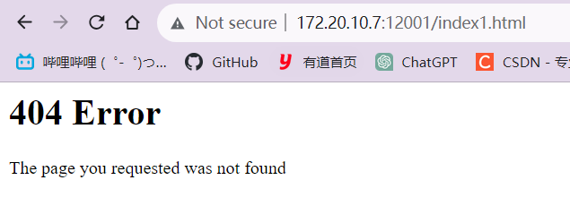

# Web服务器

参考资源: `https://blog.csdn.net/htwhtw123/article/details/78134219`

## 创建套接字

创建套接字并绑定要监听的端口和监听的客户端数量

 ```py
 serverSocket = socket(AF_INET, SOCK_STREAM)
 serverPort = 12001
 serverSocket.bind(('', serverPort))
 serverSocket.listen(1)
 ```

## 获取HTTP请求

获取用户的请求报文

```python
message = connectionSocket.recv(2048).decode()
```

## 解释请求

获取到的message是一个请求报文, 内部由空格/空行隔开, 通过split函数将长文本分割为若干个字符串

```
GET /index.html HTTP/1.1   ......
```

因为GET后面是请求的文件名, 所以获得的字符串列表的下标为1的字符串就是文件路径

```py
# 先分割后获取index=1的字符串
filename = message.split()[1]
# 去掉'/'获得文件名
f = open(filename[1:])
```

## 进行响应

获取到文件名后, 打开并读取, 先发送报文头, 在发送html文件的内容

```python
f = open(filename[1:])
outputdata = f.read()
...
```

构造响应头, 至少包含首部行, 和内容格式及长度

```python
def responseHeader(text):
    respHeader = '''HTTP/1.1 200 OK 
    Connection: keep-alive
    Content-Length''' + str(len(text.encode('utf-8'))) + '\nContent-Type:text/html\n\n'
    return respHeader

connectionSocket.send(responseHeader(outputdata).encode('utf-8'))
```

发送html文本

```python
for i in range(0, len(outputdata)):
    connectionSocket.send(outputdata[i].encode('utf-8'))
connectionSocket.send("\r\n".encode('utf-8'))
```

## 访问失败

当访问一个不存在的资源时, 将返回404

```python
except IOError:
        #! Send response message for file not found
        #Fill in start
        fnf = "HTTP/1.1 404 Not Found \r\n\r\n";
        html = "<html><head><title> 404 Not Found 1</title></head><body><h1>404 Error</h1><p> The page you requested was not found</p></body></html>\r\n"
        connectionSocket.send(fnf.encode())
        connectionSocket.send(html.encode())
        #Fill in end

        #Close client socket
        #Fill in start
        connectionSocket.close()
```

## 完整代码

`WebServer.py`

```python
#import socket module
from socket import *
import sys # In order to terminate the program
serverSocket = socket(AF_INET, SOCK_STREAM)
#Prepare a sever socket
#Fill in start
serverPort = 12001
serverSocket.bind(('', serverPort))
serverSocket.listen(1)
#Fill in end
def responseHeader(text):
    respHeader = '''HTTP/1.1 200 OK 
    Connection: keep-alive
    Content-Length''' + str(len(text.encode('utf-8'))) + '\nContent-Type:text/html\n\n'
    return respHeader
while True:
    #Establish the connection
    print('Ready to serve...')
    # connectionSocket, addr = #Fill in start #Fill in end
    connectionSocket, addr = serverSocket.accept()
    try:
        message = connectionSocket.recv(2048).decode()
        if (message == ""):
            continue
        print(message)
        filename = message.split()[1]
        print("filename = " + filename)
        f = open(filename[1:])
        outputdata = f.read()
        print(outputdata)
        #! Send one HTTP header line into socket
        #Fill in start
        connectionSocket.send(responseHeader(outputdata).encode('utf-8'))
        #Fill in end
        #Send the content of the requested file to the client
        for i in range(0, len(outputdata)):
            connectionSocket.send(outputdata[i].encode('utf-8'))
        connectionSocket.send("\r\n".encode('utf-8'))
        print("ok")
        connectionSocket.close()
    except IOError:
        #! Send response message for file not found
        #Fill in start
        fnf = "HTTP/1.1 404 Not Found \r\n\r\n";
        html = "<html><head><title> 404 Not Found 1</title></head><body><h1>404 Error</h1><p> The page you requested was not found</p></body></html>\r\n"
        connectionSocket.send(fnf.encode())
        connectionSocket.send(html.encode())
        #Fill in end

        #Close client socket
        #Fill in start
        connectionSocket.close()
        #Fill in end
serverSocket.close()
sys.exit() #Terminate the program after sending the corresponding data
```

# 多线程处理请求


# 客户端命令行

`client.py`

指定shebang, 则在命令行中不用显示指定python3命令

参考资料: `https://blog.csdn.net/boriscoding/article/details/21714923`

```python
#!/usr/bin/python3
from socket import *
import sys
# 根据请求的文件名和主机名组成http请求头
def getRequestHeader(filename, server_host):
    url = 'GET ' + filename + ' HTTP/1.1\nHost: ' + str(server_host) 
    return url
if __name__ == '__main__':
    server_host = sys.argv[1]
    # port要求是int类型
    server_port = int(sys.argv[2])
    filename = sys.argv[3]
    clientSocket = socket(AF_INET, SOCK_STREAM)
    clientSocket.connect((server_host, server_port))
    httpRequest = getRequestHeader(filename, server_host)
    clientSocket.send(httpRequest.encode())
    httpResponse = clientSocket.recv(2048)
    print(httpResponse.decode())
    clientSocket.close()
```

调用

```
$ ./client.py 172.20.10.7 12001 /index.html
```

成功接收响应

```
HTTP/1.1 200 OK 
Connection: keep-alive
Content-Length: 239
Content-Type:text/html

<!DOCTYPE html>
<html lang="en">
<head>
    <meta charset="UTF-8">
    <meta name="viewport" content="width=device-width, initial-scale=1.0">
    <title>Document</title>     
</head>
<body>
    <h1>successfully recived</h1>
</body>
</html>
```


# 效果

访问`http://172.20.10.7:12001/index.html`

其中`172.20.10.7`是本地主机的IP地址

`index.html`与`WebServer.py`同级



访问其它文件: `http://172.20.10.7:12001/index1.html`


