在本实验中，我们将详细研究著名的 TCP 协议的行为。 我们将通过分析将 150KB 文件（包含 Lewis Carrol 的《爱丽丝梦游仙境》的文本）从计算机传输到远程服务器时发送和接收的 TCP 段的跟踪来实现此目的。 我们将研究 TCP 使用序列号和确认号来提供可靠的数据传输； 我们将看到 TCP 的拥塞控制算法（慢启动和拥塞避免）的实际应用； 我们将了解 TCP 的接收者通告流量控制机制。 我们还将简要考虑 TCP 连接设置，并研究计算机和服务器之间 TCP 连接的性能（吞吐量和往返时间）。

# 捕获从计算机到远程服务器的批量 TCP 传输

在开始探索 TCP 之前，我们需要使用 Wireshark 获取文件从计算机到远程服务器的 TCP 传输的数据包跟踪。 为此，您可以访问一个网页，该网页允许您输入计算机上存储的文件名（其中包含爱丽丝梦游仙境的 ASCII 文本），然后使用 HTTP POST 将该文件传输到 Web 服务器 方法（见正文2.2.3节）。 我们使用 POST 方法而不是 GET 方法，因为我们希望将大量数据从您的计算机传输到另一台计算机。 当然，我们将在此期间运行 Wireshark 来获取从您的计算机发送和接收的 TCP 段的跟踪信息。

# A first look at the captured trace

## Q1

> 将文件传输到 gaia.cs.umass.edu 的客户端计算机（源）使用的 IP 地址和 TCP 端口号是什么？
>
> 要回答这个问题，最简单的方法可能是选择一条 HTTP 报文，并使用“所选数据包标头窗口的详细信息”来探索用于承载此 HTTP 消息的 TCP 数据包的详细信息（请参阅“入门”中的图 2） 如果您不确定 Wireshark 窗口，请访问“Wireshark”实验室

查看了第一次握手的TCP报文

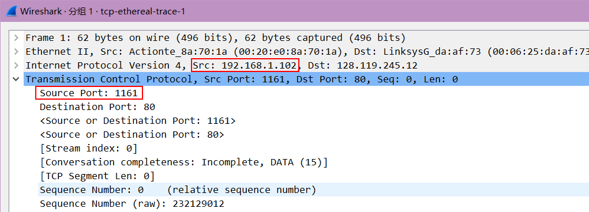

源IP地址: 192.168.1.102

源端口号: 1161

## Q2

> gaia.cs.umass.edu 的 IP 地址是什么？ 它在哪个端口号上发送和接收此连接的 TCP 段？

IP 地址: 128.119.245.12

80

# TCP 基础知识

## Q4

> 用于启动客户端计算机和 gaia.cs.umass.edu 之间的 TCP 连接的 TCP SYN 段的序列号是多少？
>
> 段中是什么标识该段为SYN段？

序列号为232129012

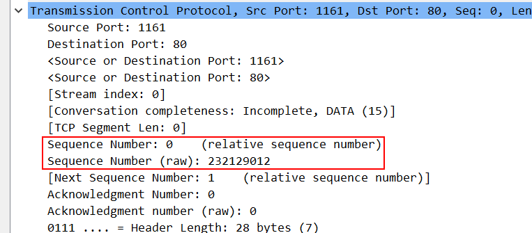

Flag字段部分的Syn被置为1

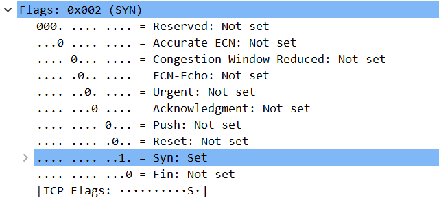

## Q5

> gaia.cs.umass.edu 发送到客户端计算机以回复 SYN 的 SYNACK 段的序列号是多少？
>
> SYNACK 段中的确认字段的值是多少？
>
> gaia.cs.umass.edu 如何确定该值？
>
> 段中是什么将段标识为 SYNACK 段？

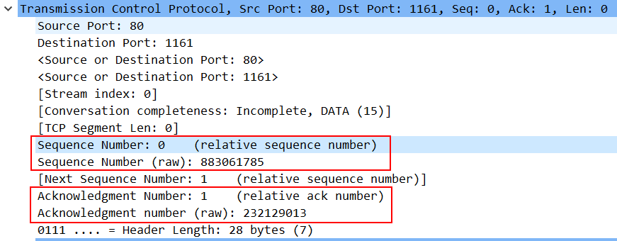

SYNACK的序列号为883061785

ACK字段为232129012, 即SYN的序列+1

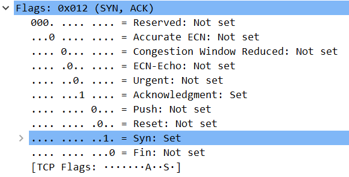

Flags的Syn和ACK位被置1

## Q6

> 包含 HTTP POST 命令的 TCP 段的序列号是多少？ 
>
> 请注意，为了找到 POST 命令，您需要深入 Wireshark 窗口底部的数据包内容字段，查找其 DATA 字段中带有“POST”的段。

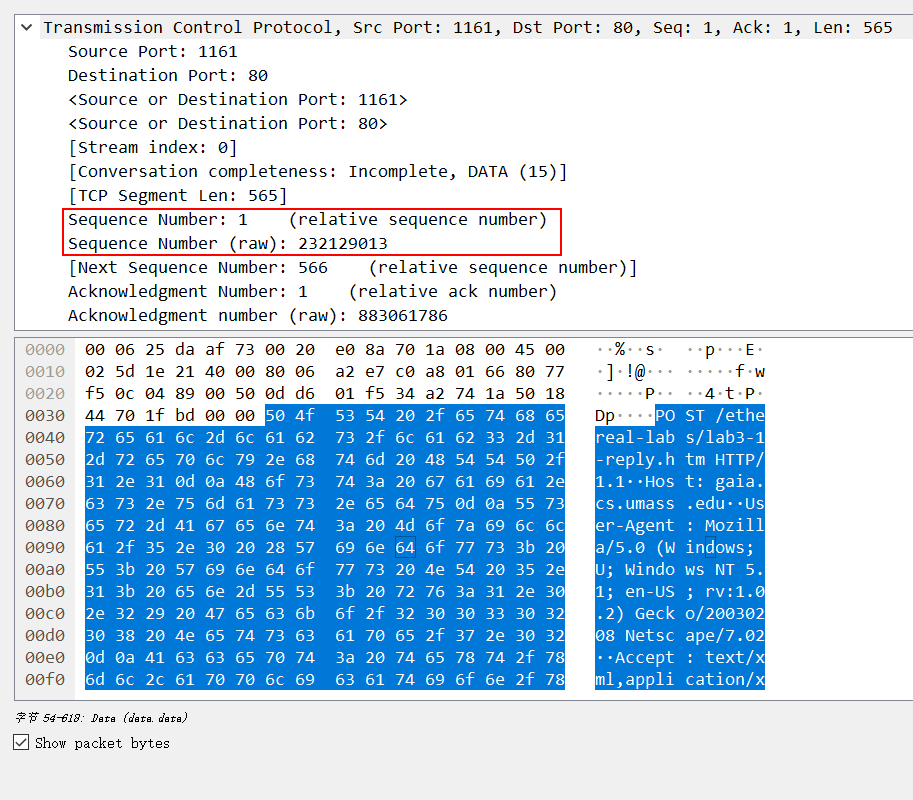

## Q7

> 将包含 HTTP POST 的 TCP 段视为 TCP 连接中的第一个段。 TCP 连接中前 6 个报文段（包括包含 HTTP POST 的报文段）的序列号是多少？
>
> 每个段是在什么时间发送的？ 
>
> 每个段的 ACK 是什么时候收到的？ 
>
> 考虑到发送每个 TCP 报文段的时间和收到其确认的时间之间的差，这六个报文段中每个的 RTT 值是多少？ 
>
> 收到每个 ACK 后的 EstimatedRTT 值是多少（请参阅第 3.5.3 节，第 242 页的正文）？ 假设 EstimatedRTT 的值等于第一个分段的测量 RTT，然后使用第 242 页上的 EstimatedRTT 公式计算所有后续分段的 EstimatedRTT 公式。 
>
> 注意：Wireshark 有一个很好的功能，允许您绘制每个发送的 TCP 段的 RTT。 在“捕获的数据包列表”窗口中选择从客户端发送到 gaia.cs.umass.edu 服务器的 TCP 段。 然后选择：统计->TCP 流图->往返时间图。

TCP发送端发送的前6各TCP报文段为下图编号为4, 5, 7, 8, 10, 11的分组

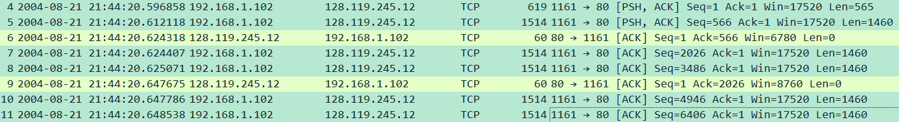

从上图可以看出, 这6个分组的发送时间依次是: 

4: 2004-08-21 21:44:20.596858

5: 2004-08-21 21:44:20.612118

7: 2004-08-21 21:44:20.624407

8: 2004-08-21 21:44:20.625071

10: 2004-08-21 21:44:20.647786

11: 2004-08-21 21:44:20.648538

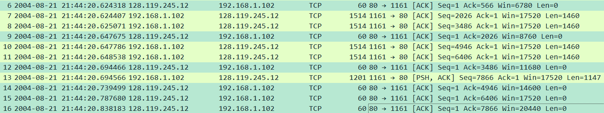

从上图的ACK字段的值与前6个分组的序号可以看出, 

分组6是分组4的ACK, 接收时间是: 2004-08-21 21:44:20.624318

分组9是分组5的ACK, 接收时间是: 2004-08-21 21:44:20.647675	

分组12是分组7的ACK, 接收时间是: 2004-08-21 21:44:20.694466	

分组14是分组8的ACK, 接收时间是: 2004-08-21 21:44:20.739499

分组15是分组10的ACK, 接收时间是:2004-08-21 21:44:20.787680	

分组16是分组11的ACK, 接收时间是:2004-08-21 21:44:20.838183	

分组4的RTT = 0.624318 - 0.596858 = 0.02746s

分组5的RTT = 0.647675 - 0.612118 = 0.035557s

分组7的RTT = 0.694466 - 0.624407 = 0.070059s

分组8的RTT = 0.739499 - 0.625071 = 0.114428s

分组10的RTT = 0.787680 - 0.647786 = 0.139894s

分组11的RTT = 0.838183 - 0.648538 = 0.189645s

收到第1个RTT后的EstimatedRTT = 0.02746s

收到第2个RTT后的EstimatedRTT = 0.875 * 0.02746 + 0.125 * 0.035557 = 0.0284721

收到第3个RTT后的EstimatedRTT = 0.875 * 0.0284721 + 0.125 * 0.035557 = 0.0293577

收到第4个RTT后的EstimatedRTT = 0.875 * 0.0293577+ 0.125 * 0.035557 = 0.0301326

收到第5个RTT后的EstimatedRTT = 0.875 * 0.0301326+ 0.125 * 0.035557 = 0.0308106

收到第6个RTT后的EstimatedRTT = 0.875 * 0.0308106+ 0.125 * 0.035557 = 0.0314039

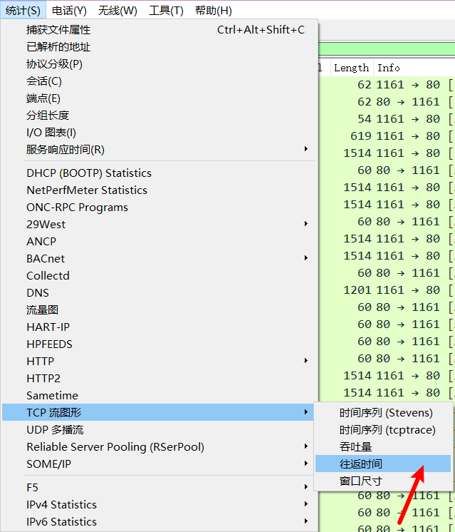

点击切换方向, 绘制的RTT图像

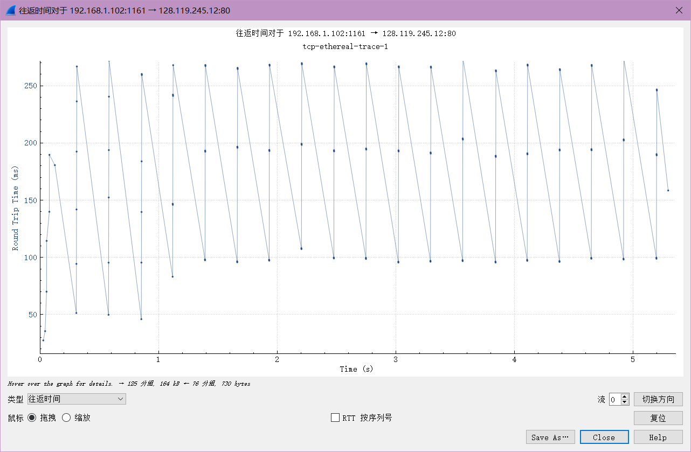

## Q8

> 前 6 个 TCP 段中每个段的长度是多少？

由之前的图可以看出

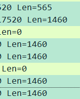

长度分别为 565, 1460, 1460, 1460, 1460, 1460

## Q9

> 整个跟踪在接收时通告的最小可用缓冲区空间量是多少？ 接收方缓冲区空间不足是否限制了发送方?

筛选出接收方到发送方的报文

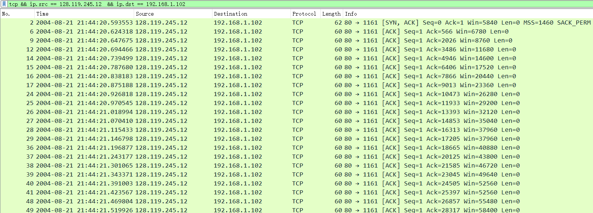

最小缓冲区空间是第一个通告告知的 5840

接收方的Win一直增大, 没有限制发送方

## Q10

> 跟踪文件中是否有重传的段？ 为了回答这个问题，您（在跟踪中）检查了什么？

确认是否存在重传的段, 即查看是否有多个段的序号相同

也可通过tcp的筛选

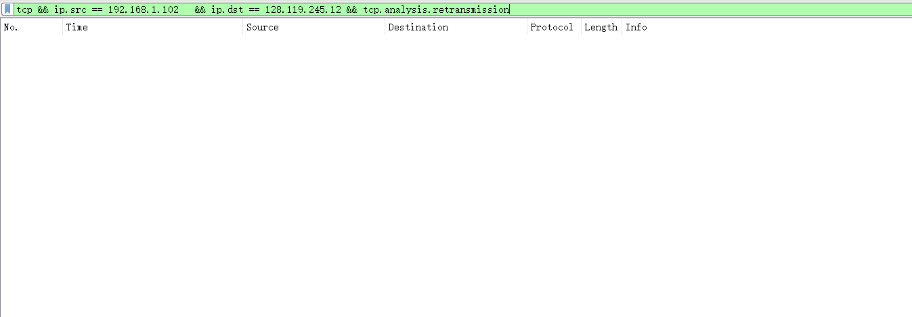

没有发现重传的段

## Q11

> 接收方通常在 ACK 中确认多少数据？ 您能否识别接收方每隔一个接收到的数据段进行 ACK 确认的情况（请参阅课本第 250 页上的表 3.2）。

有点不太懂题目要求

可能是ACK数据部分的长度为0

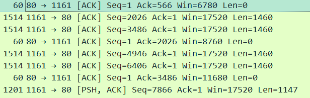

所以只要看Len=0就知道是不是接收方发送的ACK

## Q12

> TCP 连接的吞吐量（单位时间传输的字节数）是多少？ 解释一下你是如何计算这个值的。

接收方最后一个ACK

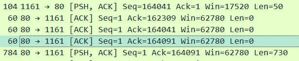

第一个报文段发送的时间: 2004-08-21 21:44:20.596858

最后一个报文段确认的时间: 2004-08-21 21:44:26.026211

总的字节数为164091

所以吞吐量为164091 / (6.026211 - 0.596858) = 30222.9 byte/s

# TCP 拥塞控制的实际应用

---

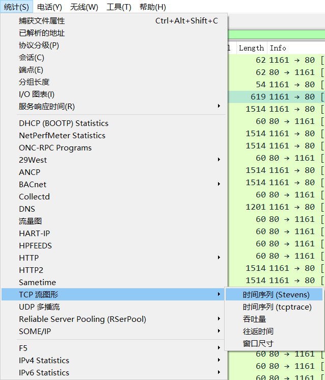

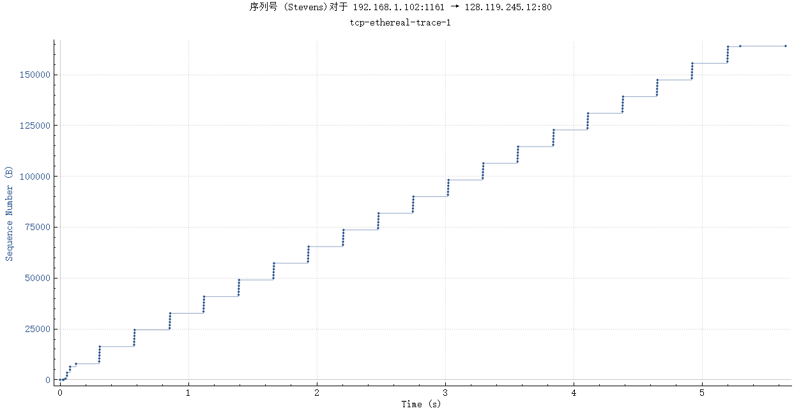

这里，每个点代表一个发送的 TCP 段，绘制该段的序列号与发送时间的关系。 请注意，一组彼此堆叠的点表示由发送方连续发送的一系列数据包。

## Q13

> 使用时间序列图 (Stevens) 绘图工具查看从客户端发送到 gaia.cs.umass.edu 服务器的段的序列号与时间图。 您能确定 TCP 的慢启动阶段从哪里开始和结束，以及拥塞避免在哪里接管吗？ 评论测量数据与我们在文本中研究的 TCP 理想化行为的不同之处

## Q14

> 回答上述两个问题，了解将文件从计算机传输到 gaia.cs.umass.edu 时收集的跟踪信息

