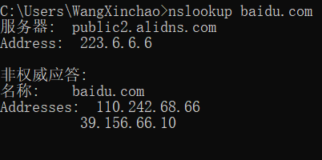

在本实验中，我们将快速了解 UDP 传输协议。 正如我们在本文第 3 章中看到的那样，UDP 是一种简化的、简洁的协议。 在进行本实验之前，您可能需要重新阅读文本中的 3.3 节。 由于 UDP 简单而实用，我们将能够在本实验中快速介绍它。 因此，如果您在 30 分钟内还有另一个约会要参加，无需担心，因为您应该能够有充足的空闲时间完成本实验。 

在这个阶段，您应该是一名 Wireshark 专家。 因此，我们不会像早期实验那样明确地阐明这些步骤。 特别是，我们不会提供所有步骤的示例屏幕截图。

# The Assignment

开始在 Wireshark 中捕获数据包，然后执行一些操作，使您的主机发送和接收多个 UDP 数据包。 也有可能，只要不执行任何操作（除了通过 Wireshark 捕获数据包），其他人发送的一些 UDP 数据包就会出现在您的跟踪中。 特别是，简单网络管理协议（SNMP – 请参阅文本中的第 5.7 节）在 UDP 内部发送 SNMP 消息，因此您可能会在跟踪中找到一些 SNMP 消息（以及 UDP 数据包）。

仅显示您的主机发送和接收的 UDP 数据包

## Q1

> 从跟踪中选择一个 UDP 数据包。 从该数据包中确定 UDP 标头中有多少个字段。 （您不应该查看教科书！直接根据您在数据包跟踪中观察到的内容回答这些问题。）为这些字段命名

源端口，目的端口，长度，校验和

## Q2

> 通过查阅该数据包的 Wireshark 数据包内容字段中显示的信息，确定每个 UDP 标头字段的长度（以字节为单位）。

由上图可以看出source port是2个字节大小, 4个16进制位

由上图可以看出Destination Port是2个字节大小

由上图可以看出Length是2个字节大小

由上图可以看出Checksum是2个字节大小

## Q3

> Length字段中的值是什么长度？ （这个答案你可以查阅正文）。 使用捕获的 UDP 数据包验证您的声明。

长度字段应该是首部8个字节+应用层的数据大小

## Q4

> UDP 有效负载中可以包含的最大字节数是多少？ （提示：这个问题的答案可以根据你对上面2.的回答来确定）

Len字段由2个字节, 即16位, 可以表示的最大字节长度为2^16 - 1 = 65535

减去首部的8个字节, 65535 - 8 = 65527

## Q5

> 最大可能的源端口号是多少？ （提示：参见4中的提示。）

源端口号字段占2个字节, 最大为2^16 - 1 = 65535

## Q6

> UDP 的协议号是多少？ 以十六进制和十进制表示法给出答案。 要回答这个问题，您需要查看包含此 UDP 段的 IP 数据报的协议字段（参见正文中的图 4.13，以及 IP 标头字段的讨论）。

## Q7

> 检查一对 UDP 数据包，其中主机发送第一个 UDP 数据包，第二个 UDP 数据包是对第一个 UDP 数据包的回复。 （提示：对于响应第一个数据包而发送的第二个数据包，第一个数据包的发送者应该是第二个数据包的目的地）。 描述两个数据包中端口号之间的关系。

查看baidu.com的DNS服务器

抓取到DNS包, 内部包裹了UDP分组

