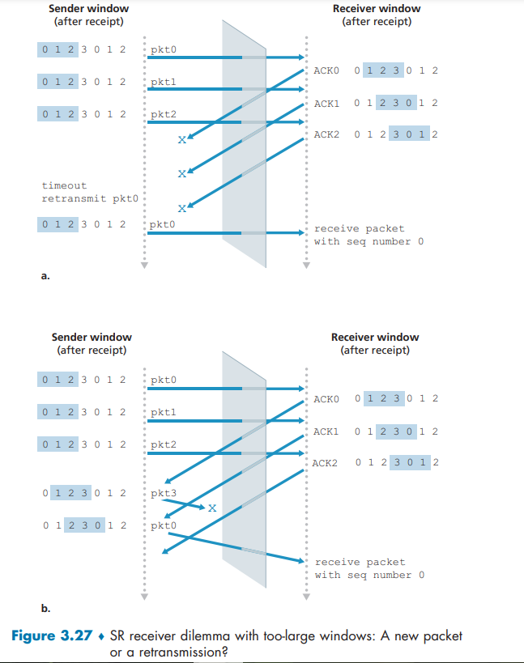
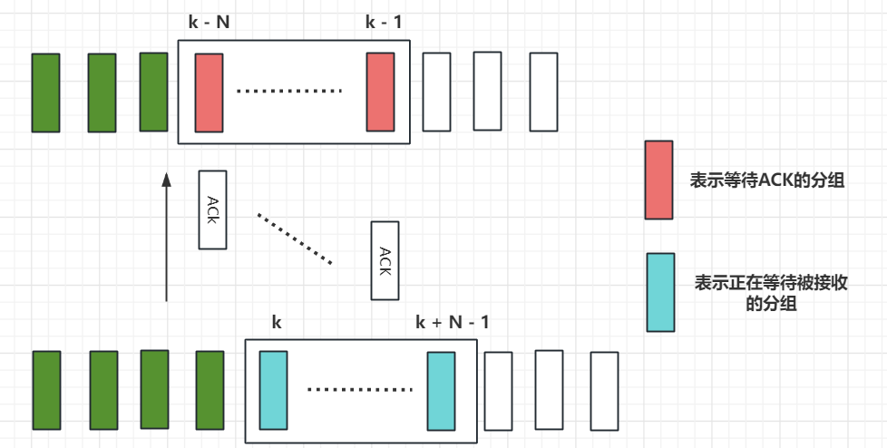

# P1

> 假设客户 A 向服务器 S 发起一个 Telnet 会话。与此同时，客户 B 也向服务器 S 发起一个 Telnet 会话。给出下面报文段的源端口号和目的端口号：
>
> a. 从 A 向 S 发送的报文段。
>
> b. 从 B 向 S 发送的报文段。
>
> c. 从 S 向 A 发送的报文段。
>
> d. 从 S 向 B 发送的报文段。
>
> e. 如果 A 和 B 是不同的主机，那么从 A 向 S 发送的报文段的源端口号是否可能与从 B 向 S 发送的报文段的源端口号相同？
>
> f. 如果它们是同一台主机，情况会怎么样？

假设A的客户端端口号为a, B的客户端端口号为b 

已知Telnet 默认端口号为23

## a

source port : a   dest port : 23

## b

source port : b   dest port : 23

## c

source port : 23   dest port : a

## d

source port : 23   dest port : b

## e

A, B的端口号可能会相同, 这样服务器还是可以将不同的报文发送到不同的主机

## f

如果它们是同一台主机, 并且共用一个端口号, 则服务器的响应发送到了一台主机的一个端口

# P2

> 考虑图 3-5。
>
> 
>
> 从服务器返回客户进程的报文流中的源端口号和目的端口号是多少？在承载运输层报文段的数据报中，IP 地址是多少？

对于主机A, 源端口号为80, 目的端口号为26145, dest IP = A

对于主机C左边的进程, 源端口号为80, 目的端口号为7532, dest IP = C

对于主机C左边的进程, 源端口号为80, 目的端口号为26145, dest IP = C

# P3

> UDP 和 TCP 使用反码来计算它们的校验和。假设你有下面 3 个 8 比特字节：01010011，01100110，01110100。这些 8 比特**字节和**的反码是多少？（注意到尽管 UDP 和 TCP 使用 16 比特的字来计算校验和，但对于这个问题，你应该考虑 8 比特和。）写出所有工作过程。UDP 为什么要用该和的反码，即为什么不直接使用该和呢？使用该反码方案，接收方如何检测出差错？1 比特的差错将可能检测不出来吗？2 比特的差错呢？

$$
\space \space  \space \space  01010011 \\
+  \ 01100110 \\
\hline 
\space \space \space \space 10111001 \\
+  \ 01110100 \\
\hline 
\space \space \space \space 00101110 \\
$$

3个8位二进制的和的反码为: 11010001

发送方将3个数据字节加和作为校验和

接收方为了检测错误, 将3个数据字节和校验和全部相加, 如果和全为为1, 则可能无差错, 如果存在0, 则肯定有差错

1个bit出错一定可以检测出来, 因为所求和一定会改变

如果两个bit同时出错, 则可能检测不出来。例如, 第一个字节的第一个bit发送反转, 第二个字节的第一个bit也发送反转, 则所求和与正确的字节一致, 但是此时检测不出bit错误

# P4

> a. 假定你有下列 2 个字节：0101 1100 和 0110 0101。这两个字节之和的反码是什么？
>
> b. 假定你有下列 2 个字节：1101 1010 和 0110 0101。这两个字节之和的反码是什么？
>
> c. 对于（a）中的字节，给出一个例子，使得这两个字节中的每一个都在一个比特反转时，其反码不会改变。

## a

$$
\space \space  \space \space  0101 1100 \\
+  \ 0110 0101 \\
\hline 
\space \space \space \space 11000001 \\
$$

和的反码为00111110

## b

$$
\space \space  \space \space  1101 1010 \\
+  \ 0110 0101 \\
\hline 
\space \space \space \space 01000000 \\
$$

和的反码为10111111

## c

改变最低位

第一个Byte = 0101 1101; 第二个byte =  0110 0100.

# P5

> 假定某 UDP 接收方对接收到的 UDP 报文段计算因特网校验和，并发现它与承载在校验和字段中的值相匹配。该接收方能够绝对确信没有出现过比特差错吗？试解释之。

不，接收方不能绝对确定没有发生bit错误。 这是因为计算数据包校验和的方式所致。 如果数据包中两个 16 位字的相应位（将相加）为 0 和 1，那么即使它们分别翻转为 1 和 0，总和仍然保持不变。 因此，接收方计算的和将全为1。 这意味着即使存在传输错误，校验和也会验证通过。

# P6

> 考虑我们改正协议 rdt 2.1 的动机。试说明如图 3-60 所示的接收方与如图 3-11 所示的发送方运行时，接收方可能会引起发送方和接收方进入**死锁状态**，即双方都在等待不可能发生的事件。

rdt2.1发送方的FSM

rdt2.1接收方错误的FSM

rdt2.1假设分组在传输过程中不会丢失, 但是会受损

假设发送发起初接收到上层的调用, 向接收方发送了序号为1的分组, 此时发送方进入等待接收方对1ACK或者NAK的状态;

如果接收方成功接收到了序号为1的分组, 然后接收方进入等待接收下层的序号为0的分组

但是如果该ACK分组在传送过程中受损, 也就是说发送发接收到了受损分组, 发送方状态不变, 并且再次发送序号为1的分组

接收方再次接收到了序号为1的分组,与自己期待收到的分组不一致, 此时接收方该状态对该事件的响应为返回NAK, 当发送发接收到NAK后, 又继续发送序号为1的分组

因此，发送方将始终发送序列号为 1 的数据包，而接收方将始终否认该数据包。 两者都不会从该状态继续前进。

rdt2.1接收方正确的FSM

# P7

> 在 rdt 3.0 协议中，从接收方向发送方流动的 ACK 分组没有序号（尽管它们具有 ACK 字段，该字段包括了它们正在确认的分组的序号）。为什么这些 ACK 分组不需要序号呢？

为了最好地回答这个问题，首先考虑为什么我们需要序列号。 我们看到发送方需要序列号，以便接收方可以判断数据包是否与已接收的数据包重复。发送方不需要ACK 上的序列号来检测重复的 ACK。 因为当发送方收到初始的 ACK 时，它会转换到下一个状态。 重复的 ACK 不是发送方需要的 ACK，因此被 rdt3.0 发送方忽略。

# P8

> 画出协议 rdt 3.0 接收方的 FSM。

引入定时器后, 由于发送方的定时器可能会超时, 接受方因此可能会收到重复的分组, 所以对于重复收到的分组, 返回对其序号的ACK即可

当收到受损的分组也返回对上一个序号的ACK

# P9

> 当数据分组和确认分组发生篡改时，给出 rdt 3.0 协议运行的轨迹。你画出的轨迹应当类似于图 3-16 中所用的图。

主要考虑在具有超时重传机制下, 发送方接收到受损ACK分组或者不是期望的ACK分组时, 应该利用超时机制, 等待超时事件的到来, 进行分组重传

数据分组发生篡改的情况

确认分组发生篡改的情况

# P10

> 考虑一个能够**丢失分组**但其**最大时延已知**的信道。修改协议 rdt 2.1 ，以包括发送方超时和重传机制。非正式地论证：为什么你的协议能够通过该信道正确通信？

因为我们最大时延已经确定, 所以我们要在发送方添加一个计时器，其值大于已知的往返传播延迟。

我们向"等待 ACK 或 NAK0"和"等待 ACK 或 NAK1"状态添加超时事件。 如果发生超时事件，则重新传输最近传输的数据包。 

而接收方的FSM不用改变。以下分两种情况讨论为什么接收方的FSM与rdt2.1的接收方一致。

+ 假设超时是发送方到接收方的数据包丢失引起的。 

  在这种情况下，接收方从未接收到先前的传输，此时不会引起接收方状态的改变, 并且从接收方的角度来看，如果接收到超时重传，则看起来与正在接收原始传输完全相同。

+ 假设超时是接收方到发送方的ACK丢失引起的。 

  接收方最终将在超时时重新传输ACK。 但重传与 ACK 出现乱码时的操作完全相同。 因此，发送方对丢失的反应与对错误 ACK 的反应相同。 即超时的重传和乱码的重传对于接收方来说都一样, 都会返回出错的ACK。rdt 2.1 接收器已经可以处理 ACK 乱码的情况。

# P11

> 考虑在图 3-14 中的 rdt 2.2 接收方，在状态 "等待来自下层的 0" 和状态 "等待来自下层的 1" 中的自转换（即从某状态转换回自身）中生成一个新分组：sndpk = make_pkt(ACK, 1, checksum) 和 sndpk = make_pkt(ACK, 0, checksum)。
>
> 
>
> 如果这个动作从状态"等待来自下层的 1" 中的自转换中删除，该协议将正确工作吗？评估你的答案。
>
> 在状态"等待来自下层的 0" 中的自转换中删除这个事件将会怎样？(提示：在后一种情况下，考虑如果第一个发送方到达接收方的分组损坏的话，将会发生什么情况?)

如果删除对于这种情况的应对措施, 即重新发送ACK，发送方和接收方将陷入僵局，等待永远不会发生的事件。 

例如如下情况：

发送方发送pkt0，进入"等待ACK0 状态"，等待接收方返回的ACK0

接收方处于"等待来自下方的0"状态，并从发送方接收到损坏的数据包。 假设它没有发回任何东西，只是重新进入"等待下面的 0"状态。 

此时，发送者正在等待来自接收者的某种 ACK，而接收者正在等待来自下层的数据包, 从而出现了死锁。

# P12

> rdt 3.0 协议的**发送方**直接忽略（即不采取任何动作）接收到的所有出现差错的分组和确认号(acknum)字段中的值有差错的分组。
>
> 假设在这种情况下，rdt 3.0 只是**重传当前的数据分组**，该协议是否还能正常运行？
>
> (提示：考虑在下列情况下会发生什么情况：
>
> 仅有一个比特差错时；
>
> 报文没有丢失但能出现定时器过早超时。
>
> 考虑到当 n 趋于无穷时，第 n 个分组将被发送多少次。)

题目意思就是将上图$\Lambda$换为`udt_send(sndpkt)`

该协议仍然可以正常工作。

当出现比特差错时, 发送方将立即重传, 而不必等到超时, 但是也一定会迎来超时, 则发送方会再次发送数据包, 但是接收方重复的数据分组时无视的, 会响应一个ACK

当我们发送n个分组时, 当n趋向于无穷大时, 则第n个分组的ACK会经历无穷大次超时, 被重发无穷次

# P13

> 考虑 rdt 3.0 协议。如果发送方和接收方网络能够对报文**重排序**（即在发送方和接收方之间的媒体上传播的两个报文段能重新排序），那么比特交替协议(就是rdt3.0)将**不能正确工作**（确信你清楚地理解这时它不能正确工作的原因），试画图说明之。
>
> 画图时把发送方放在左边，接收方放在右边，使时间轴朝下，标出交换的数据报文（D）和确认报文（A）。要标明与任何数据和确认报文段相关的序号。

可以重排序意味着早发送的报文可能后接收到, 所以当出现了过早超时情况时, 旧版本的报文的重排序可能会使得接收方接收到非预期的报文

发送到一半的pkt0, 将被接收方忽略

# P14

> 考虑一种仅使用**否定确认**的可靠数据传输协议。假定发送方只是**偶尔**发送数据。只用 NAK 的协议是否会比使用 ACK 的协议更好？为什么？
>
> 现在我们假设发送方要发送大量的数据，并且该端到端连接很少丢包。在第二种情况下，只用 NAK 的协议是否会比使用 ACK 的协议更好？为什么？

在仅使用 NAK 的协议中，只有当接收到数据包 x + 1时，接收方才会检测到数据包 x 的丢失。 也就是说，接收者收到x - 1，然后收到x + 1，接收者才意识到x丢失了。如果发送方只是偶尔发送数据, 则在x的传输和x+1的传输之间存在较长的延迟，则在仅NAK协议下，x可以被发现丢失到被重发会经过很长时间, 会比ACK协议的情况差。

如果发送方频繁发送大量的数据，则仅 NAK 方案下的恢复可能会很快发生。 另外，如果端到端连接很少丢包，则仅在很小的情况下才会发送反馈信息 NAK，所以仅 NAK 情况下对发送方的反馈的信息显着减少。而使用ACK协议的话, 就要面临频繁发送大量ACK的情况。

# P15

> 考虑如图 3-17 所示的跨国示例，当信道利用率要大于 98% 时窗口尺寸需要变多大？假定一个分组的尺寸是 1500 字节（包括首部字段和应用数据）。

引用要使得信道利用率足够大, 所以必须采用流水线的方式传输分组, 则一次连续发送的分组数量收到发送窗口的限制, 设窗口尺寸为n

由信道利用率要大于 98% 可得下面不等式:

RTT+L/R时发送方接受到最后一个ACK的时刻
$$
\frac{nL/R}{RTT + L/R} \ge 0.98 \\
$$
有题目可知 L = 1500 byte, R = 1G bps, RTT = 30ms

则
$$
\frac{nL/R}{RTT + L/R} \ge 0.98 \\
 \frac{n \frac{1500 \times8}{10^9}}{30ms + \frac{1500 \times8}{10^9}} \ge 0.98 \\
 \frac{n \times 12\mu s}{30ms +  12\mu s} \ge 0.98 \\
 \frac{n \times 0.012ms}{30.012ms} \ge 0.98 \\
 0.012n \ge 29.41176 \\
n \ge 2450.98 
$$
所以n至少要等于2451, 即窗口尺寸至少要容纳2451分组

# P16

> 假设某应用使用 rdt 3.0 作为运输层协议。因为停等协议具有非常低的信道利用率（显示在网络跨越国家的例子中），该应用程序的设计者让接收方持续回送许多（大于2）交替的 ACK 0 和 ACK 1，即使对应的数据未到达接收方。这个应用程序设计将能增加信道利用率吗？为什么？该方法存在某种潜在的问题吗？试解释之。

可以增加信道利用率。虽然采用的停等协议, 但是接收方一直发送ACK0/1, 使得发送方可以持续地发送新的分组(就像流水线那样;即使旧分组还未到达, 甚至已经丢失), 这使得在发送时间内有更多时间正在发送分组, 使得信道利用率增大。

但是, 这存在一个潜在的问题。 如果数据段在信道中丢失，发送方对应的定时器可能超时, 发送方进行重发, 但是此时流水线中前面仍有分组, 不能保证接收方可能正确接收到; 或者可能连续的2个分组丢失后, 使得接收方错误地接受了序号相同的错误分组

# P17

> 考虑两个网络实体 A 和 B，它们由一条完善的双向信道所连接（即任何发送的报文将正确地收到；**信道将不会损坏、丢失或重排序分组**）。A 和 B 将以**交互的方式**彼此交付报文：
>
> 首先，A 必须向 B 交付一个报文，B 然后必须向 A 交付一个报文，接下来 A 必须向 B 交付一个报文，等等。
>
> 如果一个实体处于它不试图向另一侧交付报文的状态，将存在一个来自上层的类似于 `rdt_send(data)` 调用的事件，它试图向下传递数据以向另一侧传输，来自上层的该调用能够直接忽略对于 `rdt_unable_to_send(data)` 调用，这通知较高层当前不能够发送数据。(注意：做出这种简化的假设，使你不必担心缓存数据。)
>
> 对该协议画出 FSM 说明（一个 FSM 用于 A, 一个 FSM 用于 B）。注意你不必担心这里的可靠性机制，该问题的要点在于创建**反映这两个实体的同步行为**的 FSM 说明。应当使用与图 3-9 中协议 rdt 1.0 有相同含义的下列事件和动作：`rdt_send(data)`, `packet = make_pkt(data)`, `udt_send(data)`, `rdt_rcv(packet)`, `extract(packet, data)`, `deliver_data(data)`。保证你的协议反映了 A 和 B 之间发送的**严格交替**。还要保证你的 FSM 描述中指出 A 和 B 的初始状态。

A的FSM: 

初始状态等待上层的数据, 如果接收到了上层的数据, 则打包成分组向对方发送, 进入等待接收分组状态

在等待接收分组状态时, 如果上层继续向下层传输数据, 则通知上层不会向对方发送, 并将数据返回给上层

等到接收到了对方的分组, 向上层递交后, 再次进入等待上层传输状态

B的FSM:

由于发送方和接收方实现的交替传输, 所以二者的FSM是对称的, 即状态转移一致, 只是初始状态不一致

# P18

> 在 3.4.4. 节我们学习的一般性 SR 协议中，只要报文可用（如果报文在窗口中），发送方就会不等待确认而传输报文。假设现在我们要求一个 SR 协议，**一次发出一对报文**，而且只有在知道第一对报文中的两个报文都正确到达后才发送第二对报文。
>
> 假设该信道中**可能会丢失报文**，但报文不会发生损坏和失序。试为报文的**单向**可靠传输而设计一个差错控制协议。画出发送方和接送方的 **FSM** 描述。描述在发送方和接收方之间两个方向发送的报文格式。
>
> 如果你使用了不同于 3.4 节（例如 `udt_send()`、`start_timer()`、`rdt_rcv()` 等）中的任何其他过程调用，详细地阐述这些动作。
>
> 举例说明（用于发送方和接收方的时序踪迹图）你的协议是如何恢复报文丢失的。

在我们的解决方案中，发送方将等到收到一对消息（seqnum 和 seqnum 1）的 ACK，然后再继续处理下一对消息。 数据包具有数据字段并携带两位序列号。 也就是说，有效的序列号是 0、1、2 和 3。（注意：您应该考虑为什么只有 0、1 的 1 位序列号空间在下面的解决方案中不起作用。）ACK 消息携带 他们正在确认的数据包的序列号。 发送方和接收方的 FSM 如图 2 所示。请注意，发送方状态记录是否 (i) 尚未接收到当前对的 ACK，(ii) 已接收到（仅）seqnum 的 ACK，还是已接收到 ACK （仅）已收到 seqnum 1。 在此图中，我们假设 seqnum 最初为 0，并且发送方已发送前两条数据消息（以使事情顺利进行）。 发送方和接收方从丢失数据包中恢复的时间线跟踪如下所示：

# P22

> 考虑一个 GBN 协议，其发送方窗口为 4，序号范围为 1024。假设在时刻 t，接收方期待的下一个有序分组的序号是 k。假设媒体不会对报文重排序。回答以下问题：
>
> a. 在 t 时刻，发送方窗口内的报文序号可能是多少？论证你的回答。
>
> b. 在 t 时刻，在当前传播回发送方的所有可能报文中，ACK 字段的所有可能值是多少？论证你的回答。

## a

设窗口长度为N, 考虑2个极端情况

如果发送方收到了k-1及其之前的ACK, 窗口左端点右移, 则窗口从k开始, 并且窗口长度为N, 对应的区间为: `[k, k + N - 1]`

如果发送方没有收到任何对窗口内的分组的ACK, 则窗口右端点为k-1,  则此时的窗口区间为: `[k - N, k - 1]`

综上, 发送方窗口内的报文序号是起点从`[k - N, k]`开始的长度为N的区间内的数字

## b

接收方期待的分组序号为k, 说明接收方已经接收到了序号为k-1以及在k-1之前的N-1个分组了

如果发送方没有接收到这些分组任何一个的ACK, 则在发送半路的ACK的序号范围为:`[k - 1 - N + 1, k - 1] = [k - N, k - 1]`

因为接收方已经接收了`k-1`号分组, 则说明发送方已经发送了`k-1`号及其之前的分组, 那么`[k - N, k - 1]`这些分组也一定发送了, 所以发送方也一定收到了`k - N - 1`号的ACK, 接收方发送`k - N - 1`号ACK后可能还会发送该ACK(由于ACK丢失导致对方超时重传), 所以接收方正在发送的ACK报文可能范围为:`[k - N - 1, k - 1]`

# P23

> 考虑 GBN 协议和 SR 协议。假设序号空间的长度为 k，那么为了避免出现图 3-27 中的问题。对于这两种协议中的每一种，允许的发送窗口最大为多少？

图3-27中的问题是在于, 接收方接收到了与之前序号一样的分组, 使得接收方不能确定是重传的分组, 还是新的分组但只是序号与之前的分组一样。

假设使用窗口大小为w

假设接收方正在等待的分组的最小序号为m, 此时所有等待接收的分组序号构成的窗口为`[m, m + w - 1]`, 此时已经对`[m - w, m - 1]`的分组返回了ACK, 如果发送方没有接收到这些ACK中的任何一个(考虑这种情况的目的是让发送方的窗口的左端点尽可能小), 如下图所示, 其中ACK表示的是接收方k号分组之前的分组发送的ACK

则发送方的窗口中的序号范围为`[m - w, m - 1]`, 此时发送方和接收方的序号使用范围最大(`[m - w, m + w -1]`), 要让序号没有冲突, 则需要
$$
m + w - 1 - (m - w) \le k \\
2  m \le k \\
m \le k/2
$$

# P24

> 对于下面的问题判断是非，并简要地论证你的回答。
>
>  a. 对于 SR 协议，发送方可能会收到落在当前窗口之外的分组的 ACK。
>
>  b. 对于 GBN 协议，发送方可能会收到落在其当前窗口之外的分组的 ACK。
>
> c. 当发送方和接收方窗口长度都为 1 时，比特交替协议与 SR 协议相同。
>
> d. 当发送方和接收方窗口长度都为 1 时，比特交替协议与 GBN 协议相同。

## a

✔

假设发送方初始发送窗口为3, 在t1时刻发送了序号分别为1, 2, 3的分组, 接收方在t2时刻接收到了这3个分组, 并且返回了ACK1, ACK2, ACK3这3个ACK, 但是这些ACK可能在链路中经历了比较大的时延, 导致发送方在时刻t3提前超时重发分组1, 2, 3。然后在时刻t4发送方又接收到了发送方在t2时刻发送的ACK1, 2, 3, 此刻发送方将窗口右移3格, 变为[4, 5,  6], 但是接收方可能会接收到发送方重发的冗余分组1, 2, 3, 然后又再次返回ACK1, 2, 3, 当发送方再次接收到ACK1, 2, 3时, 这些ACK对应的分组已经不在窗口之内

## b

✔

与SR协议同理, GBN在超时后会重发窗口内所有未被确认的分组, 当然也可能经历上述的过程

## c

当发送方和接收方窗口长度都为 1 时, 比特交替协议和SR与GBN协议没有区别。对于发送方, 超时的分组只可能有一个, 对于接收方也不存在收到乱序的分组。

# P25

> 我们曾经说过，应用程序可能选择 UDP 作为运输协议，因为 UDP 提供了（比 TCP）更好的应用层控制，以决定在报文段中发送什么数据和发送时机。
>
> a. 应用程序为什么对在报文段中发送什么数据有更多的控制。
>
> b. 应用程序为什么对何时发送报文段有更多的控制。

## a

考虑通过运输层协议发送应用报文。 

使用 TCP 时，应用程序将数据写入连接发送缓冲区，TCP 将从缓冲区抓取字节，而无需将单个报文放入 TCP 段中； 由于报文段数据字段的大小取决于MSS, 所以段的数据字段的数据可能会多于或少于一条报文的实际内容。

而UDP 将应用程序提供的任何内容封装在一个段中。 因此，如果应用程序向 UDP 提供应用报文，则该报文将是 UDP 段的有效负载。 UDP报文段头部的的长度字段占用2个字节, 所以UDP一次可以放置2^16^-1 = 65535个字节的应用层数据, 这对于应用层来说够大了! 而TCP报文段的头部没有描述其实际数据段长度的字段, 因为被MSS限定了。

因此，当应用程序使用 UDP 作为运输层协议时可以更好地控制在数据段中发送哪些数据。

## b

对于 TCP，由于流量控制和拥塞控制，从应用程序将数据写入其发送缓冲区到将数据提供给网络层可能会存在明显的延迟。 

UDP 不会因流量控制和拥塞控制而产生延迟, 当UDP分解收到应用进程的数据后, 会立即将数据打包为UDP报文段并发送给网络层。

# P26

> 考虑从主机 A 向主机 B 传输 L 字节的大文件，假设 MSS 为 536 字节。
>
> a. 为了使得 TCP 序号不至于用完，L 的最大值是多少？前面讲过 TCP 的序号字段为 4 字节。
>
> b. 对于你在（a）中得到的 L，求出传输此文件要用多长时间？假定运输层、网络层和数据链路层首部总共 66 字节，并加在每个报文段上，然后经 155 Mbps 链路发送得到的分组。忽略流量控制和拥塞控制，使主机 A 能够一个接一个和连续不断地发送这些报文段。

## a

因为报文段的序号字段占用4个字节, 可表示的无符号数最大值为
$$
(2^{32} - 1)  = 4,294,967,295
$$
即可以编码的字节编号为: `0 ~ 4,294,967,295 `, 共4,294,967,296个编号

所以A向B传输的字节数不能超过4,294,967,296, 否则超出的字节将无法编码, 所以L 的最大值4,294,967,296

## b

在A中初始文件大小为L= 4,294,967,296字节的数据, 将会产生
$$
\lceil \frac{L}{MSS} \rceil \\
= \lceil \frac{4,294,967,296}{536} \rceil \\
= 8,012,999
$$
个报文段。

考虑各层的头部后, 每个报文段比只考虑MSS多了66 bytes

因为A是连续发送这些报文段, 所以只考虑总共发出的字节数是多少即可, 即原有的字节数加上由于每个报文段头部增加的字节数

所以总的字节数为
$$
2^{32} + 8,012,990 \times 66 \\
= 4,823,824,636
$$
传输此文件需要
$$
\frac{4,823,824,636 \times 8}{155 \times10^{6}} \\
\approx 249\ s
$$

# P27

> 主机 A 和 B 经一条 TCP 连接通信，并且主机 B 已经收到了来自 A 的最长为 126 字节的所有字节。假定主机 A 随后向主机 B 发送**两个紧接着的报文段**。第一个和第二个报文段分别包含了 80 字节和 40 字节的数据。在第一个报文段中，序号是 127，源端口号是 302，目的端口号是 80。无论何时主机 B 接收到来自主机 A 的报文段，他都会发送确认。
>
> a. 在主机 A 发往主机 B 的第二个报文段中，序号、源端口号和目的端口号是什么？
>
> b. 如果第一个报文段在第二个报文段之前到达，在第一个到达报文段的确认中，确认号、源端口号和目的端口号各是什么？
>
> c. 如果第二个报文段在第一个报文段之前到达，在第一个到达报文段的确认中，确认号是什么？
>
> d. 假定由 A 发送的两个报文段按序到达 B。第一个确认丢失了而第二个确认在第一个超时间隔之后到达。画出时序图，显示这些报文段和发送的所有其他报文段和确认。（假设没有其他分组丢失。）对于图上每个报文段，标出序号和数据的字节数量；对于你增加的每个应答，标出确认号。

## a

序号: 127+80 = 207

源端口号: 302

目的端口号:80

## b

确认号: 207

源端口号: 80

目的端口号: 302

## c

确认号: 127

源端口号: 80

目的端口号: 302

## d

# P28

> 主机 A 和 B 直接经一条 100 Mbps 链路连接。在这两台主机之间有一条 TCP 连接。主机 A 经这条连接向主机 B 发送一个大文件。主机 A 能够向它的 TCP 套接字以高达 120 Mbps 的速率发送应用数据，而主机 B 能够以最大 50 Mbsp 的速率从它的 TCP 接收缓存中读出数据。描述 TCP 流量控制的影响。

由于链路容量只有100Mbps，所以主机A的发送速率最多只能是100Mbps。

尽管如此，主机 A 将数据发送到接收缓冲区的速度仍然快于主机 B 从缓冲区中删除数据的速度。 接收缓冲区以大约 40Mbps 的速率填满。

当缓冲区已满时，主机 B 通过设置 RcvWindow = 0 向主机 A 发出停止发送数据的信号。然后主机 A 停止发送，直到收到 RcvWindow > 0 的 TCP 报文段。因此，主机 A 将根据从主机 B 接收到的 RcvWindow 值重复停止和开始发送。平均而言，作为此连接的一部分，主机 A 向主机 B 发送数据的长期速率不超过 60Mbps

# P29
> 在 3.5.6 节中讨论了 SYN cookie。
>
> a. 服务器在 SYNACK 中使用一个特殊的初始序号，这为什么是必要的。
>
> b. 假定某攻击者得知了一台目标主机使用了 SYN cookie。该攻击者能够通过直接向目标发送一个 ACK 分组创建半开或全开连接吗？为什么？
>
> c. 假设某攻击者收集了由服务器发送的大量初始序号。该攻击者通过发送具有初始序号的 ACK，能够引起服务器产生许多全开连接吗？为什么？

## a

服务器使用特殊的初始序列号（从源和目标 IP 和端口的哈希值获得）来防御 SYN FLOOD 攻击

## b

不，攻击者不能通过简单地向目标发送 ACK 数据包来创建半开放或完全开放的连接。 

半开连接是不可能的，因为使用 SYN cookie 的服务器在建立完全连接之前不会维护任何连接的连接变量和缓冲区。 

为了建立完全开放的连接，攻击者应该知道与攻击者的源 IP 地址相对应的特殊初始序列号。 此序列号需要每个服务器使用的“秘密”数。 由于攻击者不知道这个秘密数字，因此她仅根据已知信息是无法猜测初始序列号

## c

不，服务器可以简单地在计算这些初始序列号时添加**时间戳**，并为这些序列号选择**生存时间值**，并丢弃过期的初始序列号，即使攻击者重播它们也是如此。

# P30

> 考虑在 3.6.1 节中显示**第二种情况下**的网络。假设发送主机 A 和 B 具有某些固定的**超时值**。
>
> a. 证明增加路由器有限缓存的长度可能减小吞吐量。
>
> b. 现在假设两台主机基于**路由器的缓存时延**，**动态地调整**它们的超时值(像 TCP 所做的那样）。增加缓存长度将有助于增加吞吐量吗？为什么？

## a

如果超时时间是固定的, 则原本可能被缓存队列丢弃的分组, 则可以加入队列, 使得发送方过早超时, 即重传了还未丢失的分组, 使得接收方在单位时间接收到的有用分组(重复的分组虽然也接收, 但是会被丢弃)减少, 吞吐量也减少。

## b

如果2个发送方主机接收到ECN(明确拥塞通告), 则会增加超时时间, 以避免过早超时引起的重传分组。因此,  对于接收方来说, 单位接收的重复分组减少, 则吞吐量增加(假设A,B都在不断发送分组, 对于接收方的吞吐量来说, 队列一直是有分组出队列的, 它一直在接收, 而不管是谁的分组)。 但对于发送方来说, 它发送的分组将会经历更长的时延

# P31

> 假设测量的 5 个 SampleRTT 值（参见 3.5.3 节）是 106 ms、120 ms、140 ms、90 ms 和 115 ms。在获得了每个 SampleRTT 值后计算 EstimatedRTT，使用 $\alpha = 0.125 $并且假设在刚获得这5个样本中的第一个样本之前 EstimatedRTT 的值为 100 ms。在获得每个样本之后，也计算 DevRTT，假设 $\beta  = 0.25$，并且假设在刚获得这5个样本中的第一个样本之前 DevRTT 的值为 5 ms。最后，在获得这些样本之后计算 TCP TimeoutInterval。

要用到的公式如下(注意, 第一个公式右边的EstimatedRTT为上一次计算所得或初始给定, 第二个公式右边的DevRTT 同理):
$$
EstimatedRTT = (1-\alpha) \cdot EstimatedRTT + \alpha \cdot SampleRTT \\
DevRTT = (1-\beta) \cdot DevRTT + \beta \cdot |SampleRTT  - EstimatedRTT| \\
TimeoutInterval = EstimatedRTT + 4 \cdot DevRTT
$$
获取第1个SampleRTT = 106ms 后计算上述3个值为:
$$
EstimatedRTT = 0.875 \times 100 + 0.125 \times 106 = 100.75 \\
DevRTT = 0.75 \times 5 + 0.25 \times |106  - 100| = 5.25 ms\\
TimeoutInterval = 100.75 + 4 \times 5.25 = 121.75ms
$$
获取第2个SampleRTT = 120ms 后计算上述3个值为:
$$
EstimatedRTT = 0.875 \times 100.75 + 0.125 \times 120 = 103.16ms \\
DevRTT = 0.75 \times 5.25 + 0.25 \times |120  - 100.75| = 8.75 ms\\
TimeoutInterval = 103.16 + 4 \times 8.75 = 138.16ms
$$
后面3个计算过程省略...

# P32

> 考虑 TCP 估计 RTT 的过程。假设 $\alpha = 0.1$，令 $SampleRTT_1$ 设置为最新样本 RTT，令 $SampleRTT_2$ 设置为下一个最新样本 RTT，以此类推。
>
> a. 对于一个给定的 TCP 连接，假定 4 个确认报文相继到达，带有 4 个对应的 RTT 值：$SampleRTT_4$、$SampleRTT_3$、$SampleRTT_2$ 和 $SampleRTT_1$。根据这 4 个样本 RTT 表示 EstimatedRTT。
>
> b. 将你的到的公式一般化到 n 个 RTT 样本的情况。
>
> c. 对于在（b）中得到的公式，令 n 趋于无穷。试说明为什么这个平均过程被称为指数移动平均。

## a

依次根据获取的SampleRTT表示EstimatedRTT, 右上角数字表示第几次估计的EstimatedRTT

第一次由于没有之前的EstimatedRTT, 所以估计的EstimatedRTT与SampleRTT一致
$$
EstimatedRTT^{(1)} =  SampleRTT_4 \\
EstimatedRTT^{(2)} = (1-\alpha)\cdot EstimatedRTT^{(1)} + \alpha \cdot SampleRTT_3 \\
EstimatedRTT^{(3)} = (1-\alpha)\cdot EstimatedRTT^{(2)} + \alpha \cdot SampleRTT_2 \\
EstimatedRTT^{(4)} = (1-\alpha)\cdot EstimatedRTT^{(3)} + \alpha \cdot SampleRTT_1 \\
$$
现在依次将`i`式将式子带入`i+1`式`(i = 1, 2, 3)`
$$
EstimatedRTT^{(2)} = (1-\alpha)\cdot SampleRTT_4 + \alpha \cdot SampleRTT_3 \\

EstimatedRTT^{(3)} = (1-\alpha)\cdot [(1-\alpha)\cdot SampleRTT_4 + \alpha \cdot SampleRTT_3] + \alpha \cdot SampleRTT_3 \\
= (1-\alpha)^2\cdot SampleRTT_4 + \alpha(1-\alpha)SampleRTT_3 + \alpha \cdot SampleRTT_3 \\

EstimatedRTT^{(4)} = (1-\alpha)\cdot \{(1-\alpha)^2\cdot SampleRTT_4 \\+ \alpha(1-\alpha)SampleRTT_3 + \alpha \cdot SampleRTT_2\} + \alpha \cdot SampleRTT_1 \\
= (1-\alpha)^3SampleRTT_4 + \alpha(1-\alpha)^2 SampleRTT_3+\alpha(1-\alpha)SampleRTT_2 + \alpha \cdot SampleRTT_1 \\
$$

## b

从第一问很容易看出规律

该式的含义是: 依次获取n个SampleRTT($SampleRTT_n$ ~ $SampleRTT_1$)后, 最终估计的EstimatedRTT是多少
$$
EstimatedRTT^{(n)}= \alpha\sum\limits_{i = 1}^{n - 1} (1-\alpha)^{i - 1} SampleRTT_i
+ (1-\alpha)^{n - 1}SampleRTT_n
$$

## c

当n趋于无穷时, 等式右边第二部分可以合并到左边和式
$$
EstimatedRTT^{(\infty)}= \alpha\sum\limits_{i = 1}^{\infty} (1-\alpha)^{i - 1} SampleRTT_i + (1-\alpha)^{\infty}SampleRTT_n \\
= \frac{\alpha}{1-\alpha} \sum\limits_{i = 1}^{\infty} (1-\alpha)^{i} SampleRTT_i \\
= \frac{1}{9}\sum\limits_{i = 1}^{\infty} (\frac{9}{10})^{i} SampleRTT_i \\
$$
SampleRTT的下标越大意味着离当前样本越远

所以该式给予过去样本的权重呈指数衰减。

# P33

> 在 3.5.3 节中，我们讨论了 TCP 的往返时间估计。TCP 避免测量重传报文段的 SampleRTT，对此你有何看法？

让我们看看如果 TCP 测量重传报文段的 SampleRTT 会出现什么问题。

假设源发送数据包 P1，P1 的计时器超时，然后源发送 P2（同一数据包的新副本）。 进一步假设源测量 P2（重传数据包）的 SampleRTT。 最后假设在发送 P2 后不久，P1 的确认到达。 源会错误地将此确认视为对 P2 的确认，并计算出错误的 SampleRTT 值。 

# P34

> 3.5.4 节中的变量 SendBase 和 3.5.5 节中的变量 LastByteRevd 之间有什么关系?

SendBase 是发送方最早的未被确认的字节序号

SendBase - 1是发送方已按序确认的最后一个字节序号

LastByteRevd 是接收方最后一个接收到缓存中的字节序号

因为发送方接收到分组后就更新LastByteRevd并发送ACK, 在ACK还没被发送方接收之前, 那些在路上的ACK会导致LastByteRevd > SendBase - 1

而当发送方接收到ACK后LastByteRevd =  SendBase - 1

所以$LastByteRevd \ge SendBase - 1$

图示为接收方已接收, 但ACK在管道中的情况

# P35

> 3.5.5 节中的变量 LastByteRcvd 和 3.5.4 节中的变量 y 之间有什么关系?

在3.5.4 节中的变量 y 表示, 发送方已经接收的分组的ACK字段为y, 而ACK字段表示下一个请求的字节序号, 所以发送方接收到ACK字段为y的ACK时, 表示接收方已经接收到了序号y-1及其之前的字节

因为 LastByteRevd 是接收方最后一个接收到缓存中的字节序号

如果管道中仍有ACK分组未到达发送方, 即发送方接收到的ACK分组并不是最后一个ACK, 此时LastByteRcvd > y-1, 如果是接收方发送的最后一个ACK, 则LastByteRcvd > y-1

综上, $LastByteRcvd \ge y-1$

# P36

> 在 3.5.4 节中，我们看到 TCP 直到收到 3 个冗余 ACK 才执行快速重传。你对 TCP 设计者没有选择在收到对报文段的第一个冗余 ACK 之后就快速重传有何看法？

注意, 所谓3个冗余ACK实际上是1个正常的ACK和2个多余的ACK

冗余ACK是接收方对最后接收到的按序字节的响应

快速重传指的是, 为了避免超时时间过大, 而导致不能及时重传实际已经丢失的分组, 所以在超时之前对重复的ACK检测来推测分组是否实际(我们认为的实际)已经丢失, 进行重传。

下面讨论收到1个冗余ACK还是2个冗余ACK

假设发送了数据包 n、n+1 和 n+2，并且接收到并确认了数据包 n。 如果数据包 n+1 和 n+2 沿着端到端路径重新排序（即按照 n+2、n+1 的顺序被接收方接收），则数据包 n+2 的接收将导致为 n 生成 1 个重复的 ACK

分组n+1, n+2发生了重排:

分组n接收到了重复的2个ACK:

如果发送方采取接收到2个重复的ACK, 就对第一个没有收到ACK的分组进行重发, 可能**行之过早**, 在上述描述中, 第分组n+1并没有丢失, 只是在n+2之后被接收, ACK n + 1可能即将到来

如果发送方接收到三次重复的ACK，一定是连续两个数据包(n+2, n+3)被正确接收，而n+1没有被接收到的情况

如果我们已经收到了2个对n重复的ACK, 我们期望下一个收到的应该是对n+1的ACK, 如果下一个收到的还是对n的ACK, 则我们可以大胆的断定分组n+1已经丢失

分组n接收到3个重复的ACK

此时, 如果n+1还没有超时, 则很大概率已经丢失, 此时进行快速重传

综上, 一个冗余ACK可能是由于分组乱序造成的, 而2个甚至3个冗余ACK式丢包造成的可能性非常大

我们的希望是, 在不发送重复分组的情况, 尽可能快的发现分组的丢失并在超时时间内快速重传，所以等待两个多余的ACK数据包（而不是 1 个）是在需要时触发快速重传与在数据包重新排序时过早重传之间(会导致发送重复分组)的正确权衡。

# P37

> 比较 GBN、SR 和 TCP（无延时的 ACK）。假设对所有 3 个协议的超时值足够长，使得 5 个连续的数据报文段及其对应的 ACK 能够分别由接收主机（主机 B）和发送主机（主机 A）收到（如果在信道中无丢失）。假设主机 A 向主机 B 发送 5 个数据报文段，并且第二个报文段（从 A 发送）丢失。最后，所有 5 个数据报文段已经被主机 B 正确接收。
>
> a. 主机 A 总共发送了多少报文段和主机 B 总共发送了多少 ACK？它们的序号是什么？对所有 3 个协议回答这个问题。
>
> b. 如果对所有 3 个协议超时值比 5 RTT 长得多，则哪个协议在最短的时间间隔中成功地交付所有 5 个数据报文段？

## a

### 使用GBN协议

主机A第一次发送5个分组 序号为0, 1, 2, 3, 4

分组1丢失

接收方只接收分组0, 丢弃分组2, 3, 4, 但都返回对分组0的ACK

分组0的ACK被发送方接收, 分组1的定时器开启, 等待超时

超时后, 1, 2, 3, 4重发

接收方按序接收到了1, 2, 3, 4, 返回对应的ACK

所以, 主机A发送了9个报文段, 依次为: 0, 1, 2, 3, 4; 1, 2, 3, 4

主机B发送了8个ACK, 依次为: 0, 0, 0, 0; 1, 2, 3, 4

### 使用SR协议

与GBN协议不同的是, SR协议缓存乱序的分组, 返回ACK 0, 2, 3, 4

并且, 每个分组都有独立的定时器, 分组1的定时器超时, 只会导致分组1被重传

所以, 主机A发送了6个分组, 依次为: 0, 1, 2, 3, 4; 1

主机B发送了5个ACK, 依次为: 0, 2, 3, 4; 1

### 使用TCP(无延时的ACK)

TCP采用累计确认, 接收方只接收分组0, 2, 3, 4, 但都返回序号为1的ACK

注意, TCP中的ACK表示期望收到的分组序号

当分组0接收到3个冗余ACK时, 因为超时值足够长, 所以对分组1重传

接收方, 接收到分组1后, 发送对分组5的请求, 即序号为5的ACK

发送方接收到序号为5的ACK后, 表示序号为5之前的分组都已被接收方接收, SendBase变为5

所以

发送方共发送6个分组, 依次为: 0, 1, 2, 3, 4; 1

接收方共发送5个ACK, 依次为: 1, 1, 1, 1; 5

## b

因为3 个协议超时值比 5 RTT 长得多

SR协议要等丢失分组的计时器超时会等好久

GBN协议也要等待SendBase位置上的分组计时器超时, 在此基础上还要考虑发送的冗余分组, 肯定比SR协议慢

而TCP再收到3个冗余ACK后会在超时时间内快速重传

所以TCP协议能在最短的时间间隔中成功地交付所有 5 个数据报文段

# P38

> 在图 3-52 中的 TCP 描述中，阈值 ssthresh 的值在几个地方被设置为 ssthresh = cwnd / 2，并且当出现一个丢包事件时，ssthresh 的值被设置为窗口长度的一半。当出现丢包事件时发送方发送的速率大约等于cwnd / RTT 个报文段吗？解释你的答案。如果你觉得不是，你能建议一种不同的方式，进行 ssthresh 设置吗？

当出现丢包事件时, cwnd 会改变, 但发送方的发送速率总是大约等于 cwnd / RTT

# P39

> 考虑图 3-46b。如果 $\lambda_{in}^{'}$ 增加超过了 R/2，$\lambda_{out}$能够增加超过 R/3 吗？试着解释之。
>
> 现在考虑图 3-46c。假定一个分组从路由器到接收方平均发送两次的话，如果 $\lambda_{in}^{'}$ 增加超过 R/2，$\lambda_{out}$能够增加超过 R/4 吗？试解释之。

对于3-46b

当 $\lambda_{in}^{'}$ 为 R/2 时，因为接收方的吞吐量只有 R/3, 由于路由器缓存有限, 会导致分组丢失, 大约每 3 个分组就有一个丢失，因此当  $\lambda_{in}^{'}$ 继续增加超过R/2，势必造成更多丢包和重传，接收方的吞吐量反而会下降。

类似的，如果离开队列的数据包中有一半是重传(即一个分组从路由器到接收方平均发送两次)的，并且每个会话的最大输出数据包速率为R/2，则$\lambda_{out}$的最大值为R/4。

# P40 

> 考虑图 3-61。
>
> 
>
> 假设 TCP Reno 是一个经历如上所示行为的协议，回答下列问题。在各种情况中，简要地论证你的回答。
>
> a. 指出 TCP 慢启动运行时的时间区间。
>
> b. 指出 TCP 拥塞避免运行时的时间区间。
>
> c. 在第 16 轮传输后, 报文段的丢失是根据 3 个冗余 ACK 还是根据超时检测出来的？
>
> d. 在第 22 轮传输后, 报文段的丢失是根据 3 个冗余 ACK 还是根据超时检测出来的？
>
> e. 在第 1 个传输轮回里，ssthresh 的初始值被设置为多少？
>
> f. 在第 18 个传输轮回里，ssthresh 的值被设置为多少?
>
> g. 在第 24 个传输轮回里，ssthresh 的值设置为多少？
>
> h. 在哪个传输轮回内发送第 70 个报文段？
>
> i. 假定在第 26 个传输轮回后，通过收到 3 个冗余 ACK 检测出有分组丢失，拥塞的窗口长度和 ssthresh 的值应当是多少？
>
> j. 假定使用 TCP Tahoe (而不是 TCP Reno)，并假定在第 16 个传输轮回收到 3 个冗余 ACK。在第 19 个传输轮回，ssthresh 和拥塞窗口长度是什么？
>
> k. 再次假设使用 TCP Tahoe, 在第 22 个传输轮回有一个超时事件。从第 17 个传输轮回到第 22 个传输轮回（包括这两个传输轮回），一共发送了多少个分组？

## a

找指数增长的区间

`[1, 6]`, `[23, 26]`

## b

找线性增长的区间

`[6, 16]`, `[17, 22]`

## c

第 16 轮传输后，是通过3个冗余 ACK 检测到报文段的丢失。

如果发生超时，拥塞窗口大小cwnd将降至 1。

## d

第 22 轮传输后，是通过超时检测到报文段的丢失。因为拥塞窗口大小cwnd将降至了1。

## e

阈值ssthresh最初为 32，因为慢启动正是在这个窗口大小下停止并开始拥塞避免。

## f

当检测到丢包时，阈值设置为拥塞窗口值的一半。 当在第 16 轮传输期间检测到报文段丢失(由于3个冗余ACK)时，拥塞窗口大小为 42。因此在第 18 轮传输期间ssthresh为 21

## g

当检测到丢包时，阈值设置为拥塞窗口值的一半。 当在第 22 轮传输期间检测到丢失时(由于超时)，拥塞窗口大小为 29。因此，在第 24 轮传输期间，阈值为 14（$\lfloor\frac{29}{2}\rfloor$）

## h

从1时刻起, cwnd长度序列为: 1, 2, 4, 8, 16, 32, 33, 34 ....

对该序列求前缀和: 1, 3, 7, 15, 31, 63, 96, 130... 

表示到对应下标的时间为止已经发送了多少报文段

容易看出,  63 < 70 <= 96, 又因为96的下标是7, 所以第70个报文段是在第7个轮回中发送的

用编程实现就是, 在前缀和序列中二分出第一个大于等于70的位置

## i

在第 26 个传输轮回, cwnd = 8

当收到3个冗余ACK, 执行操作`ssthresh = cwnd / 2; cwnd = ssthresh + 3`

执行该操作后, ssthresh = 4, cwnd = 7

## j

使用 TCP Tahoe, 在第 16 个传输轮回收到 3 个冗余 ACK, 则会将cwnd设置为1, ssthresh = 42 / 2 = 21

## k

在第22个回合, cwnd如果按16 * 2 = 32 会超过ssthresh = 21, 则22只能等于ssthresh = 21开始线性增长

所以从17到22共发送52(a[17] + ...+a[22])个分组

# P41

> 参考图 3-57, 该图描述了 TCP 的 AIMD 算法的收敛性。
>
> 
>
> 假设 TCP 不采用乘性减，而是采用按某一常量减小窗口。所得的 AIAD 算法将收敛于一种平等共享算法吗？使用类似于图 3-57 中的图来论证你的结论。

乘性减: 每次出现分组丢失, cwnd减为原来一般

按某一常量减小窗口: 即线性减, 每次出现分组丢失, cwnd减少一个常量

如果两个连接的线性减少率一致, 那么两条连接的吞吐量将在一条线段移动, 由于2条连接初始的吞吐量可能不一致, 所以不是一种平等的算法。

如下图, 连接1和连接2的线性减少率一致, 但连接1的初始吞吐量较大, 则在线段AB移动的过程中, A一直比B的吞吐量大

如果两个连接的线性减少率不一致, 那么最终, 减小率小的连接将霸占整个连接的吞吐量。

如下图, 连接1的线性减小率是连接2的2倍, 这意味着, 没经历依次丢包, 连接1的吞吐量损失更大, 最终会减小到0。

# P42

> 在 3.5.4 节中，我们讨论了在发生超时事件后将超时间隔加倍。为什么除了这种加倍超时间隔机制外，TCP **还需要**基于窗口的拥塞控制机制（如在 3.7 节中学习的那种机制呢）呢？

如果 TCP 是停等协议，一次只发送一个分组, 对一个分组等待, 则避免了发送方继续向网络中发送分组, 那么超时间隔加倍就足以作为拥塞控制机制。 

然而，TCP 使用流水线（因此不是停等协议），这允许发送方有多个未确认的数据段。 即使端到端路径高度拥塞，超时间隔加倍只能阻止超时的分组不进行重传, 但不能阻止 TCP 发送方向网络发送大量**首次传输**的数据包。 因此，当出现网络拥塞迹象时，需要一种拥塞控制机制来阻止"从上层应用程序接收到的数据"的流动, 即限制已经发送但未确认的分组数量。

# P43

> 主机 A 通过一条 TCP 连接向主机 B 发送一个很大的文件。在这条连接上，**不会出现任何分组丢失和定时器超时**。主机 A 与因特网连接链路的传输速率表示为 R bps。假设主机 A 上的进程能够以 S bps 的速率向 TCP 套接字发送数据，其中 S = 10R。进一步假设 TCP 的接**收缓存足够大，能够容纳整个文件**，并且**发送缓存只能容纳这个文件的百分之一**。
>
> 如何防止主机 A 上的进程连续地向 TCP 套接字以速率 S bps 传送数据呢？是用 TCP 流量控制呢？还是用 TCP 拥塞控制呢？或者用其他措施？阐述其理由。

在这个问题中，接收方不存在溢出的危险，因为接收方的接收缓冲区可以容纳整个文件。 此外，由于没有分组丢失并且在计时器到期之前返回确认，因此 TCP 拥塞控制不会限制发送方。 但是，主机 A 中的进程不会连续向套接字传递数据，因为发送缓冲区很快就会填满。 一旦发送缓冲区变满，进程将以平均速率或 R << S 传递数据

# P44

> 考虑从一台主机经一条没有丢包的 TCP 连接向另一台主机发送一个大文件。
>
> a. 假定 TCP 不具有慢启动的 AIMD 进行拥塞控制。假设每当收到一批 ACK 时，cwnd 增加一个 MSS，并且假设往返时间大约恒定，cwnd 从 6MSS 增加到 12 MSS 要花费多长时间（假设没有丢包事件）？
>
> b. 对于该连接，到时间 = 6RTT, 其平均吞吐量是多少？（根据 MSS 和 RTT）？

## a

每个RTT, cwnd增加一个MSS

6MSS 增加到 12 MSS 要花费6个RTT

## b

到时间 = 6RTT, 依次发送了 6, 7, 8, 9, 10, 11个MSS, 共51个MSS

所以平均吞吐量为: 51 MSS / 6 RTT = 8.5 MSS / RTT

# P45(unsolved)

> 考虑图3-54，假设在$t_3$时刻，即下一个拥塞丢包发生时，发送速率下降为$0.75W_{max}$(当然，不为TCP 发送方所知)。请分别给出TCP Reno和TCP CUBIC在之后两轮的变化情况。(提示: TCP Reno和TCP CUBIC对拥塞丢包做出反应的时间可能不再相同。)
>
> 

$0.75W_{max}$相当于之前的$0.5W_{max}$, 会使得CUBIC的发送增加速度变慢

# P46(unsolved)

> 再次考虑图 3.54。 假设在$t_3$ 时，下一次发生拥塞丢失的发送速率增加到$1.5W_{max}$。 请分别给出 TCP Reno 和 TCP CUBIC 在之后两轮的变化情况。（提示：参见 P45 中的提示）

# P47

> 回想 TCP 吞吐量的宏观描述。在链接速率从 W/(2 x RTT) 变化到 W/RTT 的周期内，只丢失了一个分组（在该周期结束）。
>
> a. 证明其丢包率（分组丢失的比率）等于：
> $$
> L = loss\ rate = \frac{1}{\frac{3}{8}W^2 + \frac{3}{4}W}
> $$
> b. 如果一条连接的丢包率为 L，使用上面的结果，则它的平均速率近似由下式给出：
> $$
> \approx \frac{1.22 \cdot MSS}{RTT\sqrt{L}}
> $$

丢包率L是丢失的数据包数量与发送的数据包数量之比。

一个周期内丢失1个数据包。

一个周期发送的数据包数量为:
$$
\frac{W}{2} + (\frac{W}{2}+1) + ... +W 
$$
由等差数列求和公式可知上面和式为:
$$
(\frac{W}{2} + 1)\frac{\frac{W}{2} + W}{2} \\
= \frac{3}{8}W^2 + \frac{3}{4}W
$$
所以丢包率为:
$$
\frac{1}{\frac{3}{8}W^2 + \frac{3}{4}W}
$$

## b

一条连接的平均吞吐量为
$$
\frac{3}{4}\times\frac{W \times MSS}{RTT}
$$
由于 W 的单位是报文段的个数，如果最后平均速率是按字节计数，那么就再乘上每个报文段的大小 MSS 字节。

当W很大时, $\frac{3}{8}W^2 \gg \frac{3}{4}W$

所以
$$
L \approx 8 / 3W^2 \\
W \approx \sqrt{\frac{8}{3L}}
$$
带入平均吞吐量的式子
$$
\frac{3}{4}\times\frac{W \times MSS}{RTT} \\
\approx \frac{3}{4} \sqrt{\frac{8}{3L}}\frac{MSS}{RTT} \\
\approx \frac{3}{4} \sqrt{\frac{8}{3}} \frac{MSS}{RTT\cdot \sqrt{L}} \\
\approx \frac{1.22 \cdot MSS}{RTT\cdot \sqrt{L}} \\
$$

# P48

> 考虑仅有一条单一的 TCP (Reno) 连接使用一条 10 Mbps 的链路，且该链路没有缓存任何数据。假设这条链路是发送主机和接收主机之间的唯一拥塞链路。假定某 TCP 发送方向接收方有一个大文件要发送，而接收方的接收缓存比拥塞窗口要大得多。我们也做下列假设：每个 TCP 报文段长度为 1500 字节；该连接的往返时延是 150 ms；并且该 TCP 连接总是处于拥塞避免阶段，即忽略了慢启动。
>
> a. 这条 TCP 连接能够取得的最大窗口长度（以报文段计）是多少？
>
> b. 这条 TCP 连接的平均窗口长度（以报文段计）和平均吞吐量（以 bps 计）是多少？
>
> c. 这条 TCP 连接从丢包恢复后，再次到达其最大窗口要经历多长时间？

## a

令 W 表示以段为单位测量的窗口大小。

发送速率为
$$
\frac{W \times MSS}{RTT}
$$
发送速率不能超过链路的带宽, 最大只能取到链路带宽

其中MSS = 1500 * 8 字节, RTT = 0.15s
$$
\frac{W \times MSS}{RTT} = 10Mbps \\
\frac{W \times 1500 \times8}{0.15} = 10 \times 10^6 \\
W = 125
$$
$W_{max} = 125$

## b

窗口长度的范围是$[\frac{W_{max}}{2}, W_{max}]$

所以平均窗口长度的范围是$\frac{3}{4}W_{max} = 0.75 \times 125 = 93.5$, 向上取整后为94

平均吞吐量为以该平均窗口长度为发送窗口长度的发送速率
$$
\frac{\frac{3}{4}W_{max} \times MSS}{RTT} \\
= \frac{94 \times 1500 \times 8 }{0.15}\\
= 7.52Mbps
$$

## c

当发生丢包时, 窗口长度为$\frac{W_{max}}{2} = 62.5$, 向下取整为62

要达到125, 还需要63个MSS大小, 因为线性增长, 每个RTT增加一个窗口大小(即一个MSS), 所以需要63个RTT

$(125 - 62)\times 0.15 = 9.45s$

# P49

> 考虑在前面习题中所描述的场景。假设 10 Mbps 链路能缓存有限个报文段。试论证为了**使该链路总是忙于发送数据**，我们将要选择缓存长度使其至少为发送方和接收方之间链路速率 C 与双向传播时延之积。

设 W 表示最大窗口大小, S 表示缓冲区大小

为简单起见，假设 TCP 发送方以一轮接一轮的方式发送数据包，每一轮对应一个 RTT。 如果窗口大小达到W，就会发生丢包。 然后发送方将其拥塞窗口大小减半，并在再次开始发送数据段之前等待 W/2 个 未完成数据包的 ACK。为了保证链路始终忙于发送数据，需要让链路在W/(2*C)周期内忙于发送数据。这是发送方等待 W/2 未完成数据包的 ACK 的时间间隔

因此, 发送方等待W/2个ACK的时间要小于等于链路发送数据整个缓冲区的时间, 即
$$
\frac{W}{2C} \le \frac{S}{C}
$$
即
$$
S \ge \frac{W}{2}
$$
设 Tp 表示发送方和接收方之间的单向传播延迟。

当窗口大小达到最小W/2并且缓冲区为空时，我们需要确保链路也忙于发送数据。 即, 发送W/2个分组的实验要大于因此，我们必须有 $\frac{W/2}{2T_p} \ge C$，因此，$W/2 \ge C \cdot 2T_p$。

因此有
$$
S \ge W/2 \ge C \cdot 2 T_p
$$
所以缓存长度至少为$C \cdot 2 T_p$, 才能使得使该链路总是忙于发送数据。

# P50

> 重复习题 48, 但用一条 10 Gbps 链路代替 10 Mbps 链路。注意到在对 c 部分的答案中，应当认识到在从丢包恢复后，拥塞窗口长度到达最大窗口长度将需要很长时间。给出解决该问题的基本思路。

## a

$$
\frac{W \times MSS}{RTT} = 10Gbps \\
\frac{W \times 1500 \times8}{0.15} = 10 \times 10^9 \\
W = 125000
$$

## b

平均吞吐量B:
$$
B = \frac{\frac{3}{4}W_{max} \times MSS}{RTT} \\
= \frac{93750 \times 1500 \times 8 }{0.15}\\
= 7.52Gbps
$$

## c

恢复到最大窗口长度的时间
$$
W/2 \times RTT = 9375 s
$$
为了加快窗口增加过程，我们可以将窗口大小增加一个更大的值，而不是在每个 RTT 中仅将窗口大小增加 1。 一些协议被提出来解决这个问题，例如ScalableTCP或HighSpeed TCP。

# P51

> 令 T (用 RTT 度量)表示一条 TCP 连接将拥塞窗口从 W/2 增加到 W  所需的时间间隔，其中 W 是最大的拥塞窗口长度。论证 T 是 TCP 平均吞吐量的函数。

拥塞窗口从 W/2 增加到 W, TCP的平均吞吐量B为
$$
B = \frac{1.22 \cdot MSS}{RTT\sqrt{L}}
$$
所以
$$
L = (\frac{1.22 \cdot MSS}{B \cdot RTT})^2
$$
拥塞窗口从 W/2 增加到 W期间内(即第一次丢包为止), 只有1次丢包, 又因为丢包率为L , 则发送方共发送了1/L个分组

所以, 发送这些分组所用的时间为
$$
T = \frac{\frac{1}{L}MSS }{B}
$$
带入L
$$
T = B \cdot RTT^2 / (1.22^2 \cdot MSS)
$$
所以T是B的函数

# P52

> 考虑一种简化的 TCP 的 AIMD 算法，其中拥塞窗口长度用报文段的数量来度量，而不是用字节度量。在加性增中，每个 RTT 拥塞窗口长度增加一个报文段。在乘性减中，拥塞窗口长度减小一半（如果结果不是一个整数，向下取整到最近的整数）。假设两条 TCP 连接 C1 和 C2，它们共享一条速率为每秒 30 个报文段的单一拥塞链路。假设 C1 和 C2 均处于拥塞避免阶段。连接 C1 的 RTT 是 50 ms，连接 C2 的 RTT 是 100 ms。假设当链路中的数据速率超过了链路的速率时，所有 TCP 连接经受数据报文段丢失。
>
> a. 如果在时刻 t0，C1 和 C2 具有 10 个报文段的拥塞窗口，在 1000 ms 后它们的拥塞窗口为多长？
>
>  b. 经长时间运行，这两条连接将取得共享该链路的相同的带宽吗？

## a

C1和C2之间的主要区别在于C1的RTT只有C2的一半。 因此，C1 在 50 毫秒后调整其窗口大小，但 C2 在 100 毫秒后调整其窗口大小。

假设每当发生丢包事件时，C1 在 50msec 后收到，C2 在 100msec 后收到。 

我们进一步得到了以下 TCP 的简化模型。 

在每个 RTT 之后，连接会确定是否应该增加窗口大小。 

对于C1，我们计算前50毫秒内链路中的平均总发送速率。 如果该速率超过链路容量，则我们假设 C1 检测到丢失并减小其窗口大小。 

但对于C2，我们计算前100毫秒内链路中的平均总发送速率。 如果该速率超过链路容量，则我们假设 C2 检测到丢失并减小其窗口大小。

注意，有可能最后 50 毫秒的平均发送速率高于链路容量，但最后 100 毫秒的平均发送速率小于或等于链路容量，那么在这种情况下，我们假设 C1 将发生丢失

下表描述了基于上述假设的窗口大小和发送速率的演变。

在 1000 ms 后它们的拥塞窗口都为1

## b

不会。从长远来看，C1 的带宽共享大约是 C2 的两倍，因为 C1 的 RTT 更短，只有 C2 的一半，所以 C1 调整窗口大小的速度是 C2 的两倍。 如果我们看上表，我们可以看到每 200 毫秒一个周期，例如 从 850 毫秒到 1000 毫秒（含）。 在一个周期内，C1的发送速率为(40+20+40+20) = 120，是C2发送速率的三倍，即(10+10+10+10) = 40。

# P53

> 考虑在前面习题中描述的网络。现在假设两条 TCP 连接 C1 和 C2, 它们具有相同的 100 ms RTT。假设在时刻 t0, C1 的拥塞窗口长度为 15 个报文段，而 C2 的拥塞窗口长度是 10 个报文段。
>
> a. 在 2200 ms 后，它们的拥塞窗口长度为多长？
>
> b. 经长时间运行，这两条连接将取得共享该拥塞链路的相同的带宽吗？
>
> c. 如果这两条连接在相同时间达到它们的最大窗口长度，并在相同时间达到它们的最小窗口长度，我们说这两条连接是同步的。经长时间运行，这两条连接将最终变得同步吗？如果是，它们的最大窗口长度是多少？
>
> d. 这种同步将有助于改善共享链路的利用率吗？为什么？给出打破这种同步的某种思路。

## a

在 2200 ms 后，它们的拥塞窗口长度都为2

## b

是的，这是由于TCP的AIMD算法，使得每一个RTT只增长一个MSS, 并且两个连接具有相同的RTT

## c

是的，这一点从上表中可以清楚地看出。 它们的最大窗口大小是 2。

## d

不，这种同步无助于提高链路利用率，因为这两个连接充当在最小和最大窗口大小之间振荡的单个连接。

因此，该链接没有被充分利用（回想一下，我们假设该链接没有缓冲区）。 打破同步的一种可能方法是向链路添加有限缓冲区，并在缓冲区溢出之前随机丢弃缓冲区中的数据包。 这将导致不同的连接在不同的时间削减它们的窗口大小。 有许多 AQM（主动队列管理）技术可以做到这一点，例如 RED（随机早期检测）、PI（比例积分 AQM）、AVQ（自适应虚拟队列）和 REM（随机指数标记）等。

# P54

> 考虑修改 TCP 的拥塞控制算法。不使用加性增，使用**乘性增**。无论何时某 TCP 收到一个合法的 **ACK**, 就将其窗口长度增加一个小正数 a（**0 < a < 1**）。求出丢包率 L 和最大拥塞窗口 W 之间的函数关系。
>
> 论证：对于这种修正的 TCP, 无论 TCP 的平均吞吐量如何，一条 TCP 连接将其拥塞窗口长度从 W/2 增加到 W, 总是需要相同的时间。

如果当前窗口长度为$x$, 发送$x$个分组并接收后, 窗口长度会增加$ax$, 则新窗口长度为$x+ax = x(1 + a)$, 即没经过一个RTT, 窗口大小会变为原来的(1+a)倍

从W/2到W总共会发送S个分组:
$$
S = \frac{W}{2} + \frac{W}{2}(1+a) + \frac{W}{2}(1+a)^2+...+\frac{W}{2}(1+a)^k
$$
其中, 最后一项即为W, 即
$$
\frac{W}{2}(1+a)^k = W \\
$$
则
$$
(1+a)^k = 2 \\
k = \log_{(1+a)}2
$$
S为等比数列的和, 公比q = (1+a), 首项a1 = W/2, 项数n = k+1
$$
S = \frac{a_1(1-q^n)}{1-q} \\
= \frac{W/2(1-(1+a)^{k+1})}{1-(1+a)} \\
= \frac{W(1-(1+a)^{\log_{(1+a)}2 + 1})}{-2a} \\
= \frac{W(1- 2(a+1))}{-2a} \\
= \frac{W(2a+1)}{2a} \\
$$
从W/2到W总共会发送S个分组, 丢失一个分组, 则丢包率L为
$$
L = \frac{1}{S} = \frac{2a}{W(2a+1)}
$$
窗口大小从W/2到W, 总共等待k个RTT, 共花费时间:
$$
k \times RTT \\
= \log_{(1+a)}2 \times RTT
$$
该式与平均吞吐量无关, 所以每条TCP连接都会花费相同的时间使其窗口大小从W/2到W

此时, 从W/2到W的平均吞吐量B为(第k+1个RTT式最后发送丢包的RTT):
$$
B = \frac{S \cdot MSS}{(k + 1) RTT} \\
= \frac{MSS}{L(k+1)RTT}
$$

# P55

> 在 3.7 节对 TCP 未来的讨论中，我们注意到为了取得 10 Gbps 的吞吐量，TCP 仅能容忍 $2 \times 10^{-10}$ 的报文段丢失率（或等价为每 5 000 000 000 个报文段有一个丢包事件）。给出针对 3.7 节中给定的 RTT 和 MSS 值的对 $2 \times 10^{-10}$ 值的推导。如果 TCP 需要支持一条 100 Gbps 的连接，所能容忍的丢包率是多少？

 我们假设一个分组1500字节, 往返时延为100ms

根据TCP吞吐量的公式
$$
B = \frac{1.22 \cdot MSS}{RTT\sqrt{L}}
$$
有
$$
L = (\frac{1.22 \cdot MSS}{B \cdot RTT})^2
$$
带入B = 10Gbps 求得丢包率
$$
L = 2.14 \times 10^{-10}
$$
带入B = 100Gbps 求得丢包率
$$
L = 2.14 \times 10^{-12}
$$

# P56

> 在 3.7 节中对 TCP 拥塞控制的讨论中，我们隐含地假定 TCP 发送方总是有数据要发送。现在考虑下列情况，某 TCP 发送方发送大量数据，然后在 t1 时刻变得空闲（因为它没有更多的数据要发送）。TCP 在相对长的时间内保持空闲，然后在 t2 时刻要发送更多的数据。当 TCP 在 t2 开始发送数据时，让它使用在 t1 时刻的 cwnd 和 ssthresh 值，将有什么样的优点和缺点？你建议使用什么样的方法？为什么？

在t2使用较早的cwnd和ssresh值的一个优点是，TCP不必通过缓慢启动和拥塞避免来提高到t1获得的吞吐量值。

使用这些值的一个缺点是它们可能不再准确。特别是，如果路径在t1和t2之间变得更加拥塞，发送方将向已经(更)拥塞的路径发送一个大窗口的段。

# P57

> 在这个习题中我们研究是否UDP 或 TCP提供了某种程度的端点鉴别。
>
> a. 考虑一台服务器接收到在一个UDP分组中的请求并对该请求进行响应（例如，如由 DNS服务器所做的那样)。如果一个具有P地址X的客户用地址Y进行哄骗的话，服务器将向何处发送它的响应?
>
> b.假定一台服务器接收到具有IP源地址Y的一个SYN，在用 SYNACK响应之后，接收一个具有IP源地址Y和正确确认号的ACK。假设该服务器选择了一个随机初始序号并且没有“中间人"，该服务器能够确定该客户的确位于Y吗?(并且不在某个其他哄骗为Y的地址 X。)

## a

服务器将其响应发送给 Y。

## b

服务器可以确定客户端确实位于 Y。如果它位于欺骗 Y 的某个其他地址，则 SYNACK 将被发送到地址 Y，并且该主机中的 TCP 不会发回 TCP ACK 段。 即使攻击者要发送适当定时的 TCP ACK 段，它也不会知道正确的服务器序列号（因为服务器使用随机初始序列号。）

# P58

> 在这个习题中，我们考虑由 TCP 慢启动阶段引入的时延。考虑一个客户和一个 Web 服务器直接连接到速率为 R 的一条链路。假定该客户要取回一个对象，其长度正好等于 15 S，其中 S 是最大报文段长度(MSS)。客户和服务器之间的往返时间表示为 RTT（假设为常数）。忽略协议首部，确定在下列情况下取回该对象的时间（包括 TCP 连接创建）：
>
> a. 4S/R > S/R + RTT > 2S/R
>
> b. S/R + RTT > 4S/R
>
> c. S/R > RTT

Web服务器是发送方, 客户端时接收方

初次建立TCP连接要消耗2个RTT

以上都是基础时间, 下面根据不同情况讨论

如果在传输分组的过程中, 接收到了ACK, 将增加一个窗口大小

## a

条件: 4S/R > S/R + RTT > 2S/R

S/R + RTT表示传输一个分组并接收到对应的ACK的时间, 该条件描述这这时间在

对于窗口长度小于等于2的拥塞窗口

发送第一个分组后, 经过S/R + RTT后窗口的第一个分组的ACK到达, 才会将窗口长度+1, 开启下一个窗口周期, 此时窗口的最后一个分组已经传输完毕, 所以在窗口最后一个分组传输完毕后到窗口长度增加这个时间段会导致传输不连续

所以窗口长度为1和2时, 发送完窗口的分组所用的时间(从发送分组开始到窗口长度翻倍)都是S/R + RTT

即从窗口长度为1增加到窗口长度为2的间隔为S/R + RTT, 从窗口长度为2增加到窗口长度为4的时间间隔为S/R + RTT

当窗口长度增加到4后, 每个分组的ACK到达时, 仍有分组在传输, 保证了发送的连续性

RTT + RTT + **S/R + RTT + S/R + RTT** + 12S/R = 4RTT + 14 S/R

## b

条件: S/R + RTT > 4S/R

说明, 在窗口长度小于等于4时, 第一个分组的ACK到达时, 窗口内的最后一个分组还没有传输完毕, 即S/R + RTT才开启下一个窗口发送周期

所以对于窗口长度为2的周期与窗口长度为4的周期间隔S/R + RTT, 窗口长度为4的周期与窗口长度为8的周期间隔S/R + RTT

RTT+RTT + **S/R + RTT + S/R + RTT + S/R + RTT** + 8S/R = 5RTT +11 S/R

## c

条件: S/R > RTT

对于窗口长度小于等于1的拥塞窗口

第一个分组的ACK到达时, 才开启下一个窗口周期(长度为2)

RTT + RTT + **S/R + RTT** + 14 S/R = 3 RTT + 15 S/R

