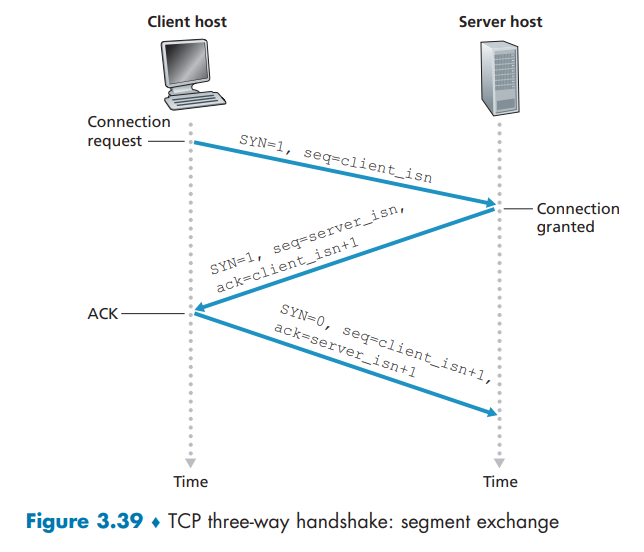

# R1 

> 假定网络层提供了下列服务。在源主机中的网络层接收最大长度 1200 字节和来自运输层的目的主机地址的报文段。网络层则保证将该报文段交付给位于目的主机的运输层。假定在目的主机上能够运行许多网络应用进程。
>
> a. 设计尽可能简单的运输层协议，该协议将使应用层程序数据到达位于目的主机的所希望的进程。假设在目的主机的操作系统已经为每个运行的应用程序分配了一个 4 字节的端口号。
>
> b. 修改这个协议，使它向目的进程提供一个 “返回地址”。
>
> c. 在你的协议中，该运输层在计算机网络的核心中 “必须做任何事” 吗？

## a

将此协议称为简单传输协议 (STP)。 

在发送方，STP 从发送进程接受不超过 1196 字节的数据块、目标主机地址和目标端口号。 在此基础上, STP再为每个块添加一个4字节的标头，并将目标进程的端口号放入该标头中。 然后，STP 将目标主机地址和结果段提供给网络层。 

网络层将报文段传送到目标主机上的 STP。 然后，STP 检查报文段中的目的端口号，从报文段中提取数据，并将数据传递给由端口号标识的进程。

## b

该段现在有两个标头字段：源端口字段和目标端口字段。 

在发送方，STP 接受不超过 1192 字节的数据块、目标主机地址、源端口号和目标端口号。在此基础上, STP 在该段的头部添加4字节的源端口号和4字节的目的端口号。然后它将报文段提供给网络层。

接收到报文段后，接收主机的 STP 向应用程序进程提供应用程序数据和源端口号。

## c

不，传输层没有在网络核心中执行任何操作； 该运输层协议仅在端系统中接收应用层数据并将其交给网络层, 仅指明了目的主机的IP和端口号, 和源主机的端口号, 没有触及到网络核心的路由器, 交换机的工作。

# R2 

> 考虑有一个星球，每个人都属于某个六口之家，每个家庭都住在自己的房子里，每个房子都有一个唯一的地址，并且某给定家庭中的每一个人都有一个独特的名字。
>
> 假定该星球有一个从源家庭到目的家庭交付信件的邮政服务。该邮政服务要求：
>
> 1. 在一个信封中有一封信；
>
> 2. 在信封上清楚地写上目的家庭的地址（并且没有别的东西）。假设每个家庭有一名家庭成员代表为家庭中的其他成员收集和分发信件。这些信没有必要提供任何有关信的接收者的提示。
>
> a. 使用对上面复习题 R1 的解决方案作为启发，描述**家庭成员代表**能够使用的协议，以从发送家庭成员向接收家庭成员交付信件。
>
> b. 在你的协议中，该邮政服务必须打开信封并检查信件能容才能提供它的服务吗？

参考书中举得东西海岸家庭邮件传输案例

## a

寄信时, 每个家庭成员向代表提供收件人姓名和家庭地址, 家庭成员代表将收件人姓名写在信件顶部, 然后将信件装进信封, 每个信封上标明了目的家庭的房子的地址,  然后该代表将收集到的信件交付给邮政服务。

收信时, 一个家庭成员代表从邮政服务那里收到一批信件后, 打开每个信封, 然后根据信件顶部的收件人姓名将信件交给对于的家庭成员

## b

邮政服务没有必要打开信封检查, 只需要根据信封上的目的家庭地址, 送到对于的房子, 交给该家庭的代表即可。

# R3 

> 考虑在主机 A 和主机 B 之间有一条 TCP 连接。假设从主机 A 传送到主机 B 的 TCP 报文段具有源端口号 x 和目的端口号 y。对于从主机 B 传送到主机 A 的报文段，源端口号和目的端口号分别是多少？

对于从主机 B 传送到主机 A 的报文段，源端口号为`y`和目的端口号为`x`

# R4

> 描述应用程序开发者为什么可能选择在 UDP 上运行应用程序而不是在 TCP 上运行的原因。

参考P128

由于UDP没有拥塞控制机制, 所以可以尽可能地占用网络带宽, 可以更自由地控制发送速率

由于UDP是无连接的, 没有建立连接导致的时延, 所以可以有更小的时延

开发者开发的应用程序可能不需要保证数据地可靠性, 并且可以忍受部分数据丢失。

# R5

> 在今天的因特网中，为什么语音和图像流量常常是经过 TCP 而不是经 UDP 发送。（提示：答案与 TCP 的拥塞控制没有关系）

由于大多数**防火墙都配置为阻止 UDP 流量**，因此对视频和语音流量使用 TCP 可以让流量通过防火墙

# R6

> 当某应用程序运行在 UDP 上时，该应用程序可能得到可靠数据传输吗？如果能，如何实现？

可以。 应用程序开发人员可以将可靠的数据传输放入**应用层协议**中。 然而，这需要大量的工作和调试。

可靠数据传输(重传机制，带序号 ACK 确认报文, 定时器, 超时检)在除物理层的其它层均可实现, 但实现的层次越高, 难度就越。

# R7 

> 假定在主机 C 上的一个进程有一个具有端口号 6789 的 UDP 套接字。假定主机 A 和主机 B 都用目的端口号 6789 向主机 C 发送一个 UDP 报文段。
>
> 这两台主机的这些报文段在主机 C 都被定位到相同的套接字吗？
>
> 如果是这样的话，在主机 C 的该进程将怎样知道源于两台不同主机的这两个报文段呢？

UDP套接字是由目的IP和目的端口号这个二元组`(Source port, Dest port)`唯一标识的, 虽然主机A, B发送的UDP报文的源IP不同, 但是目的IP和目的端口号都一样, 所以都被定位到相同的套接字。


由于UDP报文段首部包含了源端口号, 并且操作系统会将网络层报文中的 IP 地址提取出来交给应用进程, 所以主机C根据源IP和源端口号就可以区分两个UDP报文段了。

# R8 

> 假定在主机 C 端口 80 上运行的一个 Web 服务器。假定这个 Web 服务器使用**持续连接**，并且正在接收来自两台不同主机 A 和 B 的请求。
>
> 被发送的所有请求都通过位于主机 C 的相同套接字吗？
>
> 如果它们通过不同的套接字传递，这两个套接字都具有端口 80 吗？讨论和解释之。

对于每个持久连接，Web 服务器都会创建一个单独的"连接套接字"。 每个连接套接字都用一个四元组来标识：`(source ip, source port, dest ip, dest port)`。 当主机 C 接收 IP 数据报时，它会检查数据报的报文段部分中的这四个字段，以确定应将 TCP 段的有效负载传递到哪个套接字。 因此，A 和 B 的请求通过不同的套接字。 

这两个套接字的标识符都是 80 表示目标端口。 但是，这些套接字的标识符中的源 IP 地址具有不同的值。 与 UDP 不同，当传输层将 TCP 段的有效负载传递给应用程序进程时，它不指定源 IP 地址，因为这是由套接字标识符隐式指定的。

它们通过2个不同的套接字传递, 并且这2个套接字在一个端口上, 所以一个端口可以有多个套接字, 但是一个套接字只能有1个端口号, 


# R9

> 在我们的 rdt 协议中，为什么要引入序号？


接收方需要序列号来判断到达的数据包是新数据还是重传数据, 如果是所期待的序号则是新数据, 否则是重传数据。

接收方根据接收到的是新数据(与当前期望序号一致)还是重传数据(上次接收到的数据), 进入不同的状态, 如果是新数据则, 进入下一个状态, 等待下一个新数据, 如果是重传的数据, 则返回ACK, 并继续等待新数据

发送方收到ACK后, 发送下一个新分组, 这样就可以解决数据丢失后哦的重传问题

# R10

> 在我们的 rdt 协议中，为什么要引入定时器？


用于检测是否出现了丢包, 或者说确定何时有必要进行重传, 防止发送方接收不到ACK, 一直进行等待, 而陷入死锁状态。

如果定时器计时期间, 没有收到ACK(可能是由于丢包, 丢失ACK或者时延过大), 则发送方应当重发分组

# R11 

> 假定发送方和接收方之间的往返时延是固定的并且为发送方所知。假设分组能够丢失的话，在协议 rdt 3.0 中，一个定时器仍是必需的吗？试解释之。


rdt 3.0 协议中仍然需要计时器。 如果往返时间已知，则唯一的优点是，发送方可以确定数据包或数据包的 ACK（或 NACK）已丢失，与实际情况相比，其中 ACK（或 NACK）已丢失。 定时器到期后，NACK）可能仍在发送至发送方的途中。 然而，为了检测丢失，对于每个数据包，发送方仍然需要一个恒定持续时间的计时器。

无论如何我们都要知道数据包是否丢失, 所以我们还是要计时器来计时, 有了确定的往返时延, 好处就是我们不用自己估算往返时延, 并且计时器时间到了就表明数据包确实丢失了,  而不是经历了比较大的时延, 往返时延估计偏大可能会造成冗余的数据

# R12 

> 在配套网站上使用 Go-Back-N (回退 N 步) Java 小程序。
>
> [Go-Back-N interactive animation](https://media.pearsoncmg.com/aw/ecs_kurose_compnetwork_7/cw/content/interactiveanimations/go-back-n-protocol/index.html)
>
> a. 让源发送 5 个分组，在这 5 个分组的任何一个到达目的地之前暂停该动画。然后毁掉第一个分组并继续该动画。试描述发生的情况。
>
> b. 重复该实验，只是现在让第一个分组到达目的地并毁掉第一个确认。再次描述发生的情况。
>
> c. 最后，尝试发送 6 个分组。发生了什么情况？

## a

连续发送5个分组, 分组0开启了定时器


```
(S) -  Start timer (for Packet 0).
(S) -  packet 0 sent. Press Pause to be able to kill packet.
(S) -  Timer already running.
(S) -  packet 1 sent. Press Pause to be able to kill packet.
(S) -  Timer already running.
(S) -  packet 2 sent. Press Pause to be able to kill packet.
(S) -  Timer already running.
(S) -  packet 3 sent. Press Pause to be able to kill packet.
(S) -  Timer already running.
(S) -  packet 4 sent. Press Pause to be able to kill packet.
```

在接收第一个分组前, 毁掉了第一个分组


接收方接收到了乱序的分组, 没有发送ACK

最终停留在该状态,一段时间


```
(R) -  Packet 1 received out of order - no Packets acknowledged. Special case -  No Ack sent.
(R) -  Packet 2 received out of order - no Packets acknowledged. Special case -  No Ack sent.
(R) -  Packet 3 received out of order - no Packets acknowledged. Special case -  No Ack sent.
(R) -  Packet 4 received out of order - no Packets acknowledged. Special case -  No Ack sent.
```

一段时间后, 定时器超时, 发送方进行重传

```
(S) -  Timeout occurred (for Packet 0) 
All outstanding Packet(s) from 0 to 4 are retransmitted. Start timer (for Packet 0)
```


## b

连续发送5个分组


log

```xml
(S) -  Start timer (for Packet 0).
(S) -  packet 0 sent. Press Pause to be able to kill packet.
(S) -  Timer already running.
(S) -  packet 1 sent. Press Pause to be able to kill packet.
(S) -  Timer already running.
(S) -  packet 2 sent. Press Pause to be able to kill packet.
(S) -  Timer already running.
(S) -  packet 3 sent. Press Pause to be able to kill packet.
(S) -  Timer already running.
(S) -  packet 4 sent. Press Pause to be able to kill packet.
```

删除编号为0的的ACK


接收方接收1, 2, ,3, 4ACK, 此后未进行重发, 因为序号大的ACK已经收到, 所以序号小的分组也已经被接收方收到


```
(S) -  Cumulative Ack received for Packet(s) up to and including 1.
(S) -  Stop timer.
(S) -  Start timer (for Packet 2).
(S) -  Cumulative Ack received for Packet(s) up to and including 2.
(S) -  Stop timer.
(S) -  Start timer (for Packet 3).
(S) -  Cumulative Ack received for Packet(s) up to and including 3.
(S) -  Stop timer.
(S) -  Start timer (for Packet 4).
(S) -  Cumulative Ack received for Packet(s) up to and including 4.
(S) -  Stop timer.
```


## c

受发送窗口限制, 最多只能发送5个分组, 即已发送但未确认的分组个数在同一时刻不能超过5个

# R13

> 重复复习题 R12，但是现在使用 Selective Repeat (选择重传) Java 小程序
>
> [Selective Repeat interative animation](https://media.pearsoncmg.com/aw/ecs_kurose_compnetwork_7/cw/content/interactiveanimations/selective-repeat-protocol/index.html)
>
> a. 让源发送 5 个分组，在这 5 个分组的任何一个到达目的地之前暂停该动画。然后毁掉第一个分组并继续该动画。试描述发生的情况。
>
> b. 重复该实验，只是现在让第一个分组到达目的地并毁掉第一个确认。再次描述发生的情况。
>
> c. 最后，尝试发送 6 个分组。发生了什么情况？

## a

连续发送5个分组


```
(S) -  Timer started for Packet 0.
(S) -  Packet 0 sent. Press Pause to be able to kill packet.
(S) -  Timer already running.
(S) -  Packet 1 sent. Press Pause to be able to kill packet.
(S) -  Timer already running.
(S) -  Packet 2 sent. Press Pause to be able to kill packet.
(S) -  Timer already running.
(S) -  Packet 3 sent. Press Pause to be able to kill packet.
(S) -  Timer already running.
(S) -  Packet 4 sent. Press Pause to be able to kill packet.
```

删除第0个分组


接收方成功接收1, 2, 3, 4分组


```
(R) -  Packet 1 received out of order. Packet buffered. Selective acknowledge for only Packet 1 sent.
(R) -  Packet 2 received out of order. Packet buffered. Selective acknowledge for only Packet 2 sent.
(R) -  Packet 3 received out of order. Packet buffered. Selective acknowledge for only Packet 3 sent.
(R) -  Packet 4 received out of order. Packet buffered. Selective acknowledge for only Packet 4 sent.
```


发送方接收1, 2, 3, 4分组的ACK


```
(S) -  Selective ACK for only Packet 1 received. Timer for Packet 1 stopped.
(S) -  Timer started for Packet 1.
(S) -  Selective ACK for only Packet 2 received. Timer for Packet 2 stopped.
(S) -  Timer started for Packet 2.
(S) -  Selective ACK for only Packet 3 received. Timer for Packet 3 stopped.
(S) -  Timer started for Packet 3.
(S) -  Selective ACK for only Packet 4 received. Timer for Packet 4 stopped.
(S) -  Timer started for Packet 4.
```


发送方的分组0的计时器超时, 发送方重传分组0, 并重新开启计时器

```
(S) -  Timeout occurred for Packet 0. Timer restarted for Packet 0. 
```


## b

连续发送5个分组


删除分组0对应的ACK


分组0的计时器又超时, 发送方重发分组0, 但接收方已经接收到了分组0


# R14 

> 是非判断题：
>
>  a. 主机 A 经过一条 TCP 连接向主机 B 发送一个大文件。假设主机 B 没有数据发往主机 A。因为主机 B 不能随数据捎带确认，所以主机 B 将不向主机 A 发送确认。
>
> b. 在连接的整个过程中，TCP 的 rwnd 的长度决不会变化。
>
> c. 假设主机 A 通过一条 TCP 连接向主机 B 发送一个大文件。主机 A 发送但未被确认的字节数不会超过接收缓存的大小。
>
>  d. 假设主机 A 通过一条 TCP 连接向主机 B 发送一个大文件。如果对于这条连接的一个报文段的序号为 m，则对于后继报文段的序号将必然是 m + 1。
>
> e. TCP 报文段在它的首部中有一个 rwnd 字段。
>
> f. 假定在一条 TCP 连接中最后的 SampleRTT 等于 1 秒，那么对于该连接的 TimeoutInterval 的当前值必定大于等于 1 秒。
>
> g. 假设主机 A 通过一条 TCP 连接向主机 B 发送一个序号为 38 的 4 个字节的报文段。在这个相同的报文段中，确认号必定是 42。

## a

❌

主机 B 会对主机 A 发送的每个分组单独发送一个确认报文，并在确认报文段的确认号域填写期望接收的下一字节序号。 

## b

❌

rwnd = receive window

其大小是接收缓存可以的字节数

TCP接收方有接收缓存, 接收方维护一个接收窗口(实际上TCP连接的双方都各自维护一个接收窗口), 向发送方指示可用的缓存空间大小, 防止发送方发送过快, 而接收方应用程序读取过慢, 使得接收方缓存溢出的情况, 使得发送方与接收方的速度匹配, 从而实现流量控制

接收方根据当前缓存可用空间计算出rwnd, 把当前的rwnd值放在要返回给发送方的报文的的`receive window`字段中, 告知发送方在该TCP连接中还有多少可用空间, 发送方接收到rwnd后, 调整发送窗口的大小

所以rwnd会随着接收方应用读取缓存的速率发送变化

具体可以复习3.5.5流量控制一节


## c

✔

因为TCP连接有流量控制, 所以不会让发送方发送过快而使得接收方的缓存溢出

## d

❌

报文段的序号是第一个数据字节的字节流编号

从发送方的观点看, 发送方下一个发送的报文段的序号不一定是前一个报文的序号+1, 如果在握手阶段第3次握手发送的报文段的序号是第一次握手发送的报文段的序号+1,  但是如果连接已经建立, 发送方发送的报文段肯定是有数据字段的, 对于携带数据的报文段，下一个报文的的序号是前一个报文数据字段的最后一个字节的序号+1

将一个大文件的字节流, 分割为多个数据段, 如下:


TCP 3次握手过程, 如下:



## e

✔


## f

❌
$$
TimeoutInterval = EstimatedRTT + 4 \ \cdot\ DevRTT \\
= (1 - \alpha) \cdot EstimatedRTT + \alpha \cdot SampleRTT \\ 
	+ 4 \cdot ((1-\beta)\cdot DevRTT + \beta \cdot |SampleRTT - EstimatedRTT|)
$$
超时间隔理论上要大于连接的往返时延, 但是实际上往返时延是估计出来的, 而不是利用最后一次检测的SampleRTT直接, 如果之前的SampleRTT都小于1s,  最后一次的SampleRTT可能不会导致TimeoutInterval >1s, 具体取决于新样本的权值和最近的SampleRTT和上一个EstimatedRTT的差

## g

❌

确认号与报文段序号无关, 确认号是当前主机期望下一次收到的第一个字节的编号, 是根据已经收到的字节算出来的。

例如, 如果主机A已经收到了来自TCP另一端主机B的0~245个字节, 则会在发送给主机B的报文段的确认号中填写245

# R15

> 假设主机 A 通过一条 TCP 连接向主机 B 发送两个紧接着的 TCP 报文段。第一个报文段的序号为 90，第二个报文段的序号为 110。
>
> a. 第一个报文段中有多少数据？
>
> b. 假设第一个报文段丢失而第二个报文段到达主机 B。那么在主机 B 发往主机 A 的确认报文中，确认号应该是多少？

## a

由报文段序号的定义可知, 第一个报文数据部分的首字节的编号为90, 因为第二个报文段紧挨着第一个报文段, 并且第二个报文段的首字节编号为120, 所以第一个报文段的数据的末字节的编号为119(), 则第一个报文中有119 - 90 + 1 个字节的数据(不包含头部)

## b

TCP 是累积确认的, 即之确认第一个丢失字节前的所有字节

因为确认号ACK是期待收到的首字节编号, 并且第一个报文段没有收到, 所以会发送确认号为90的ACK报文

# R16 

> 考虑在 3.5 节中讨论的 Telnet 的例子。用户键入字符 C **数秒**之后，用户又键入字符 R。那么在用户键入字符 R 之后，总共发送了多少个报文段，这些报文段中的序号和确认号字段应该填入什么？


用户方面总共发送了3个报文段

因为用户键入'C' 数秒后才键入'R', 所以C的回显已经被收到, 所以可以在发送R的同时**捎带**对服务器刚才的回显的'C'的ACK确认


# R17 

> 假设两条 TCP 连接存在于一个带宽为 R bps 的瓶颈链路上，它们都将发送一个很大的文件（以相同的方向经过瓶颈链路），并且两者是同时开始发送文件。那么 TCP 将为每条连接分配什么样的速率？


如果这两条TCP连接的吞吐量和小于R, 不会发生丢包, 此时每经过一个RTT, 二者发送窗口长度增加1, 即沿着45°线上升

直到二者带宽和(可能只是一个连接的占用带宽过大)超过链路的带宽R, 此时发送分组丢失, 则两条连接都将窗口长度减半, 继续沿45°方向增加

下图展示的是初始吞吐量点在平等曲线的上方, 所经历的过程


这样两个连接的吞吐量决定的点一直向者平等带宽共享曲线移动(无论点初始在平等带宽共享曲线的哪一侧)

如此反复, 二者的带宽都将趋于R/2

# R18 

> 是非判断题。
>
> 考虑 TCP 的拥塞机制。当发送方定时器超时时，其 ssthresh(慢启动阈值 slow start thresh) 的值将被设置为**原来值**的一半。

❌

将ssthresh设置为检测到超时时的cwnd(拥塞窗口)的一半

然后如果是超时, 则cwnd = 1, 如果是收到3个冗余ACK, 则cwnd = 新的ssthresh + 3

# R19

> 在 3.7 节的 "TCP分岔" 讨论中，对于 TCP 分岔的响应时间，断言大约是 4RTT~FE~ + RTT~BE~ + 处理时间。评价该断言。

使用TCP分岔, 客户端始终与前端服务器交互, 基础时间为4RTT~FE~, 在客户端到前端服务器的第三次握手后, 前端服务器向后端服务器发送请求, 然后前端服务器收到响应, 所以在4RTT~FE~的基础上增加了RTT~BE~ + 处理时间


