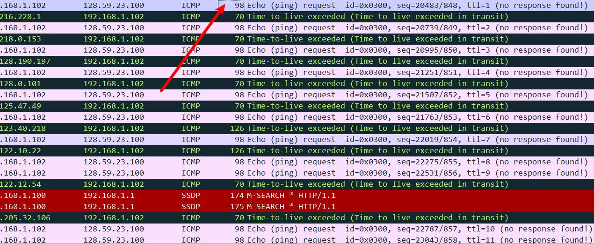
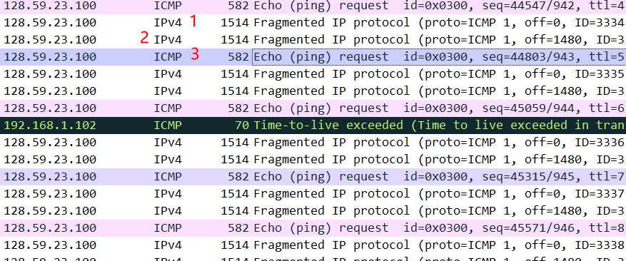
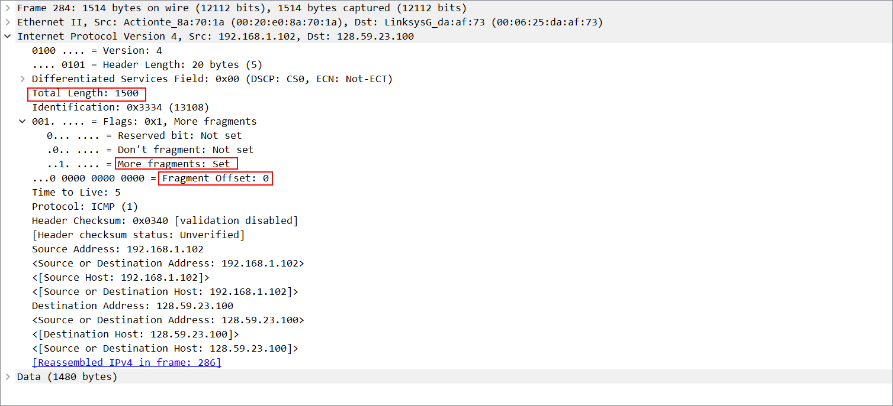

# 从traceroute的执行中捕获数据包

Linux中的 Traceroute命令，可以通过指示数据报中的字节数来显式设置发送到目的地的UDP数据报的大小； 该值在traceroute 命令行中紧跟在目标名称或地址之后输入。 例如，要向 gaia.cs.umass.edu 发送 2000 字节的跟踪路由数据报，命令为：`$ traceroute gaia.cs.umass.edu 2000`

a length of 56 bytes, one with a length of 2000 bytes, and one with a length of 3500 bytes

# 查看捕获的踪迹

## Q1

> 选择您的计算机发送的第一条 ICMP Echo Request 消息，然后在数据包详细信息窗口中展开数据包的 Internet 协议部分。您计算机的 IP 地址是什么？

ICMP Echo Request 报文时traceroute程序发送的

192.168.1.102

## Q2

> 在IP数据包头中，上层协议字段的值是多少？

## Q3

> IP 标头中有多少字节？ IP 数据报的有效负载有多少字节？ 解释一下如何确定有效负载字节数

total length 是整个IP数据报的大小, 要减去IP报的首部大小20, 计算出载荷部分的字节数

84 - 20 = 64

ICMPEcho Request报文的数据部分只有56字节, 其首部占8个字节

ICMP（Internet Control Message Protocol）报文的首部占8个字节。这个8字节的首部包括以下字段：

1. 类型（Type）：占1个字节，指定消息的类型，例如，回显请求、回显回答、目的不可达等。

2. 代码（Code）：占1个字节，用于提供更多关于消息类型的细节信息。

3. 校验和（Checksum）：占2个字节，用于检测报文首部和数据部分的完整性。

4. 标识符（Identifier）：占2个字节，通常在回显请求和回显回答报文中用于匹配请求和响应。

5. 序列号（Sequence Number）：占2个字节，用于标识回显请求和回显回答之间的关系。

## Q4

> 此 IP 数据报是否已分片？ 解释一下如何确定数据报是否已分段。

identification: 标识

Flags: 标志

Fragment offset: 片偏移

查看标志Flags字段, 发现没有分段

接下来，单击“Source”列标题，根据 IP 源地址对跟踪的数据包进行排序； “来源”一词旁边应出现一个向下的小箭头。 如果箭头向上，请再次单击“源”列标题。 选择您的计算机发送的第一条 ICMP Echo Request 消息，然后在“所选数据包标头的详细信息”窗口中展开“Internet 协议”部分。 在“捕获的数据包列表”窗口中，您应该在第一个 ICMP 下方看到所有后续 ICMP 消息（可能还包含计算机上运行的其他协议发送的其他散布数据包）。 使用向下箭头浏览计算机发送的 ICMP 消息。

## Q5

> 在计算机发送的这一系列 ICMP 报文中，IP 数据报中的哪些字段总是从一数据报到下一个数据报发生变化？

Time to Live 会改变

Identification 会改变

Header Checksum 会改变

## Q6

> 哪些字段保持不变？ 哪些字段必须保持不变？ 哪些字段必须更改？ 为什么？

源IP和目标IP必须不变, 本身就是要检测源IP和目标IP之间的路由器情况

length可以变, 无关紧要

TTL字段必须改变, 要探测距离TTL条的路由器

## Q7

> 描述您在 IP 数据报的标识Identification字段的值中看到的模式

是一个16进制的数, 是对IP数据报的有序编号

接下来（数据包仍按源地址排序）查找最近（第一跳）路由器发送到您的计算机的一系列 ICMP TTL 超出回复

## Q8

> 标识字段Identification 和 TTL 字段的值是多少

## Q9

> 对于最近（第一跳）路由器发送到您的计算机的所有 ICMP TTL-exceeded replies ，这些值是否保持不变？ 为什么？

TTL不会变

Identification可能会变

# Fragmentation

单击“时间”列，再次根据时间对数据包列表进行排序

## Q10

> 在将 pingplotter 中的数据包大小更改为 2000 后，查找计算机发送的第一条 ICMP Echo Request 消息。该消息是否被分成多个 IP 数据报？

2008字节分为了2个IP数据报

## Q11

> 打印出分片 IP 数据报的第一个片段。 IP 标头中的哪些信息表明数据报已被分片？ IP 标头中的哪些信息表明这是第一个片段还是后一个片段？ 该 IP 数据报有多长？

More fragments 被置位, 表明后面还有分段, 即当前分段不是最后一个分段

Fragement offset = 0 表明这是第一个片段

数据报长度为一个MTU 1500 bytes

## Q12

> 打印出分段 IP 数据报的第二个片段。 IP 标头中的哪些信息表明这不是第一个数据报片段？ 碎片多吗？ 你怎么知道？

Fragment offset != 0 表明不是第一个片段

如果是第一个片段, total length也应该为1500

只有2个片段

## Q13

> 第一个和第二个片段之间 IP 标头中的哪些字段发生变化？

Fragment offset

Total length

现在，找到将 pingplotter 中的数据包大小更改为 3500 后计算机发送的第一条 ICMP Echo 请求消息。

## Q14

> 从原始数据报创建了多少片段

## Q15

> 分片中 IP 标头中哪些字段发生变化

Fragment offset

Total length

More fragment

可以发现3个片段的Identification字段一致

第一个片段

第二个片段

第3个片段

