# P1

> 考虑下列网络。
>
> 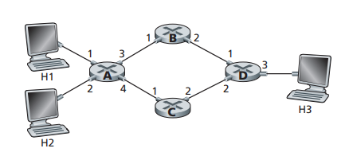
>
> a. 假定网络是一个数据报网络。写出路由器 A 中的转发表，从而满足所有指向主机 H3 的流量都通过接口 3 转发。
>
> b. 假定网络是一个数据报网络。你能写出路由器 A 中的转发表从而满足其中所有从 H1 指向主机 H3 的流量通过接口 3 转发，而所有从 H2 指向主机 H3 的流量通过接口 4 转发。（提示：这是一个技巧问题）

## a

| 目的地址 | 输出链路 |
| :------: | :------: |
|    H3    |    3     |

## b

不可以, 因为转发只依据了传入数据报的目的地址, 如果2个输入数据报的目的Ip一致, 则会转发到同一个输出链路


# P2

> 假设两个分组在完全相同的时刻到达一台路由器的两个**不同输入端口**。同时假设在该路由器中没有其他分组。
>
> a. 假设这两个分组朝着两个不同的输出端口转发。当交换结构使用一条共享总线时，这两个分组可能在相同时刻通过该交换结构转发吗?
>
> b. 假设这两个分组朝着两个不同的输出端口转发。当交换结构使用经内存交换时，这两个分组可能在相同时刻通过该交换结构转发吗?
>
> c. 假设这两个分组朝着相同的输出端口转发。当交换结构使用纵横式时，这两个分组可能在相同时刻通过该交换结构转发吗?

## a

不可能, 总线在任意时刻都最多转发一个分组, 即一次只能通过共享总线传输一个分组

## b

不可能，因为通过CPU的系统总线一次只能执行一次内存读/写操作。

## c

不可能, 此时这两个分组的其中一个会在输入端口除排队


# P3

> 在4.2.4节中，如果$R_{switch}$是$R_{line}$的N倍，即使所有的分组都转发到相同的输出端口，则仅在输入端口将出现微不足道的排队。现在假设$R_{switch} = R_{line}$，但所有分组转发到不同的输出端口。令D是传输一个分组的时间。作为D的函数，对分组使用内存、总线和纵横式交换结构，什么时候具有最大的输入排队时延?

使用内存交换和总线交换一样, 一次只能转发一个分组

所以第N个分组要等(n-1)D的时间才能被传输, 即排队时延为(n-1)D

纵横式交换一次可以并行转发到不同输出端口的分组, 所以每个分组无需等待就立刻被转发, 排队时延为0


# P4

> 考虑下列交换机。
>
> 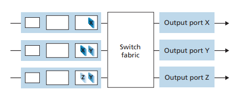
>
> 假设所有数据报具有相同长度，交换机以一种**分时隙、同步**的方式运行，在一个时隙中一个数据报能够从某输入端口传送到某输出端口。其交换结构是**纵横式**的，因此在一个时隙中至多一个数据报能够传送到一个给定输出端口，但在一个时隙中不同的输出端口能够接收到来自不同输入端口的数据报，从输入端口到它们的输出端口传送所示的分组，所需的时隙数量最小是多少?此时假定使用你所需要的任何输人排队调度方法（即此时没有HOL阻塞)。
>
> 假定采用你能够设计的最差情况下的调度方案，且**非空输入队列**不会空闲，所需的时隙数量最大是多少?

一个时隙内, 可以同时转发到X, Y, Z的分组

所需的最小时隙数为3。调度如下:

时隙1：在顶部输入队列中发送X，在中间输入队列中发送Y。由于底部队列队首的目的输出端口为Y, 所以在这个时隙不能被转fa

时隙 2：在中间输入队列中发送 X，在底部输入队列中发送 Y 

时隙 3：在底部输入队列中发送 Z。

最大时隙数仍然是 3。实际上，基于非空输入队列永远不会空闲的假设，我们看到第一个时隙始终包含在顶部输入队列中发送 X 以及在中间或底部输入中发送 Y 队列中，在第二个时隙中，我们总是可以再发送两个数据报，最后一个数据报可以在第三个时隙中发送。 


# P5

> 假设将WEQ调度策略应用到一个支持三个类的缓冲区，并假设这三个类的权里分别为0.5、0.25 和0.25。
>
> a. 假设每个类在缓冲区中有大量的分组。为了获得WFQ权值，这三个类的服务顺序是什么?(对于循环调度,自然顺序是123123123...)
>
> b. 假设第1类和第2类在缓冲区中有大量的分组，并且**缓冲区中没有第3类分组**。为了取得该WFO权重,这三个类应该以什么顺序进行服务?

## a

112311231123...

## b

112112112...


# P6

> 考虑下图, 回答下列问题
>
> 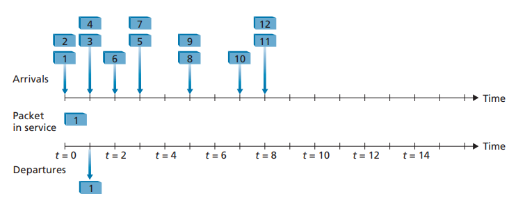
>
> a. 假设采用**FIFO服务**，分别给出分组2到12离开队列的时间。对于每个分组，它的到达和它被传送的时隙开始之间的时延是多少?这12个分组的平均时延是多少?
>
> b. 假设采用**优先权服务**，假设奇数分组优先权高，偶数分组优先权低。分别给出分组2到12离开队列的时间。对于每个分组，它的到达和它被传送的时隙开始之间的时延是多少?这12个分组的平均时延是多少?
>
> c. 假设采用**循环服务**，分组1、2、3、6、11和12来自第1类，分组4、5、7、8、9和10来自第2类。分别给出分组2到12离开队列的时间。对于每个分组，它的到达和离开之间的时延是多少?12个分组的平均时延是多少?
>
> d. 假设采用**加权公平排队（WFQ）服务**，奇数分组来自第1类，偶数分组来自第2类。第1类的WFQ权重为2，第2类的WFQ权重为1。注意到实现书中描述的理想的WFQ调度也许是不可能的，因此请说明为什么选择特定的分组在每个时隙进入服务。对于每个分组，它的到达和离开之间的时延是多少? 12个分组的平均时延是多少?
>
> e. 在所有四种情况（FIFO、RR、优先权和WFQ)中，平均时延呈现出什么现象?

## a

采用FIFO服务, 各分组的进出队列的时间如下表:

| 分组 | 进入队列的时刻 | 离开队列的时刻 | 时延 | 平均时延 |
| ---- | -------------- | -------------- | ---- | -------- |
| 2    | 0              | 2              | 2    |          |
| 3    | 1              | 3              | 2    |          |
| 4    | 1              | 4              | 3    |          |
| 5    | 3              | 6              | 3    |          |
| 6    | 2              | 5              | 3    |          |
| 7    | 3              | 7              | 4    | 3.091    |
| 8    | 5              | 8              | 3    |          |
| 9    | 5              | 9              | 4    |          |
| 10   | 7              | 10             | 3    |          |
| 11   | 8              | 11             | 3    |          |
| 12   | 8              | 12             | 4    |          |

## b

采用优先权服务服务, 各分组的进出队列的时间如下表:

| 分组 | 进入队列的时刻 | 离开队列的时刻 | 时延 | 平均时延 |
| ---- | -------------- | -------------- | ---- | -------- |
| 2    | 0              | 3              | 3    |          |
| 3    | 1              | 2              | 1    |          |
| 4    | 1              | 7              | 6    |          |
| 5    | 3              | 4              | 1    |          |
| 6    | 2              | 8              | 6    |          |
| 7    | 3              | 5              | 2    | 3.091    |
| 8    | 5              | 10             | 5    |          |
| 9    | 5              | 6              | 1    |          |
| 10   | 7              | 11             | 4    |          |
| 11   | 8              | 9              | 1    |          |
| 12   | 8              | 12             | 4    |          |

分组1在`t = 1`时刻出队列后, 此时奇数队列中有3, 偶数队列中有4, 2(队首在后) 此时队列的情况是:

```
odd : back -> front [3]
even: back -> front [4, 2]
```

**在`t = 1`时刻, 开始传输分组3**

在`t = 2`时刻, 分组3出队列, 新加入分组6, 此时队列的情况是:

```
odd : back -> front []
even: back -> front [6, 4, 2]
```

**在`t = 2`时刻, 开始传输分组2**

在`t = 3`时刻, 分组2出队列, 新加入分组5, 7, 此时队列的情况是:

```
odd : back -> front [7, 5]
even: back -> front [6, 4]
```

**在`t = 3`时刻, 开始传输分组5**

在`t = 4`时刻, 分组5出队列,  此时队列的情况是:

```
odd : back -> front [7]
even: back -> front [6, 4]
```

**在`t = 4`时刻, 开始传输分组7**

在`t = 5`时刻, 分组7出队列,  分组8, 9进入队列, 此时队列的情况是:

```
odd : back -> front [9]
even: back -> front [8, 6, 4]
```

**所以在`t = 5`时刻, 开始传输分组9**

在`t = 6`时刻, 分组9出队列,  此时队列的情况是:

```
odd : back -> front []
even: back -> front [8, 6, 4]
```

**所以在`t = 6`时刻, 开始传输分组4**

在`t = 7`时刻, 分组4出队列,  分组10进入队列, 此时队列的情况是:

```
odd : back -> front []
even: back -> front [10, 8, 6]
```

**所以在`t = 7`时刻, 开始传输分组6**

在`t = 8`时刻, 分组6出队列,  分组11, 12进入队列, 此时队列的情况是:

```
odd : back -> front [11]
even: back -> front [12, 10, 8]
```

**所以在`t = 8`时刻以后, 依次传输的分组是: 11, 8, 10, 12**

所以从`t = 1`到`t = 11`, 依次传输的分组是: 3, 2, 5, 7, 9, 4, 6, 11, 8, 10, 12

## c

采用循环服务服务, 各分组的进出队列的时间如下表:

| 分组 | 进入队列的时刻 | 离开队列的时刻 | 时延 | 平均时延 |
| ---- | -------------- | -------------- | ---- | -------- |
| 2    | 0              | 3              | 3    |          |
| 3    | 1              | 5              | 4    |          |
| 4    | 1              | 2              | 1    |          |
| 5    | 3              | 4              | 1    |          |
| 6    | 2              | 7              | 5    |          |
| 7    | 3              | 6              | 3    | 3.091    |
| 8    | 5              | 8              | 3    |          |
| 9    | 5              | 10             | 5    |          |
| 10   | 7              | 12             | 5    |          |
| 11   | 8              | 9              | 1    |          |
| 12   | 8              | 11             | 3    |          |

在`t = 1`时刻, Class1中的分组1出队列后, 此时队列的情况是:

```
Class1 : back -> front [3, 2]
Class2 : back -> front [4]
```

**在`t = 1`时刻, 开始传输Class2中的分组4**

在`t = 2`时刻, Class2中的分组4出队列后, 分组6加入队列, 此时队列的情况是:

```
Class1 : back -> front [6, 3, 2]
Class2 : back -> front []
```

**在`t = 2`时刻, 开始传输Class1中的分组2**

在`t = 3`时刻, Class1中的分组2出队列后, 分组5, 7加入队列, 此时队列的情况是:

```
Class1 : back -> front [6, 3]
Class2 : back -> front [7, 5]
```

**在`t = 3`时刻, 开始传输Class2中的分组5**

在`t = 4`时刻, Class2中的分组5出队列后,  此时队列的情况是:

```
Class1 : back -> front [6, 3]
Class2 : back -> front [7]
```

**在`t = 4`时刻, 开始传输Class1中的分组3**

在`t = 5`时刻, Class1中的分组3出队列后, 分组8, 9加入队列, 此时队列的情况是:

```
Class1 : back -> front [6]
Class2 : back -> front [9, 8, 7]
```

**在`t = 5`时刻, 开始传输Class2中的分组7**

在`t = 6`时刻, Class2中的分组7出队列后,  此时队列的情况是:

```
Class1 : back -> front [6]
Class2 : back -> front [9, 8]
```

**在`t = 6`时刻, 开始传输Class1中的分组6**

在`t = 7`时刻, Class1中的分组6出队列后, 分组10加入队列, 此时队列的情况是:

```
Class1 : back -> front []
Class2 : back -> front [10, 9, 8]
```

**在`t = 7`时刻, 开始传输Class2中的分组8**

在`t = 8`时刻, Class2中的分组8出队列后, 分组11, 12加入队列, 此时队列的情况是:

```
Class1 : back -> front [12, 11]
Class2 : back -> front [10, 9]
```

在`t = 8`时刻后, 依次传输的分组是: 11, 9, 12, 10

所以从`t = 1`到`t = 11`, 依次传输的分组是: 4, 2, 5, 3, 7, 6, 8, 11, 9, 12, 10

## d

采用加权公平排队（WFQ）服务, 各分组的进出队列的时间如下表:

| 分组 | 进入队列的时刻 | 离开队列的时刻 | 时延 | 平均时延 |
| ---- | -------------- | -------------- | ---- | -------- |
| 2    | 0              | 3              | 3    |          |
| 3    | 1              | 2              | 1    |          |
| 4    | 1              | 6              | 5    |          |
| 5    | 3              | 4              | 1    |          |
| 6    | 2              | 8              | 6    |          |
| 7    | 3              | 5              | 2    | 3.091    |
| 8    | 5              | 10             | 5    |          |
| 9    | 5              | 7              | 5    |          |
| 10   | 7              | 11             | 4    |          |
| 11   | 8              | 9              | 1    |          |
| 12   | 8              | 12             | 4    |          |

分组1在`t = 1`时刻出队列后, 此时奇数队列中有3, 偶数队列中有4, 2(队首在后) 此时队列的情况是:

```
odd : back -> front [3]
even: back -> front [4, 2]
```

**在`t = 1`时刻, 开始传输分组3**

在`t = 2`时刻, 分组3出队列, 新加入分组6, 此时队列的情况是:

```
odd : back -> front []
even: back -> front [6, 4, 2]
```

**在`t = 2`时刻, 开始传输分组2**

在`t = 3`时刻, 分组2出队列, 新加入分组5, 7, 此时队列的情况是:

```
odd : back -> front [7, 5]
even: back -> front [6, 4]
```

**在`t = 3`时刻, 开始传输分组5**

在`t = 4`时刻, 分组5出队列,  此时队列的情况是:

```
odd : back -> front [7]
even: back -> front [6, 4]
```

**在`t = 4`时刻, 开始传输分组7**

在`t = 5`时刻, 分组7出队列,  分组8, 9进入队列, 此时队列的情况是:

```
odd : back -> front [9]
even: back -> front [8, 6, 4]
```

**所以在`t = 5`时刻, 开始传输分组4**❗❗❗, 连续传了2个奇数分组后, 要传偶数分组, 尽管奇数队列中有分组

在`t = 6`时刻, 分组4出队列,  此时队列的情况是:

```
odd : back -> front [9]
even: back -> front [8, 6]
```

**所以在`t = 6`时刻, 开始传输分组9**

在`t = 7`时刻, 分组9出队列,  分组10进入队列, 此时队列的情况是:

```
odd : back -> front []
even: back -> front [10, 8, 6]
```

**所以在`t = 7`时刻, 开始传输分组6**

在`t = 8`时刻, 分组6出队列,  分组11, 12进入队列, 此时队列的情况是:

```
odd : back -> front [11]
even: back -> front [12, 10, 8]
```

**所以在`t = 8`时刻以后, 依次传输的分组是: 11, 8, 10, 12**

所以从`t = 1`到`t = 11`, 依次传输的分组是: 3, 2, 5, 7, 4, 9, 6, 11, 8, 10, 12

## e

不管采用分组调度算法, 所有分组的平均时延是一样的


# P7

> 再次考虑P6的图。
>
> 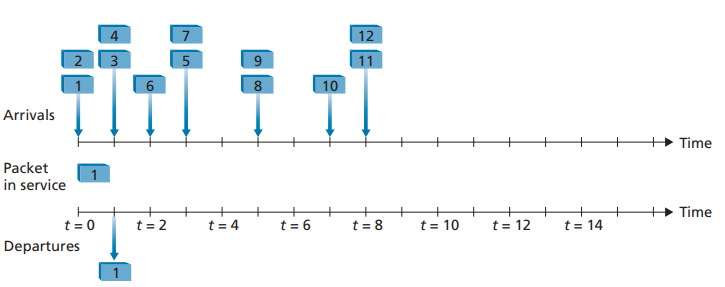
>
> a.假设采用**优先权服务**，分组1、4、5、6和11具有最高的优先权，其余分组为低优先权。分别给出分组2到12离开队列的时隙。
>
> b.假设采用**循环服务**，分组1、4、5、6和11属于第1类流量，其余分组属于第2类流量。分别给出分组2到12离开队列的时隙。
>
> c.假设采用**WFQ服务**，分组1、4、5、6和11属于第1类流量，其余分组属于第2类流量。第1类的WFQ权重为1，第2类的WFQ权重为2(注意这些权重与上一个问题中的权重不同)。分别给出分组2到12离开队列的时隙。另外，请参阅上述问题中关于WFQ服务的警告。

## a

t = 1, 处理4

```
prior [4]
lower [3, 2]
```

t = 2, 处理6

```
prior [6]
lower [3, 2]
```

t = 3, 处理5

```
prior [5]
lower [7, 3, 2]
```

t = 4, 处理2

```
prior []
lower [7, 3, 2]
```

t = 5, 处理3

```
prior []
lower [9, 8, 7, 3]
```

t = 6, 处理7

```
prior []
lower [9, 8, 7]
```

t = 7, 处理8

```
prior []
lower [10, 9, 8]
```

t = 7

```
prior [11]
lower [12, 10, 9]
```

以后依次处理: 11, 9, 10, 12

所以从t = 1到t = 11, 依次处理的分组为: 4, 6, 5, 2, 3, 7, 8, 11, 9, 10, 12

所以分组2-12的开始时间为: 4, 5, 1, 3, 2, 6, 7, 9, 10, 8, 11

则分组2-12的离开队列时间为: 5, 6, 2, 4, 3, 7, 8, 10, 11, 9, 12

## b

t = 0, 处理了Class1的1

t = 1, 处理Class2的2

```
Class1 [4]
Class2 [3, 2]
```

t = 2, 处理Class1的4

```
Class1 [6, 4]
Class2 [3]
```

t = 3, 处理Class2的3

```
Class1 [5, 6]
Class2 [7, 3]
```

t = 4, 处理Class1的6

```
Class1 [5, 6]
Class2 [7]
```

t = 5, 处理Class2的7

```
Class1 [5]
Class2 [9, 8]
```

t = 6, 处理Class1的5

```
Class1 [5]
Class2 [9, 8]
```

t = 7, 处理Class2的8

```
Class1 []
Class2 [10, 9, 8]
```

t = 8, 以后依次处理: 11, 9, 10, 12

```
Class1 [11]
Class2 [12, 10, 9]
```

所以从t = 1到t = 11, 依次处理的分组为: 2, 4, 3, 6, 7, 5, 8, 11, 9, 10, 12

所以分组2-12的开始时间为: 1, 3, 2, 6, 4, 5, 7, 9, 10, 8, 11

则分组2-12的离开队列时间为: 2, 4, 3, 7, 5, 6, 8, 10, 11, 9, 12


## c

t = 0, 处理了Class1的1

t = 1, 处理Class2的2

```
Class1 [4]
Class2 [3, 2]
```

t = 2, 处理Class2的3

```
Class1 [6, 4]
Class2 [3]
```

t = 3, 处理Class1的4

```
Class1 [5, 6, 4]
Class2 [7]
```

t = 4, 处理Class2的7

```
Class1 [5, 6]
Class2 [7]
```

t = 5, 处理Class2的8

```
Class1 [5, 6]
Class2 [9, 8]
```

t = 6, 处理Class1的6

```
Class1 [5, 6]
Class2 [9]
```

t = 7, 处理Class2的9

```
Class1 [5]
Class2 [10, 9]
```

t = 8, 以后依次处理: 10, 5, 12, 11

```
Class1 [11, 5]
Class2 [12, 10]
```

所以从t = 1到t = 11, 依次处理的分组为: 2, 3, 4, 7, 8, 6, 9, 10, 5, 12, 11

所以分组2-12的开始时间为: 1, 2, 3, 9, 6, 4, 5, 7, 8, 11, 10

则分组2~12的离开队列时间为: 2, 3, 4, 10, 7, 5, 6, 8, 9, 12, 11


# P8

> 考虑使用32比特主机地址的某数据报网络。假定一台路由器具有4条链路，编号为0~3，分组能被转发到如下的各链路接口:
>
> 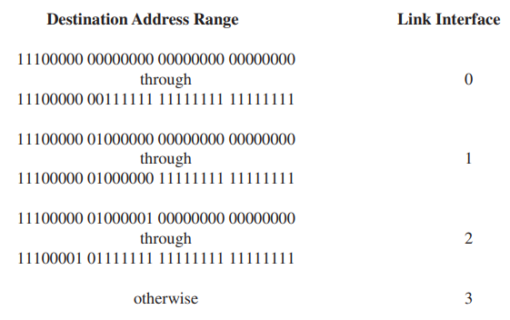
>
> a. 提供一个具有5个表项的转发表, 使用最长前缀匹配,转发分组到正确的链路接口。
>
> b. 描述你的转发表是如何为具有下列目的地址的数据报决定适当的链路接口的。
>
> 1100100010010001 01010001 01010101
>
> 11100001 01000000 11000011 00111100
>
> 11100001 10000000 00010001 01110111

## a

题目中的地址范围是按顺序划分的, 在一个范围中, 如果上下的bit相同则可以作为比特前缀

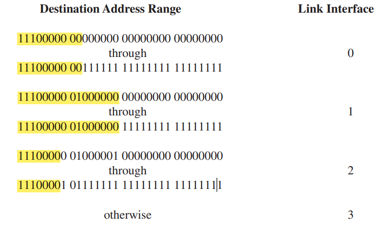

输出到链路3的的比特串要么小于`11100000 00000000 00000000 00000000`要么大于`11100001 01111111 11111111 1111111`

小于`11100000 00000000 00000000 00000000`无法用前缀描述

但是所有大于`11100001 01111111 11111111 11111111`的比特串的前缀都是`11100001 1`

如果不增加 `11100001 1  -> 3` 这一条的话, 原本输出到链路3的可能会被输出到链路2, 因为大于`11100001 01111111 11111111 11111111`也一定大于`11100000 01000001 00000000 00000000`

| 前缀匹配           | 链路接口 |
| :----------------- | :------- |
| 11100000 00        | 0        |
| 11100000  01000000 | 1        |
| 1110000            | 2        |
| 11100001 1         | 3        |
| otherwise          | 3        |

## b

`1100100010010001 01010001 01010101` 没有匹配项, 所以输出链路接口为3

`11100001 01000000 11000011 00111100` 与前缀 `1110000` 匹配, 所以输出链路接口为2

`11100001 10000000 00010001 01110111`, 与前缀 `1110000`和 `11100001 1` 都匹配, 但11100001 1的长度更长, 所以输出链路接口为3

# P9

> 考虑使用**8比特**主机地址的某数据报网络。假定一台路由器使用最长前缀匹配并具有下列转发表:
>
> 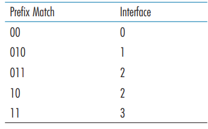
>
> 对这4个接口中的每个，给出相应的目的主机地址的范围和在该范围中的地址数量。

| 目的地址范围                  | 链路接口 | 地址数量         |
| ----------------------------- | -------- | ---------------- |
| **00**00 0000 ~ **00**11 1111 | 0        | 2^6^ = 64        |
| **010**0 0000 ~ **010**1 1111 | 1        | 2^5^ = 32        |
| **011**0 0000 ~ **10**11 1111 | 2        | 2^5^ + 2^6^ = 96 |
| **11**00 0000 ~ **11**11 1111 | 3        | 2^6^ = 64        |


# P10

> 考虑使用8比特主机地址的数据报网络。假定一台路由器使用最长前缀匹配并具有下列转发表。
>
> 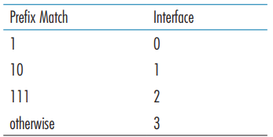
>
> 对这4个接口中的每个，给出相应的目的主机地址的范围和在该范围中的地址数量。

技巧: 根据前缀的长度从大到小确定地址范围

注意: 长度最小的前缀如果最高位不为0, 则要考虑小于该前缀的地址

| 目的地址范围                  | 链路接口 | 地址数量 |
| ----------------------------- | -------- | -------- |
| **1**100 0000 ~ **1**101 1111 | 0        | 2^5^=32  |
| **10**00 0000 ~ **10**11 1111 | 1        | 2^6^=64  |
| **111**0 0000 ~ **111**1 1111 | 2        | 2^5^=32  |
| 0000 0000 ~ 0111 1111         | 3        | 2^7^=128 |

# P11

> 考虑互联3个子网(子网1、子网2和子网3)的一台路由器。假定这3个子网的所有接口要求具有前缀223.1.17/24。还假定子网1要求支持多达60个接口，子网2要求支持多达90个接口，子网3要求支持多达12个接口。提供3个满足这些限制的网络地址（形式为a.b.c.d/x)。

从223.1.17.0开始划分

/ 左边的是网络的网络号(网络范围的起始), 右边的是子网掩码

所有地址范围的起始都是主机号全为0的部分, 代表这个子网的网络号

给子网1分配64个IP地址, 最后8位从`0000 0000 ~ 0011 1111`, 前26位作为网络号, 因为网络号为0000 0000, 所以d = 0, 所以该子网的网络地址: `223.1.17.0/26`

给子网1分配128个IP地址, 最后8位从`1000 0000 ~ 1111 1111`, 前25位作为网络号, 因为网络号为1000 0000, 所以d = 128, 所以该子网的网络地址: `223.1.17.128/25`

给子网1分配16个IP地址, 最后8位从`1011 0000 ~ 1011 1111`, 前28位作为网络号, 因为网络号为1011 0000, 所以d = 192, 所以该子网的网络地址: `223.1.17.192/28`


# P12

> 在4.2.1节中给出了一个转发表（使用最长前缀匹配)的例子。
>
> 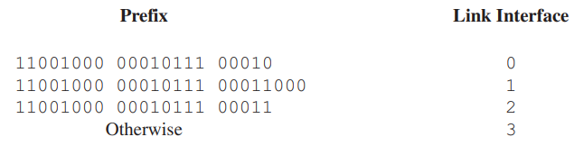
>
> 使用a.b. c.d/x记法代替二进制字符串记法,重写该转发表。

| 目的地址       | 链路接口 |
| -------------- | -------- |
| 200.23.16.0/21 | 0        |
| 200.23.24.0/24 | 1        |
| 200.23.24.0/21 | 2        |
| otherwise      | 3        |

# P13

> 在习题P8中要求你给出转发表（使用最长前缀匹配)。使用a.b.c. d/x记法代替二进制字符串记法,重写该转发表。

| 前缀匹配                                | 链路接口 |
| :-------------------------------------- | :------- |
| `1110 0000 00 -> 224.0.0.0/10`          | 0        |
| `1110 0000  0100 0000 -> 224.64.0.0/16` | 1        |
| `1110 000 -> 224.0.0.0/8`               | 2        |
| `1110 0001 1 -> 225.128.0.0/9`          | 3        |
| otherwise                               | 3        |


# P14

> 考虑一个具有前缀`128.119.40.128/26`的子网。给出能被分配给该网络的一个IP地址（形式为XXX.XXX.XXX.xxx)的例子。假定一个ISP拥有形式为128.119.40.64/26 的地址块。假定它要从该地址块生成4个子网,每块具有相同数量的IP地址。这4个子网（形式为a.b.c.d/x）的前缀是什么?

只要最后8位在1000 0000 ~ 1011 1111 即可, 即最后一个十进制为128 ~ (128+63 = 191)

即128.119.40.128~128.119.40.191


128.119.40.64/26的可分配IP范围是128.119.40.64 ~ 128.119.40.127

后八位为(....) 0100 0000 ~ (....) 0111 1111

根据27, 28位可以将该网络划分位4等份

(....) 01**00** 0000 ~ (....) 01**00** 1111  -> 128.119.40.64/28

(....) 01**01** 0000 ~ (....) 01**01** 1111  -> 128.119.40.80/28

(....) 01**10** 0000 ~ (....) 01**10** 1111 -> 128.119.40.96/28

(....) 01**11** 0000 ~ (....) 01**11** 1111 -> 128.119.40.112/28

分配给4个子网, 每个子网的IP地址有16个


# P15

> 考虑图 4-20 中显示的拓扑。（在 12:00 以顺时针开始）标记具有主机的 3 个子网为网络 A、B 和 C。标记没有主机的子网为网络 D、E 和 F。
>
> 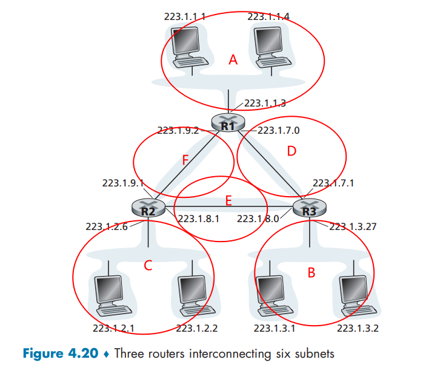
>
> a. 为这 6 个子网分配网络地址，要满足下列限制：所有地址必须从 `214.97.254/23` 起分配；子网 A 应当具有足够地址以支持 250 个接口；子网 B 应当具有足够地址以支持 120 个接口；子网 C 应当具有足够地址以支持 120 个接口。当然，子网 D、E 和 F 应当支持两个接口。对于每个子网，分配采用的形式是 `a.b.c.d/x` 或 `a.b.c.d/x ~ e.f.g.h/y`
>
> b. 使用你对（a）部分的答案，为这 3 台路由器中的每台都提供转发表（使用最长前缀匹配）

## a

划分方式不唯一❗

子网A: 214.97.254.0/24

子网B: 214.97.255.0/25

子网C: 214.97.255.128/25 ~ 214.97.255.128/29 (后3位保留)

将剩余地址分配给D, E, F

将214.97.255.241/31 分配给子网D

将214.97.255.243/30 分配给子网E

将214.97.255.242/29 分配给子网F

## b

路由器1

| 最长匹配                                               | 输出链路接口 |
| ------------------------------------------------------ | ------------ |
| 214.97.254/24 -> 11010110 01100001 11111110            | A            |
| 214.97.255.241/31 -> 11010110 01100001 11111111 111100 | D            |
| 214.97.255.243/29 -> 11010110 01100001 11111111 11110  | F            |

路由器2

214.97.255.243/30 ->11010110 01100001 11111111 111100

214.97.255.128/25 -> 11010110 01100001 11111111 1 and 214.97.255.128/29 -> 11010110 01100001 11111111 10000

214.97.255.243/29 -> 11010110 01100001 11111111 11110

| 最长匹配                          | 输出链路接口 |
| --------------------------------- | ------------ |
| 11010110 01100001 11111111        | C            |
| 11010110 01100001 11111111 111100 | E            |
| 11010110 01100001 11111111 11110  | F            |

路由器3

B: 11010110 01100001 11111111 0

| 最长匹配                          | 输出链路接口 |
| --------------------------------- | ------------ |
| 11010110 01100001 11111111 0      | B            |
| 11010110 01100001 11111111 111100 | E            |
| 11010110 01100001 11111111        | D            |

# P16

> 使用美国因特网编码注册机构 (`http://www.arin.net/whois`) 的whois 服务来确定三所大学所用的 IP 地址块。whois 服务能被用于确定某个特定 IP 地址的确定地理位置吗？使用 `www.maxmind.com` 来确定位于这三所大学的 Web 服务器的位置。

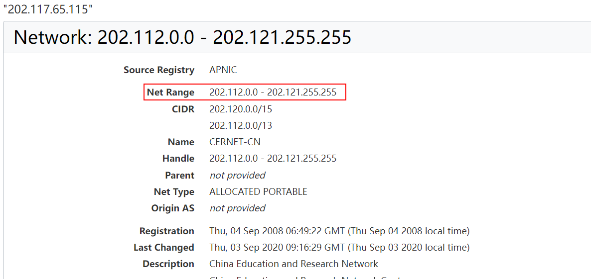

不可以，whoisservices 不能用于确定特定 IP 地址的地理位置

中国这些大学好像都具体没有城市信息

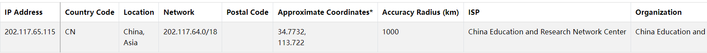

查了一下mit的, 是有具体位置的

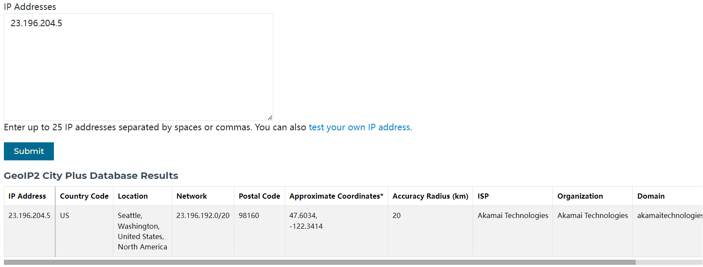

# P17

> 假定在源主机和目的主机 B 之间的数据报被限制为 1500 字节（包括首部）。假设 IP 首部为 20 字节，要发送一个 5 MB组成的 MP3 需要多少个数据报？解释你的答案是如何计算的。

假设IP数据报的数据部分携带的是TCP报文段, 首部为20字节

则每个数据报实际可用的数据容量为1460字节

所以需要$\lceil \frac{5 \times 10^6} {1460} \rceil = 3425$个数据报


# P18

> 考虑在图 4-25 中建立的网络。
>
> 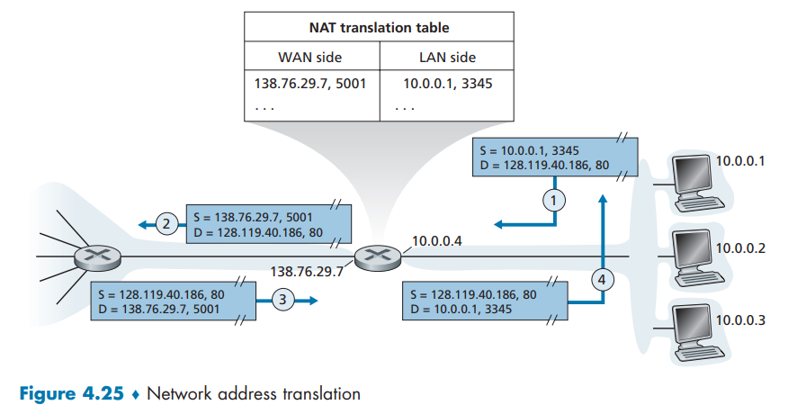
>
> 假定 ISP 此时为路由器分配地址 24.34.112.235 以及家庭网络的网络地址是 192.168.1/24。
>
> a. 在家庭网络中为所有接口分配地址
>
> b. 假定每台主机具有两个进行中的 TCP 连接，所有都是对主机 128.119.40.86 的 80 端口的。在 NAT 转换表中提供 6 个对应表项。

## a

|    接口    |   IP地址    |
| :--------: | :---------: |
| 路由器接口 | 192.168.1.4 |
| 第一台主机 | 192.168.1.1 |
| 第二台主机 | 192.168.1.2 |
| 第三台主机 | 192.168.1.3 |

## b

假设每台主机中建立TCP的端口号都是8000和8001

NAT路由器从5001开始依次给这3主机分配新的端口号, 用于内部网络主机标识

|        WAN端        |       LAN端       |
| :-----------------: | :---------------: |
| 24.34.112.235, 5001 | 192.168.1.1, 8000 |
| 24.34.112.235, 5002 | 192.168.1.1, 8001 |
| 24.34.112.235, 5003 | 192.168.1.2, 8001 |
| 24.34.112.235, 5004 | 192.168.1.2, 8002 |
| 24.34.112.235, 5005 | 192.168.1.3, 8001 |
| 24.34.112.235, 5006 | 192.168.1.3, 8002 |

# P19

> 假设你有兴趣检测 NAT 后面的主机数量。你观察到在**每个 IP 分组上 IP 层顺序地标出一个标识号**。由一台主机生成的第一个 IP 分组的标示号是一个随机数，后继 IP 分组的标示号是顺序分配的。假设由 NAT 后面主机产生的所有 IP 分组都发往外部。
>
> a. 基于这个观察，假定你能够俘获由 NAT 向外部发送的所有分组，你能概要给出一种简单的技术来检测 NAT 后面不同主机的数量吗？评估你的答案。
>
> b. 如果标示号不是顺序分配而是随机分配的，这种技术还能正常工作吗？评估你的答案。

## a

由于所有IP数据包都是发送到外部的，因此我们可以使用分组嗅探器来记录NAT后面的主机生成的所有IP数据包。 

由于每个主机都会生成一系列具有连续编号和不同（很可能是从大空间中随机选择）初始标识号 (ID) 的 IP 数据包，因此我们可以将具有连续 ID 的 IP 数据包分组到一个集群中。 集群数量是NAT后面的主机数量

我们每捕获一个分组, 就可以将其


## b

然而，如果这些标识号不是按顺序分配而是随机分配，则 (a) 部分中建议的技术将不起作用，因为嗅探到的数据中不会出现簇。

# P20

> 在这个习题中，我们将探讨 NAT 对 P2P 应用程序的影响。假定具有用户名 Arnold 的对等方通过查询发现，具有用户名 Bernard 的对等方有一个要下载的文件。同时假定 Bernard 和 Arnold 都位于 NAT 后面。尝试设计一种技术，使得 Arnold 与 Bernard 创建一条 TCP 连接，而不对 NAT 做应用特定的配置。如果你难以设计这样的技术，试讨论原因。

不可能设计出这样的技术。 为了在 Arnold 和 Bernard 之间建立直接 TCP 连接，Arnold 或 Bob 必须向对方发起连接。 但覆盖 Arnold 和 Bob 的 NAT 会丢弃从 WAN 端到达的 SYN 数据包, 因为SYN分组的目的IP是内部的, 在NAT表中的WAN列中没有这个项。 因此，如果 Arnold 和 Bob 都位于 NAT 后面，则他们都无法发起与对方的 TCP 连接


# P21

> 考虑显示在图4-30中的SDN OpenFlow网络。
>
> 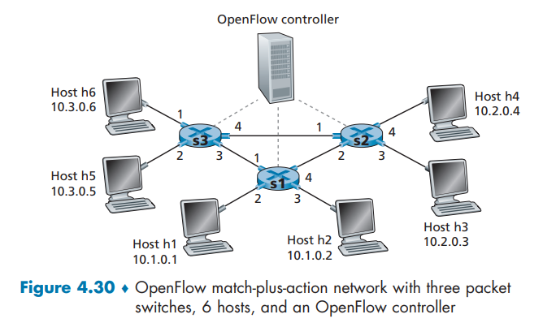
>
> 假定对于到达s2的数据报的期望转发行为如下:
>
> + 来自主机**h5或h6**并且发往主机**h1或h2**的任何数据报应当通过**输出端口2**转发到**输入端口1**。
> + 任何**从主机h1或h2**到达输入端口2的数据报，都应该通过输出端口1转发到主机 h5或h6。
> + 任何在端口1或2到达并且发往主机h3或h4的数据报应当传递到特定的主机。
> + 主机h3和h4应当能够向彼此发送数据报。
>
> 详述实现这种转发行为的s2中的流表项。

s2中的流表项

| 匹配                                                         |                     操作                     |
| :----------------------------------------------------------- | :------------------------------------------: |
| `Ingress Port = 1; IP Src = 10.3.*.*;IP Dst = 10.1.*.* `     |                  forward(2)                  |
| `Ingress Port = 2; IP Src = 10.1.*.*;IP Dst = 10.3.*.*`      |                  forward(1)                  |
| `Ingress Port = 1;  IP Dst = 10.2.0.3`                           `Ingress Port = 2;  IP Dst = 10.2.0.3`                   `Ingress Port = 1;  IP Dst = 10.2.0.4`                           `Ingress Port = 2;  IP Dst = 10.2.0.4` | forward(3) forward(3)  forward(4) forward(4) |
| `Ingress Port = 3;`                                             `Ingress Port = 4; ` |            forward(4) forward(4)             |


# P22

> 再次考虑显示在图4-30中的SDN OpenFlow网络。
>
> 假定在s2对于来自主机h3或h4的数据报的期望转发行为如下:
>
> + 任何来自主机 h3 并且发往主机h1、h2、h5或h6的数据报应当在网络中以**顺时针**方向转发。
> + 任何来自主机h4并且发往主机h1、h2、h5或h6的数据报应当在网络中以**逆时针**方向转发。
>
> 详述实现这种转发行为的s2中的流表项。

S2中的流表项

| 匹配                                                         |    操作    |
| :----------------------------------------------------------- | :--------: |
| `Ingress Port = 3; IP Dst = 10.1.*.*;                       Ingress Port = 3; IP Dst = 10.3.*.*;                                              ` | forward(2) |
| `Ingress Port = 4; IP Dst = 10.1.*.*;                       Ingress Port = 4; IP Dst = 10.3.*.*;                                              ` | forward(1) |


# P23

> 再次考虑上面P21的场景。给出分组交换机s1和s3的流表项，使得具有h3或h4源地址的任何到达数据报被路由到在IP数据报的目的地址字段中定义的目的主机。(提示:你的转发表规则应当包括如下情况，即到达的数据报被发往直接连接的主机,或应当转发到相邻路由器以便传递到最终主机。)

S1的流表

| 匹配                                   |    操作    |
| :------------------------------------- | :--------: |
| `IP Src = 10.2.*.*; IP Dst = 10.1.0.1` | forward(2) |
| `IP Src = 10.2.*.*; IP Dst = 10.1.0.2` | forward(3) |
| `IP Src = 10.2.*.*; IP Dst = 10.3.*.*` | forward(1) |

S3的流表

| 匹配                                   |    操作    |
| :------------------------------------- | :--------: |
| `IP Src = 10.2.*.*; IP Dst = 10.3.0.6` | forward(1) |
| `IP Src = 10.2.*.*; IP Dst = 10.3.0.5` | forward(2) |
| `IP Src = 10.2.*.*; IP Dst = 10.1.*.*` | forward(3) |

# P24

> 再次考虑显示在图 4-30 中的 SDN Open Flow网络。
>
> 假定我们希望交换机 s2 的功能像**防火墙**一样。在s2中定义实现下列防火墙行为的流表，以**传递目的地为h3和h4的数据报**（对下列四种防火墙行为，每种定义一张不同的流表)。不需要在s2中定义将流量转发到其他路由器的转发行为。
>
> + 仅有从主机 h1 和 h6 到达的流量应当传递到主机 h3 或 h4 (即从主机 h2和 h5到达的流量被阻塞)。
> + 仅有TCP 流量被允许传递给主机 h3 或 h4（即 UDP 流量被阻塞)。
> + 仅有发往h3的流量被传递（即所有到h4的流量被阻塞)。
> + 仅有来自h1并且发往h3的UDP 流量被传递。所有其他流量被阻塞。

+ 情况一

S2的流表: 只考虑源主机为h1或h6, 目标主机为h3或h4的4种情况

| 匹配                                   |    操作    |
| :------------------------------------- | :--------: |
| `IP Src = 10.3.0.6; IP Dst = 10.2.0.4` | forward(4) |
| `IP Src = 10.3.0.6; IP Dst = 10.2.0.3` | forward(3) |
| `IP Src = 10.3.0.1; IP Dst = 10.2.0.3` | forward(3) |
| `IP Src = 10.3.0.1; IP Dst = 10.2.0.4` | forward(4) |

+ 情况二

S2的流表: 

| 匹配                                              |    操作    |
| :------------------------------------------------ | :--------: |
| `IP Src = *.*.*.*; IP Dst = 10.2.0.4; port = TCP` | forward(4) |
| `IP Src = *.*.*.*; IP Dst = 10.2.0.3; port = TCP` | forward(3) |

+ 情况三

S2的流表: 

| 匹配                                  |    操作    |
| :------------------------------------ | :--------: |
| `IP Src = *.*.*.*; IP Dst = 10.2.0.3` | forward(3) |

+ 情况四

S2的流表: 

| 匹配                                               |    操作    |
| :------------------------------------------------- | :--------: |
| `IP Src = 10.1.0.1; IP Dst = 10.2.0.3; port = UDP` | forward(3) |


# P25

> 考虑图1-23和4.31节中的因特网协议栈。
>
> 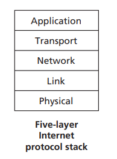
>
> 你认为**ICMP协议**是网络层协议还是运输层协议?解释你的答案。

我们将 ICMP 视为网络层协议，因为 ICMP 数据包由 IP 数据包封装
