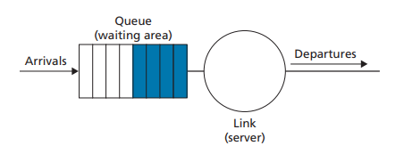
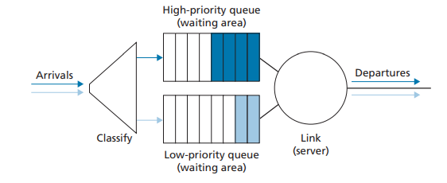
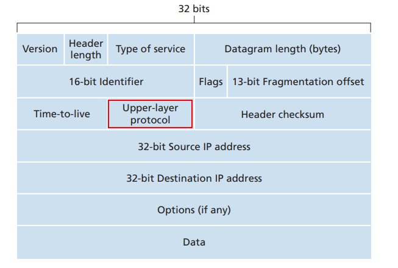
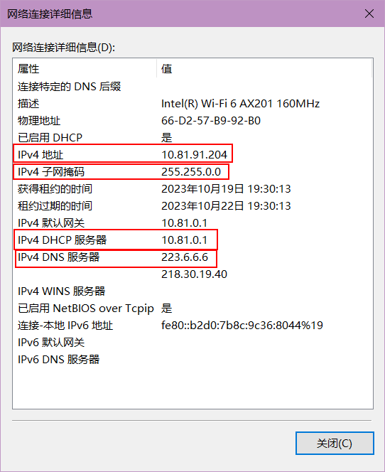
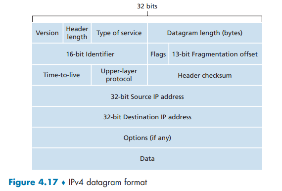
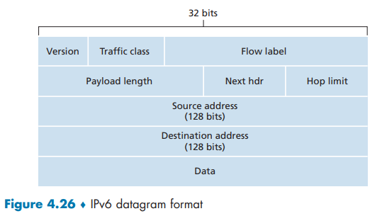

# R1

> 我们回顾一下再本书中使用的某些术语。前面讲过运输层的分组名字是报文段，数据链路层的分组名字是帧。网络层分组的名字是什么？前面讲过路由器和链路层交换机都被称为分组交换机。路由器与链路层交换机间的根本区别是什么？

网络层数据包是数据报。 路由器根据数据包的 IP（第 3 层）地址转发分组。 链路层交换机根据数据包的 MAC（第 2 层）地址转发分组

---

路由器（Router）和链路层交换机（Layer 2 Switch）是网络中的两种不同设备，它们在网络中的作用和功能上有一些根本区别。以下是它们之间的主要区别：

1. 工作层次：
   - 路由器工作在网络层（第3层），主要负责在不同网络之间进行数据包的路由和转发，实现不同网络之间的通信，通常使用IP地址进行路由。
   - 链路层交换机工作在链路层（第2层），主要负责在同一网络中的设备之间进行数据帧的交换，使用MAC地址来确定数据帧的目标设备。

2. 范围：
   - 路由器跨越不同的网络，它通常连接不同的子网，甚至不同的广域网（WAN），以实现跨网络的通信。
   - 链路层交换机在同一网络内部工作，通常用于本地局域网（LAN）内的设备之间的通信。

3. 决策方式：
   - 路由器根据目标IP地址进行路由决策，可以实现子网间的隔离和安全性。
   - 链路层交换机仅基于MAC地址进行交换决策，不涉及IP路由，因此通常在同一子网内不区分不同IP地址。

4. 数据包处理：
   - 路由器能够处理和分析数据包的内容，执行各种高级功能，如网络地址转换（NAT）、防火墙规则、质量服务（QoS）等。
   - 链路层交换机只处理数据链路层的数据帧，不涉及更高层的协议或应用层功能。

5. 路由功能：
   - 路由器有能力连接多个网络，根据网络之间的路由表来选择最佳路径进行数据包的转发。
   - 链路层交换机只在同一网络中的设备之间进行数据帧的交换，不涉及不同网络的路由。

# R2

> 我们注意到网络层功能可被大体分成数据平面功能和控制平面功能。数据平面的主要功能是什么?控制平面的主要功能呢?

数据平面的主要功能是分组转发，即将数据报从其输入链路转发到其输出链路。 例如，数据平面的输入端口执行物理层功能，在路由器上终止进入的物理链路;执行链路层功能，与进入链路的另一端的链路层进行互操作;在输入端口执行查找功能。

控制平面的主要功能是路由，即确定数据包从源到目的地的路径。控制平面负责执行路由协议、响应上行或下行的附加链路、与远程控制器通信以及执行管理功能。

# R3

> 我们对网络层执行的转发功能和路由选择功能进行区别。路由选择和转发的主要区别是什么?

路由和转发之间的关键区别在于，转发是路由器将数据包从其输入接口传输到其输出接口的本地操作，转发发生在非常短的时间尺度(通常是几纳秒)，因此通常在硬件中实现。

路由是指网络范围内的过程，它决定数据包从源到目的地的端到端路径。路由发生在更长的时间尺度上(通常是秒)，并且通常在软件中实现。

# R4

> 路由器中转发表的主要作用是什么?

转发表在路由器中的作用是保存条目，以确定到达的数据包将通过交换结构转发到的输出链路接口。

# R5

> 我们说过网络层的服务模型“定义发送主机和接收主机之间端到端分组的传送特性”。因特网的网络层的服务模型是什么?就主机到主机数据报的传递而论，因特网的服务模型能够保证什么?

Internet网络层的服务模型是尽力而为的服务。 使用这种服务模型，无法保证数据包将按发送顺序接收，无法保证其最终交付，无法保证端到端时延，也无法保证最小带宽。

# R6

> 在4.2节中，我们看到路由器通常由输入端口、输出端口、交换结构和路由选择处理器组成。其中哪些是用硬件实现的，哪些是用软件实现的?为什么?
>
> 转到网络层的数据平面和控制平面的概念，哪些是用硬件实现的，哪些是用软件实现的?为什么?

输入端口、交换结构和输出端口都是在硬件中实现的，因为它们的数据报处理功能对于软件实现来说太快了。 传统路由器内的路由处理器使用软件来执行路由协议、维护路由表和附加的链路状态信息以及计算路由器的转发表。

此外，SDN路由器中的路由处理器还依赖于与远程控制器通信的软件，以接收转发表条目并将其安装在路由器的输入端口中。由于快速处理的要求（例如纳秒级），数据平面通常在硬件中实现。 控制平面通常以软件实现，并以毫秒或秒的时间尺度运行，例如，用于执行路由协议、响应向上或向下的附加链路、与远程控制器通信以及执行管理功能。

# R7

> 讨论为什么在高速路由器的每个输人端口都存储转发表的影子副本。

使用影子副本，在每个输入端口进行本地转发查找，而无需调用集中式路由处理器。这种分散的方法避免了在路由器内的单个点上创建查找处理瓶颈。

# R8

> 基于目的地转发意味着什么?这与通用转发有什么不同（假定你已经阅读4.4节，两种方法中哪种是软件定义网络所采用的)?

基于目的地的转发意味着到达路由器的数据报将仅根据数据报的最终目的地转发到输出接口。

通用转发意味着除了最终目的地外，路由器在确定数据报的输出接口时还考虑与数据报相关的其他因素。

软件定义组网采用通用转发，例如，除了目的IP地址外，还可以根据数据报的TCP/UDP源端口号或目的端口号进行转发决策。

# R9

> 假设一个到达分组匹配了路由器转发表中的两个或更多表项。采用传统的基于目的地转发，路由器用什么原则来确定这条规则可以用于确定输出端口，使得到达的分组能交换到输出端口?

如果数据包的目标地址与转发表中的两个或多个条目匹配，则路由器使用最长前缀匹配来确定将数据包转发到哪个链路接口。 也就是说，数据包将被转发到与数据包的目的地具有最长前缀匹配的链路接口。

# R10

> 在4.2节中讨论了三种交换结构。列出并简要讨论每一种交换结构。哪一种（如果有的话）能够跨越交换结构并行发送多个分组?

经内存交换； 经总线交换； 经互连网络交换。 

只要所有数据包都转发到不同的输出端口，互连网络就可以并行转发数据包。

# R11

> 描述在输入端口会出现分组丢失的原因。描述在输入端口如何消除分组丢失（不使用无限大缓存区)。

如果数据包到达结构的速率超过交换结构速率，则数据包将需要在输入端口排队。 如果这种速率不匹配持续存在，队列将变得越来越大，最终溢出输入端口缓冲区，导致数据包丢失。 

如果交换结构速度至少是输入线路速度的 n 倍（其中 n 是输入端口的数量），则可以消除数据包丢失。在最坏情况下, n条输出链路的分组都被转发到同一个输出端口, 这是当n个分组完全通过交换结构后, 下一批n个分组的第一个分组才会到达

# R12

> 描述在输出端口会出现分组丢失的原因。通过提高交换结构速率，能够防止这种丢失吗?

假设输入和输出线路速度相同，如果数据包到达单个输出端口的速率超过线路速度，即交换结构的速率大于输出链路端口速率, 仍然会发生数据包丢失。 如果这种速率不匹配持续存在，输出端口的队列将变得越来越大，最终溢出输出端口缓冲区，导致数据包丢失。 

提高交换结构速度并不能防止此问题的发生, 反而会加剧这种情况。

# R13

> 什么是 HOL阻塞? 它出现在输入端口还是输出端口?

有时，在输入端口队列中排在第一位的数据包必须等待，因为在其想要转发到的输出端口处没有可用的缓冲区空间。 发生这种情况时，第一个数据包后面的所有数据包都会被阻塞，即使它们想要转发到的输出端口的输出队列有空间容纳它们。

HOL 阻塞发生在输入端口。

# R14

> 在4.2节我们学习了FIFO、优先权、循环（RR）和加权公平排队(WFQ)分组调度规则。这些排队规则中,哪个规则确保所有分组是以到达的次序离开的?

只有 FIFO 才能确保所有数据包按照到达的顺序离开。

# R15

> 举例说明为什么网络操作员要让一类分组的优先权超过另一类分组的。

例如，携带网络管理信息的数据包应优先于常规用户流量。 另一个示例，实时 IP 语音数据包可能需要获得高于非实时流量（例如电子邮件）的优先级。

# R16

> RR 和WFQ分组调度之间的基本差异是什么?存在RR和WFQ将表现得完全相同的场合吗?(提示:考虑WFQ权重。)

对于 RR，所有服务类别都受到同等对待，即没有服务类别具有高于任何其他服务类别的优先级。 

使用WFQ，服务类别被区别对待，即每个类别可以在任何时间间隔内接收不同数量的服务。 

当WFQ的所有类别具有相同的服务权重时，WFQ与RR相同。

# R17

> 假定主机 A 向主机 B 发送封装在一个 IP 数据报中的 TCP 报文段。当主机 B 接收到该数据报时，主机 B 中的网络层怎么知道它应当将该报文段（即数据报的有效载荷）交给 TCP 而不是 UDP 或某个其他东西呢?

IP 数据报中的 8 位上层协议字段包含有关目标主机应将数据段传递到哪个传输层协议的信息。值为6表明报文段要交给TCP, 值为17表明要交给UDP

# R18

> 在IP首部中，哪个字段能用来确保一个分组的转发不超过N台路由器?

Time-to-live

如果发送方将TTL字段设置为N, 由于每经过一个路由器TTL减1, 减到0就丢弃该数据报, 所以可以确保数据报在网络中转发不超过N个路由器

# R19

> 前面讲过因特网检验和被用于运输层报文段（分别在图3-7和图3-29的UDP 和TCP首部中）以及网络层数据报（图4-17的P首部中)。现在考虑一个运输层报文段封装在一个IP数据报中。在报文段首部和数据报首部中的检验和要遍及IP数据报中的任何共同字节进行计算吗?

不会。IP 首部校验和字段仅计算 IP 数据报的 IP 首部字段的校验和(将首部的每2个字节看作一个数做校验和)，这些字段与 IP 数据报的传输层段部分不共享公共字节。

# R20

> 什么时候一个大数据报分割成多个较小的数据报?较小的数据报在什么地方装配成一个较大的数据报?

当一个数据报的大小超过该链路的最大传输单元MTU时, 会进行IP分片

IP 数据报片段的重组在数据报的目标主机中完成

# R21

> 路由器有IP地址吗?如果有,有多少个?

有, 每个接口对应一个IP地址

# R22

> IP地址223.1.3.27的32比特二进制等价形式是什么?

11011111 00000001 00000011 00011100.

# R23

> 考察使用 DHCP的主机，获取它的IP地址、网络掩码、默认路由器及其本地DNS服务器的IP地址。列出这些值。

DHCP服务器的IP地址为10.81.0.1

子网掩码为: 255.255.0.0/16

默认路由器的IP也是10.81.0.1

DNS服务器的IP地址: 233.6.6.6和218.30.19.40

## 补充1

> 为什么会出现默认网关的IP地址和DHCP的服务器IP地址一样

在一些网络配置中，特别是在小型家庭网络或简单的办公网络中，你可能会发现默认网关的IP地址和DHCP服务器的IP地址相同。这是一个可能的配置，但并不是所有网络中都会如此。

这种情况发生的原因可以有以下几个：

1. **单一设备扮演多个角色**：某些路由器或网络设备具有多个功能，包括路由、交换和DHCP服务。在这种情况下，同一个设备可以充当路由器、默认网关和DHCP服务器，因此它的IP地址会相同。这种集成设备通常用于小型网络，以降低复杂性和成本。

2. **默认配置**：一些路由器和网络设备在初始设置或默认配置中，会将它们的IP地址配置为默认网关和DHCP服务器的IP地址。这是为了方便初次设置和配置，但通常可以在网络设置中更改。

虽然默认网关和DHCP服务器的IP地址可能相同，但在更复杂的网络中，它们通常是不同的设备，分别负责不同的功能。然而，在小型网络或家庭网络中，集成设备可能会采用相同的IP地址来简化配置和管理。

如果你想要更详细的网络配置，包括分离默认网关和DHCP服务器，通常可以在路由器或网络设备的设置界面中进行自定义配置。要了解如何更改这些设置，可以查阅设备的用户手册或在线文档。

## 补充2

> "网关" 和 "路由器"的区别

"网关" 和 "路由器" 是网络中两个重要但不完全相同的概念。它们都在网络通信中扮演关键角色，但它们的功能略有不同：

1. **网关 (Gateway)**：
   - 网关是网络中的一个设备或系统，它用于将数据从一个网络传输到另一个网络，通常是将数据从局域网（LAN）传输到广域网（WAN）或不同的子网。
   - 网关可以是硬件设备，如路由器，也可以是运行特定软件的计算机，如代理服务器。
   - 网关用于在不同网络之间进行数据包的路由和转发，执行网络地址转换（NAT）等功能，以实现不同网络之间的通信。

2. **路由器 (Router)**：
   - 路由器是一种网络设备，通常用于连接不同的网络，例如，将局域网与互联网连接起来。它在网络层（第3层）上工作，根据目标IP地址来决定如何路由和传输数据包。
   - 路由器具有路由表，其中包含有关不同网络和子网的信息，以帮助它决定如何将数据包从一个网络发送到另一个网络。
   - 路由器还执行NAT（网络地址转换）功能，允许多个设备共享一个公共IP地址，从而隐藏了局域网中的多个设备。

总结，网关通常是一个更广泛的术语，可用于描述任何在网络中连接两个不同网络的设备或系统。路由器是网关的一种形式，它特定地在网络层上工作，根据IP地址进行数据包的路由和转发。网关可以是路由器，也可以是其他设备，如防火墙、代理服务器等。这两个概念在网络中相互关联，但它们的功能和定位略有不同。

# R24

> 假设在一个源主机和一个目的主机之间有3台路由器。
>
> 不考虑分片，一个从源主机发送给目的主机的IP数据报将通过多少个接口?
>
> 为了将数据报从源移动到目的地需要检索多少个转发表?

8 个接口: 主机与路由器之间, 路由器于路由器之间的

3 张转发表: 当源主机发送一个IP数据报时，它首先会发送数据报到它的默认网关，也就是与它直接相连的第一台路由器, 这是不用使用转发表索引

# R25

> 假设某应用每 20ms 生成一个40字节的数据块，每块封装在一个TCP报文段中，TCP 报文段再封装在一个数据报中。
>
> 每个数据报的开销有多大? 
>
> 应用数据所占百分比是多少?

TCP报文段和IP数据包首部一般情况都是20字节, 所以每个数据报的开销为20 + 20 + 40 = 80 字节

所以应用数据占比为: 50%

# R26

> 假定你购买了一个无线路由器并将其与电缆调制解调器相连。同时假定ISP动态地为你连接的设备(即你的无线路由器)分配一个IP地址。还假定你家有5台PC,均使用802.11以无线方式与该无线路由器相连。
>
> 怎样为这5台PC分配IP地址?
>
> 该无线路由器使用NAT吗? 为什么?

通常，无线路由器包括 DHCP 服务器。 DHCP 用于为 5 台 PC 和路由器接口分配 IP 地址。 

是的，无线路由器也使用 NAT，因为它只从 ISP 获取一个 IP 地址。

# R27

> “路由聚合”一词意味着什么?路由器执行路由聚合为什么是有用的?

路由聚合意味着 ISP 使用单个前缀来通告多个网络。 路由聚合非常有用，因为 ISP 可以使用此技术向 Internet 的其余部分通告 ISP 拥有的多个网络的单个前缀地址。

# R28

> “即插即用”或“零配置”协议意味着什么?

即插即用或零配置协议意味着该协议能够自动配置主机的网络相关方面，以便将主机连接到网络。

# R29

> 什么是专用网络地址?
>
> 具有专用网络地址的数据报会出现在大型公共因特网中吗?
>
> 解释理由。

网络中的设备的专用网络地址是指仅对该网络中的那些设备有意义的网络地址。 

具有专用网络地址的数据报永远不应该出现在更大的公共互联网中，因为专用网络地址只可能被它们自己的专用网络内的许多网络设备使用。

# R30

> 比较并对照IPv4和IPv6首部字段。它们有相同的字段吗?

IPv6 有一个固定长度的标头，它不包括 IPv4 标头可以包括的大部分选项。 尽管 IPv6 标头包含两个 128 位地址（源 IP 地址和目标 IP 地址），但整个标头的固定长度仅为 40 字节。

有几个字段的设置在思想上是相似的。 IPv6 中的流量类别、有效负载长度、下一个首部和跳数限制分别类似于 IPv4 中的服务类型TOS、数据报长度、上层协议和生存时间TTL。

# R31

> 有人说当IPv6以隧道形式通过IPv4路由器时，IPv6将IPv4隧道作为链路层协议。你同意这种说法吗?为什么?

是的，因为整个 IPv6 数据报（包括头字段）都封装在 IPv4 数据报的数据字段中。

# R32

> 通用转发与基于目的地转发有何不同?

转发有两个主要操作：匹配和操作。 

对于基于目的地的转发，路由器的匹配操作仅查找要转发的数据报的目的地IP地址，并且路由器的动作操作涉及将数据包发送到交换结构中到指定的输出端口。

通过通用转发，可以在与协议栈中不同层的不同协议关联的多个报头字段上进行匹配，并且操作可以包括将数据包转发到一个或多个输出端口、跨多个输出接口对数据包进行负载平衡、重写首部值（如在 NAT 中），有目的地阻止/丢弃数据包（如在防火墙中）、将数据包发送到特殊服务器以进行进一步处理和操作等等。(匹配的字段更多, 执行的操作也多)

# R33 

> 我们在4.1节遇到的基于目的地转发的转发表与在4.4节遇到的OpenFlow流表之间有什么差异?

基于目的地的转发的转发表中的每个条目仅包含 IP 头字段值和数据包（与 IP 头字段值匹配）要转发到的输出链路接口。

OpenFlow 中流表的每个条目都包含一组传入数据报将与之匹配的首部字段、一组在数据包与流表条目匹配时更新的计数器，以及一组当数据包与流表条目匹配时要采取的操作。 

# R34

> 路由器或交换机的“匹配加操作”意味着什么?
>
> 在基于目的地转发的分组交换机场合中，要匹配什么并采取什么操作?
>
> 在SDN的场合中，举出3个能够被匹配的字段和3个能被采取的操作。

“匹配加操作”是指路由器或交换机尝试在数据包的某些标头值与流表中的某些条目之间找到匹配，然后根据该匹配，路由器决定到哪个接口（ s) 数据包将被转发，甚至对数据包进行更多操作。 

在基于目的地的转发数据包交换的情况下，路由器仅尝试找到流表条目与到达数据包的目的地IP地址之间的匹配，并且动作是决定将数据包转发到哪个输出接口 。 

对于SDN来说，可以匹配的字段有很多，比如IP源地址、TCP源端口、源MAC地址等； 还可以采取许多操作，例如转发、删除和修改字段值。

# R35

> 在IP数据报中举出能够在OpenFlow 1.0泛化转发中“匹配”的3个首部字段。不能在OpenFlow中“匹配”的3个IP数据报首部字段是什么?

源IP, 目标IP, 服务类型TOS可以被匹配

TTL字段, 数据报长度字段, 首部校验和不能被匹配

